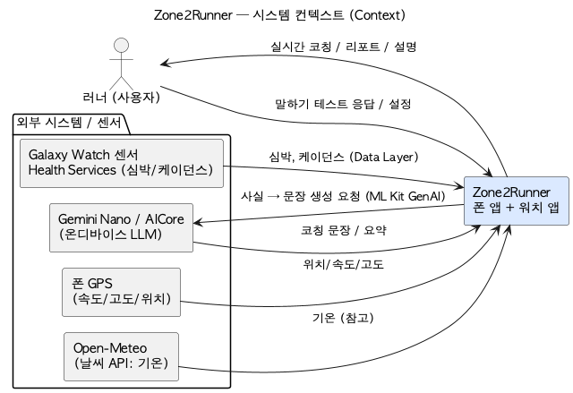
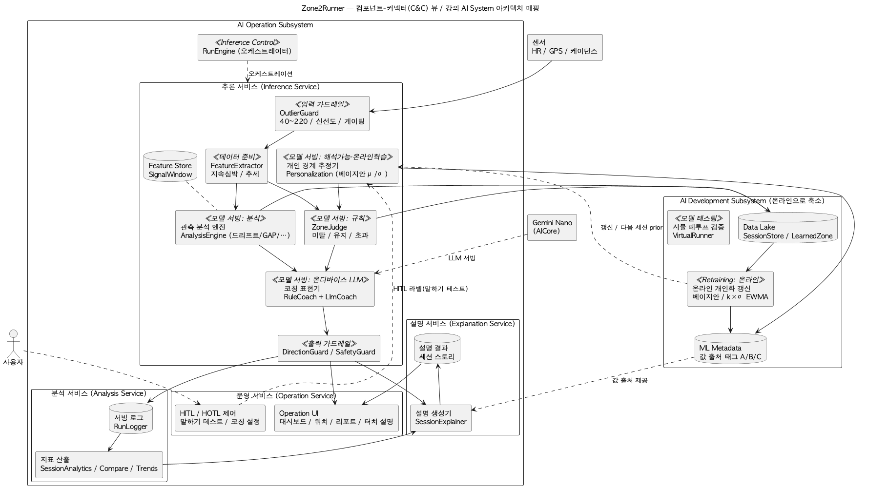
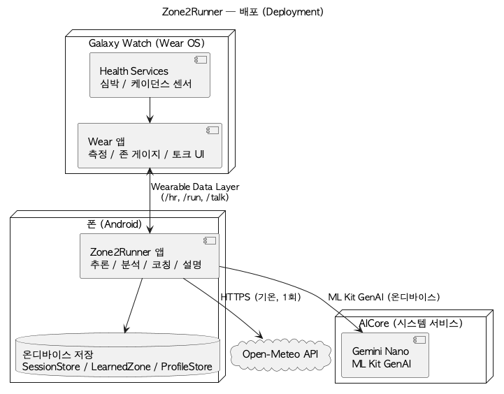

# 아키텍처 다이어그램 (PlantUML)

우리 시스템을 표준 SW 아키텍처 표기법으로 그린 뷰 세트. 강의 AI System 아키텍처(운영/개발 서브시스템, 가드레일, 설명/분석 서비스, HITL/HOTL, Retraining)에 매핑했다.

- **표기법**: UML 컴포넌트/배포 다이어그램 + C4 컨텍스트. `«...»` = 강의 표준 컴포넌트 유형(스테레오타입), 박스 = 우리 구현, 원통 = 저장소, 실선 = 데이터 흐름, 점선 = 제어(HITL/HOTL/LLM 서빙/적응).
- **소스**: `.puml`(편집본). **렌더**: `.png`.
- **렌더 방법**: `java -jar plantuml.jar -tpng arch/diagrams/*.puml` — 각 파일 상단 `!pragma layout smetana`로 **Graphviz(dot) 없이** 순수 자바 레이아웃으로 렌더된다(설치 불필요). VS Code PlantUML 확장이나 plantuml.com 서버로도 가능.

## 1. 시스템 컨텍스트 (Context)
시스템 경계와 외부 액터(사용자/워치 센서/Gemini Nano/GPS/날씨 API).

## 2. 컴포넌트-커넥터 (C&C) 뷰 — 메인
내부 컴포넌트를 강의 AI System 서비스별로 묶고, 커넥터를 타입 구분. 각 블록 상단 `«...»`가 강의 표준 컴포넌트 유형.

## 3. 배포 (Deployment)
폰 / 워치 / AICore 노드에 컴포넌트 배치.

---

> 관련: `arch/component-catalog.md`(컴포넌트 식별+디스크립션), `framework/ai-system-and-quality.md §1-3`(강의 표준 아키텍처).
