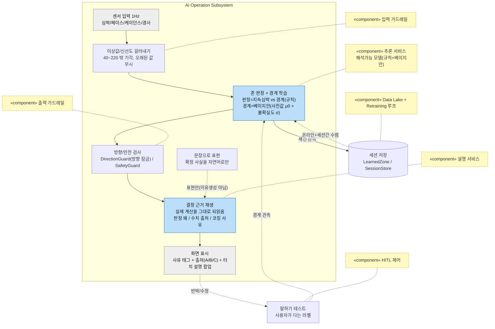
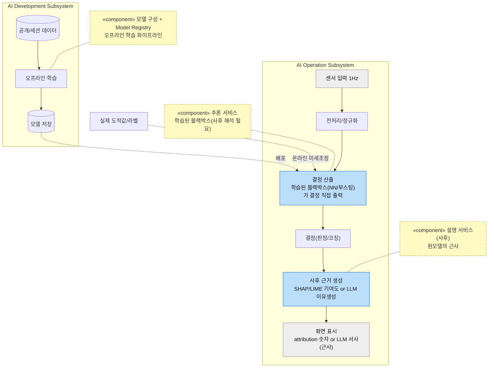

# DP(설명용이성) 설계 보고서 — 코칭 AI의 결정을 "충실하게" 설명하는 아키텍처

> 인증 보고서 "03. 설계 / Architectural Decision"의 DP 파트. 샘플(씬스틸러) DP 슬라이드 형식을 따른다:
> **[설계 문제 정의] → [설계안 결정 표: 구조(다이어그램) / 장점(QA 별점) / 단점(QA 별점) / Trade Off] → [설계 결정 및 근거]**.
> 이 분야를 전혀 모르는 사람도 읽고 이해할 수 있게 쓴다. 이 문서는 **설명용이성 DP 하나에만** 집중한다.
>
> **상태**: v1 (2026-07-14). 리서치 노트(`arch/research-explainability-dp-intrinsic-vs-posthoc.md`) 근거.
> 리포트는 설계 안정화 후 착수(CLAUDE.md) — 이 문서는 그 재료가 될 **DP 설계문서**로 arch에 둔다.

---

## 0. 읽기 전에 — 30초 배경

- 우리 앱은 사용자가 **믿고 그대로 행동해야 하는** 결정을 낸다: "지금 존을 벗어났어요 / 네 Zone 2 상한은 여기 / 지금은 속도를 낮춰요".
- 사람은 **이유를 이해하지 못하면 조언을 안 따른다.** 그래서 "왜 그렇게 판단/코칭했는지"를 설명하는 게 핵심 품질(설명용이성)이다.
- **그런데 함정이 있다**: *그럴듯하지만 틀린 설명*은 설명이 없는 것보다 **나쁘다.** 사용자가 잘못 믿고(false confidence) 엉뚱하게 행동하기 때문이다.
- 즉 진짜 요구는 "설명이 있냐"가 아니라 "설명이 **충실하냐**(진짜 이유대로냐)"다. → **XAI 용어로 fidelity/faithfulness.**
- **이 DP = 그 "충실한 설명"을 어떤 내부 구조로 만들 것인가** 라는 설계 결정이다.

---

## 1. 설계 문제 정의

### 1-1. 배경

**(1) 서비스가 원하는 것**
우리 시스템의 정체성 품질은 **설명용이성**이다(spec-002). 판정/경계/코칭 하나하나에 "왜"가 붙고, 사용자가 그걸 보고 신뢰하며, 틀렸다면 **반박**할 수 있어야 한다("그건 내 말하기 테스트 답과 달라").

**(2) 무엇이 어려운가 — 이 문제의 진짜 난도**
- **참값 없음**: 설명이 "맞는지" 잴 외부 정답이 없다(운동 임계의 실험실 참값도, "옳은 설명"의 정답도 없다). → 설명의 충실도를 **구조로 보장**해야지, 사후에 채점할 수가 없다.
- **그럴듯함 ≠ 충실함**: 사람은 매끄러운 설명이면 믿는다. 그래서 *plausible-but-wrong* 설명이 가장 위험하다 — 특히 심박처럼 사용자 눈에 보이는 값에서 어긋나면 신뢰가 즉시 붕괴한다.
- **계속 바뀜(적응)**: 경계가 개인화로 매 세션 갱신된다. 설명이 그 변화를 따라가며 여전히 충실해야 한다.

**(3) 그래서 생기는 결론**
설명을 "결정과 분리된 사후 모듈"로 만들면, 그 설명은 원래 결정의 **근사/추측**이 되어 충실도를 보장할 수 없다. 충실한 설명을 얻는 유일하게 확실한 길은 **결정 과정 자체를 투명하게 설계해서, 설명이 그 과정의 재생(replay)이 되게** 하는 것이다.

### 1-2. 문제점 — 설명을 "아무렇게나 붙이면 안 되는" 이유

| # | 문제 | 걸리는 제약(spec-001)/품질(spec-002, framework 8대 QA) |
|---|---|---|
| P1 | 사용자가 이해 못 하면 코칭을 안 따른다 | **설명용이성**(AI 특화, 정체성 QA) |
| P2 | 그럴듯하지만 틀린 설명은 없는 것보다 나쁘다(false confidence) | **설명용이성 심화 = 충실도(fidelity)** |
| P3 | "설명이 맞는지" 잴 외부 정답이 없다 | **C03 참값 없음** — 충실도를 사후 채점 불가 → 구조로 보장 |
| P4 | 판정/경계가 개인화로 계속 바뀐다 | **기능적응성**(AI 특화) — 설명이 적응을 따라가야 |
| P5 | 사용자가 설명을 보고 반박/수정할 수 있어야 | **제어가능성**(AI 특화) — HITL 채널 |
| P6 | 폰 혼자, 매초/세션종료, 비용 0 | **C01 온디바이스/비용0**, **수행효율성** — 무거운 사후 설명(SHAP 다중평가/상시 LLM) 부담 |
| P7 | 약한 LLM이 설명에 끼면 그럴듯한 거짓을 지어낼 수 있다 | **제어가능성/강건성** — LLM 역할을 묶어야 |

### 1-3. 설계 문제 (한 문장)

> **"코칭 AI의 판정/경계/코칭을, 참값도 대량 데이터도 없이, 폰 혼자, 사용자가 믿고 반박할 수 있게, 그리고 무엇보다 *그럴듯함이 아니라 충실함(진짜 이유대로)*으로 설명하는 내부 구조를 무엇으로 할 것인가."**

---

## 2. 두 후보를 공정하게 비교하는 틀

- **바깥 경계(입출력)를 똑같이 고정하고, 안쪽 구조만 다르게 본다.**
  - 입력: 관측 신호(1Hz 심박/페이스/케이던스/경사) + 시스템이 내린 결정(판정/경계/코칭).
  - 출력: ① 그 결정의 설명("왜 이렇게 판단/코칭했나"), ② 각 수치의 출처, ③ 사용자가 반박할 지점(HITL).
- 다이어그램에서 **파란/회색 상자 = 실제 기능 블록**(무엇을 하는가)이다. **노란 상자(`«component»`)는 컴포넌트가 아니라 note(주석)** 로, 점선으로 연결된 기능 블록이 강의 **AI System 아키텍처의 어느 컴포넌트**(입력/출력 가드레일, 추론 서비스, 설명 서비스, HITL/HOTL, Data Lake, Retraining)에 해당하는지 매핑해 붙인 것이다.
- 품질(QA) 평가는 그림이 아니라 **결정 표의 장점/단점 칸**에서 한다(대비가 극명한 2개씩).

---

## 3. (1안) 설계에 의한 설명 (intrinsic / glass-box) — ★채택

**한 줄 개념**: 결정 과정을 **투명하게** 만들어서, 설명이 그 과정의 **재생**이 되게 한다. 판정은 규칙, 경계는 눈에 보이는 베이지안(사전값+불확실도), 모든 수치는 출처가 선언돼 있고(종류 A 도출 / B 학습 / C 설계선택), **LLM은 이미 확정된 사실을 말로만 옮긴다**(이유를 지어내지 않는다).

**핵심 — 설명 서비스가 "재생"이다**: 설명이 별도 추측 모듈이 아니라, **추론이 실제로 쓴 그 로직/수치를 그대로 되읽는다.** 예: "지속심박 128이 하한 132보다 낮아 미달, 그런데 내리막+관절주의라 관절 보호를 우선했어요." 여기 나오는 128/132는 판정이 실제로 쓴 값 그 자체다 → **설명과 결정 사이에 간극이 없다(충실).**

**LLM의 자리(중요)**: LLM은 결정에 관여하지 않는다. 규칙이 방향/사실을 확정한 뒤, LLM은 그 **확정된 사실을 자연어로 옮기기만** 한다(verbalizer). "왜"를 LLM이 지어내지 않으므로(P7), LLM 환각이 설명의 충실도를 깨지 못한다. 표현 왜곡은 출력 가드레일(DirectionGuard)+템플릿 폴백이 막는다.

**모든 수치에 출처(provenance)**: 화면의 모든 숫자는 종류 A(도출)/B(학습)/C(설계선택, 문헌 근거) 중 하나로 선언된다("없는 숫자 금지"). 이는 XAI의 **data lineage(값의 출처 추적)** 로, "이 값이 어디서 왔나"에 항상 답한다.

### 3-1. 구조가 문제점(§1-2)을 푸는 방식

| 문제 | 푸는 구조 |
|---|---|
| P1 이해 못 하면 안 따름 | 사유 태그 + 터치 설명 팝업(layered explanation) — 짧게 먼저, 원하면 파고들기 |
| P2 그럴듯하나 틀림 | 설명=실제 계산 재생이라 **틀릴 수가 없음**(설명과 결정이 같은 로직) |
| P3 참값 없음 | 충실도를 *사후 채점*이 아니라 *구조*로 보장 — 애초에 근사가 아니라 재생 |
| P4 계속 바뀜 | 경계 갱신 시 새 μ/σ를 그대로 노출 → 설명이 적응을 자동 반영 |
| P5 반박 가능 | 라벨원(말하기 테스트)이 사용자 입력이라 "그건 내 답과 다르다"로 직접 정정(HITL) |
| P6 폰/매초/비용0 | 재생은 이미 계산한 값 되읽기 — 추가 연산 거의 0 |
| P7 LLM 환각 | LLM을 verbalizer로 한정 + 출력 가드레일/폴백 |

### 3-2. "이게 검증된 접근이냐?" — 근거 (핵심 질문)

- **① Rudin (2019, Nature Machine Intelligence)**: *고위험/신뢰 결정에는 블랙박스를 사후 설명하지 말고 해석가능한 모델을 써라.* 사후 설명은 원모델을 근사하는 "두 번째 모델"이라 구조적으로 어긋날 수 있다. 설계 A가 이 처방과 정확히 일치한다.
- **② "정확도-해석가능성 트레이드오프는 흔히 신화"(Rudin, Rashomon set)**: 의미있는 저차원 특징(이 시스템의 입력인 HR/페이스/케이던스/경사가 그렇다)에서는 해석가능 모델이 블랙박스에 거의 안 밀린다. 즉 "설명 위해 정확도 희생"이라는 통념이 **이런 저차원 문제에는 대체로 성립하지 않는다.**
- **③ 충실도(fidelity) vs 그럴듯함(plausibility)**: XAI 문헌은 사후 설명의 핵심 위험을 "그럴듯하나 충실하지 않을 수 있음"으로 명시하고, 충실도를 검증할 정답이 대개 없다고 본다(본 문서 P3와 동일). 설계 A는 재생 구조로 이 위험을 구조적으로 제거한다.
- **④ provenance/lineage = 신뢰 메커니즘**: 값의 출처 추적은 XAI에 인접한 신뢰 확보 방식으로 인정된다. 이 시스템의 "없는 숫자 금지" 원칙이 곧 이 규율이다.

**정직한 한계(먼저 인정)**: (1) "intrinsic=충실"은 *설명이 모델과 일치*함을 보장하지, *모델이 옳음*을 보장하진 않는다 — 해석가능 모델이 틀린 결정을 충실히 설명할 수도 있다. 이에 대한 보완은 provenance + **사용자 반박(말하기 테스트 HITL)** 으로 정확성을 교정하는 것이다. (2) LLM verbalizer도 표현을 왜곡할 수 있어 출력 가드레일이 실질적 역할을 한다. (3) 규칙+베이지안이라 아주 복잡한 비선형 패턴은 표현 못 한다(적응 표현력 상한).

**장점(QA 별점)**: 설명용이성 ★★★★★ (설명=실제 계산 재생 → 충실), 제어가능성 ★★★★★ (반박/수정 HITL + 출력 가드레일)
**단점(QA 별점)**: 기능적응성 ★★★ (적응은 하나 투명 구조 안이라 표현력 상한), 기능정확성 ★★★★ (참값 없어 절대 정확도는 미검증 — 양안 공통, provenance+반박이 보정)

---

## 4. (2안) 블랙박스 + 사후 설명 (post-hoc) — 카운터 아키텍처

**한 줄 개념**: 학습된 **블랙박스 모델**이 결정을 직접 산출하고, 설명은 **결정이 난 뒤 별도로** 생성한다 — 특징 기여도(SHAP/LIME)나 LLM 이유생성으로. 이는 산업계에서 가장 널리 쓰이는 주류 접근이다(웨어러블 데이터 XAI 연구의 88%가 post-hoc). 지어낸 비교 대상이 아니라 **동등하게 진지한 대안**이며, 조건이 다른 문제(고차원 원신호, 참값 확보 가능)에서는 이쪽이 우선될 수 있다.

**비유**: 학습된 모델이 결정을 내리고, 그 결정의 근거를 **사후에 별도 기법으로 근사해** 제시하는 방식. 설명은 자연스럽고 그럴듯하지만, 그것이 모델의 실제 계산과 일치하는지는 별도로 보장되지 않는다(모델 내부 로직이 다수 파라미터에 분산돼 결정 경로를 직접 대응시키기 어렵기 때문).

**구조가 문제점을 대응하는 방식과 그 비용**:

| 문제 | 2안의 대응 | 남는 비용 |
|---|---|---|
| P1 이해 | attribution/LLM 서사로 근거를 제시 | 설명이 자연스러워도 충실도는 별도로 확보해야 함 |
| P2 그럴듯하나 틀림 | 사후 기법으로 완화 시도 | 사후 설명은 원모델의 근사라, 그럴듯하지만 실제와 어긋날 가능성(plausible-but-unfaithful)이 남음 |
| P3 참값 없음 | 실시간 라벨(실제 도착값)은 1안과 동일 | 참값이 없는 조건에서는 사후 설명의 충실도를 검증하기 어려움 |
| P4 적응 | 모델이 유연히 적응 | 적응할수록 사후 설명을 충실히 유지하기 더 어려움 |
| P5 반박 | 결정 경로가 표면화되지 않음 | 사용자가 어떤 입력을 정정해야 할지 짚기 어려움(제어가능성 측면) |
| P6 폰/매초/비용0 | 소형 모델 순전파는 가벼움 | 사후 설명 비용이 큼(SHAP=다중 재평가, LLM 이유생성=상시 호출) |
| P7 LLM 개입 | LLM으로 서사 생성 | 원 설명이 충실하지 않을 경우, LLM이 그 부정확성을 더 자연스럽게 전달할 수 있음(문헌 지적) |

**장점(QA 별점)**: 기능적응성 ★★★★ 잠재 (모델이 유연해 복잡한 패턴 학습 가능 — 2안의 핵심 강점), 기능정확성 ★★★ 잠재 (고차원 원신호에 강함, 단 이 조건에선 참값 없어 검증 불가)
**단점(QA 별점)**: 설명용이성 ★★ (설명이 사후 근사라 충실도 보장이 어려움), 제어가능성 ★★ (결정 경로 비표면화로 반박 지점이 모호, attribution 불안정)

---

## 5. 설계안 결정 표 (샘플 슬라이드 형식)

| | **(1안) 설계에 의한 설명 ★채택** | (2안) 블랙박스 + 사후 설명 |
|---|---|---|
| 구조 | §3 다이어그램 | §4 다이어그램 |
| 장점 | 설명용이성 ★★★★★ 제어가능성 ★★★★★ | 기능적응성 ★★★★ 잠재(복잡한 패턴 학습) 기능정확성 ★★★ 잠재(고차원 신호에 강함) |
| 단점 | 기능적응성 ★★★ (투명 구조 내 표현력 상한) 기능정확성 ★★★★ (절대 정확도 미검증 — C03, 양안 공통) | 설명용이성 ★★ (사후 근사, 충실도 보장 어려움) 제어가능성 ★★ (결정 경로 비표면화) |
| Trade Off | 설명이 **결정의 재생**이라 구조적으로 충실 — plausible-but-unfaithful 실패모드가 없음 모든 수치 provenance(종류 A/B/C), 사용자 반박(HITL) 가능 사후 계산 불필요 → 폰에서 가벼움 | 복잡한 비선형까지 데이터가 배울 잠재력, 고차원 신호에 강함 단 그 정확 잠재는 참값이 없고 대상 대역 데이터가 부족한 이 조건에선 확인이 어려움 설명은 근사라 안전/반박을 별도로 보강해야 함 |

### 5-1. QA 별점 종합 (8대 QA 중 관련 축)

| QA(품질속성) | (1안) intrinsic + provenance | (2안) 블랙박스 + post-hoc |
|---|:---:|:---:|
| 설명용이성 (AI 특화, 정체성) | ★★★★★ | ★★ |
| 제어가능성 (AI 특화) | ★★★★★ | ★★ |
| 강건성 (AI 특화) | ★★★★ | ★★ |
| 수행효율성 | ★★★★★ | ★★ |
| 기능적응성 (AI 특화) | ★★★ | ★★★★ |
| 기능정확성 (AI 특화) | ★★★★ | ★★★ (잠재, 미검증) |

- **결정축 = 충실도(fidelity)**: 사용자가 *행동해야 하는* 코치에서는 충실도가 핵심 축이 된다. 1안은 추론이 투명해 설명이 충실하고, 2안은 사후 근사라 그럴듯해도 실제와 어긋날 수 있다(false confidence). 정체성 QA가 설명용이성인 이 시스템에서는 이 축의 가중치가 크다.
- **2안 기능적응성 별점이 높은데 종합에서 앞서지 못하는 이유**: 유연한 적응은 실질적 강점이지만, 그 유연성은 결정을 블랙박스로 만들어 설명이 사후 근사가 되는 대가를 수반한다(설명용이성 측면). 잠재 정확도(기능정확성)도 참값이 없고 대상 대역 데이터가 부족한 이 조건에서는 검증하기 어렵다.
- **조건 의존성(공정성)**: 이 별점은 *이 시스템의 조건*(온디바이스/참값 없음/저차원 의미있는 특징/정체성 QA=설명용이성)에 대한 평가다. 조건이 다르면(고차원 원신호, 참값 확보 가능, 정확도가 최우선) 2안이 앞설 수 있다. 즉 "A가 늘 낫다"가 아니라 "이 조건에서 A가 낫다"이다.
- **1안 수행효율성 ★★★★★**: 설명이 이미 계산한 값의 재생이라 추가 연산이 거의 없다. 2안 ★★은 SHAP 다중 재평가/상시 LLM 이유생성 부하 때문이다.

---

## 6. 설계 결정 및 근거

### 6-1. 최종 채택 구조
**(1안) 설계에 의한 설명(intrinsic/glass-box) + provenance + LLM=verbalizer** 구조를 채택한다. 블랙박스 결정 + 사후 설명은 쓰지 않는다.

### 6-2. 채택 근거 (2안 대비)
- **충실도(설명용이성) 우위**: 설명이 결정의 재생이라 *그럴듯하나 실제와 어긋남*이 구조적으로 발생하지 않는다. 심박처럼 사용자에게 보이는 값에서 어긋난 설명은 신뢰 저하로 직결되며(P2), 2안은 사후 근사이므로 이 실패모드에 노출된다. → **Rudin 2019의 고위험 처방과 일치.**
- **제어가능성**: 라벨원이 사용자 입력(말하기 테스트)이라 "그건 내 답과 다르다"로 직접 반박/정정 가능(HITL). 2안은 결정 경로가 표면화되지 않아 무엇을 정정할지 짚기 어렵다.
- **이 시스템의 조건 부합**: 2안의 강점(적응/정확 잠재력)은 "충분한 대상 대역 데이터 + 검증할 참값"을 전제하는데, 이 시스템에는 둘 다 없다(참값 없음 C03, 데이터 부족 C02). 또 저차원 의미있는 특징이라 "트레이드오프는 신화"(Rudin/Rashomon)로 정확도 손해도 작다.
- **수행효율성**: 재생은 추가 연산이 거의 없다(P6). 2안의 사후 설명(SHAP/LLM)은 상시 부하가 있다.
- **원칙 정합**: "없는 숫자 금지"(제1원칙)가 곧 provenance/lineage이며, 이 DP가 그 원칙의 아키텍처 표현이다.

### 6-3. 예상 질문
- **"SHAP/LIME 붙이면 블랙박스도 설명되잖아?"** — attribution은 원모델의 *근사*라 충실도가 보장되지 않고(Rudin), 입력 섭동에 결과가 바뀔 만큼 불안정하며, 다중 재평가라 연산이 무겁다. 또 이 시스템의 특징은 저차원/의미있어 블랙박스를 택할 정확도 유인이 크지 않다.
- **"그냥 LLM한테 다 설명시키면 되잖아?"** — 그건 사후 *이유생성(rationalize)*으로, 스스로 내리지 않은 결정의 이유를 지어낼 위험(컨패뷸레이션)이 있다. 설계 A는 LLM을 *verbalizer*로만 쓴다(확정 사실의 표현). 이 구분이 이 DP의 핵심이다.
- **"intrinsic이면 정확도 손해 아니냐?"** — raw 지각 데이터(이미지/음성)에서는 그럴 수 있으나, 이 시스템처럼 의미있는 저차원 특징에서는 손해가 작다(Rashomon). "이 조건에서는 대체로 성립"으로 정직하게 둔다.

### 6-4. 보완 계획
- **설명 서비스 사용자 평가**: 웨어러블 XAI 실무의 20%만 사용자 평가를 한다 — 실사용자 이해도/신뢰를 측정해 layered explanation을 다듬는다.
- **모델 정확성 교정**: "intrinsic=충실이지 옳음 보장 아님" → 말하기 테스트 반박(HITL) 채널을 정확성 교정 장치로 강화.
- **LLM 표현 왜곡 모니터링**: verbalizer의 표현 왜곡을 출력 가드레일 로그로 추적.

---

## 부록 A. 근거 문헌
- Rudin, C. (2019). *Stop Explaining Black Box ML Models for High-Stakes Decisions and Use Interpretable Models Instead.* Nature Machine Intelligence 1:206-215.
- Doshi-Velez & Kim (2017). *Towards a Rigorous Science of Interpretable ML.* arXiv:1702.08608.
- Molnar. *Interpretable Machine Learning*(intrinsic/post-hoc 분류).
- Faithfulness vs Plausibility(arXiv:2402.04614) / Assessing Fidelity(arXiv:2311.01961).
- LLM 자기설명 충실도/컨패뷸레이션(arXiv:2506.09277 / 2605.27879).
- 웨어러블 데이터 XAI 체계적 리뷰(JMIR 2024, post-hoc 88%/충실도 검증 부족).
- DARPA XAI("appropriately trust"). provenance/lineage as trust(Techstrong).
> 리서치 원본/링크 = `arch/research-explainability-dp-intrinsic-vs-posthoc.md`.

## 부록 B. 용어 한 줄 사전
- **충실도(fidelity/faithfulness)**: 설명이 시스템의 *진짜* 이유를 반영하는 정도. **그럴듯함(plausibility)** 과 다르다 — 그럴듯한데 안 충실할 수 있고, 그게 가장 위험하다.
- **intrinsic(설계에 의한 설명)**: 모델이 투명해서(규칙/선형/베이지안) 설명이 곧 그 구조. 별도 설명 모듈이 필요 없고 충실하다.
- **post-hoc(사후 설명)**: 학습된 블랙박스 모델의 결정을 사후에 SHAP/LIME/LLM으로 근사 설명하는 방식. 설명의 충실도가 별도로 보장되지는 않는다.
- **provenance/lineage(출처/계보)**: 모든 값이 어디서 왔는지(관측→도출→표시) 추적 가능 = 우리 "없는 숫자 금지".
- **verbalizer vs rationalizer**: LLM이 *확정 사실을 표현*(verbalize, 우리 방식) vs *이유를 지어냄*(rationalize, 위험).
- **SHAP/LIME**: 블랙박스의 각 특징 기여도를 사후 근사하는 대표적 post-hoc 기법.

> 관련 문서: `arch/research-explainability-dp-intrinsic-vs-posthoc.md`(리서치), `spec/spec-023`(설명 서비스), `spec/spec-002`(QA), `arch/adr-025`(AI≠NN), `framework/ai-system-and-quality.md`(AI System 아키텍처).
