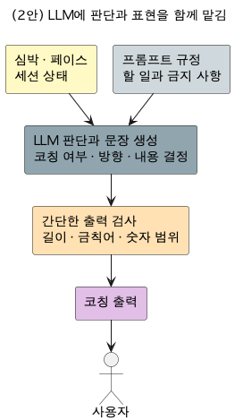

# DP(제어가능성) 설계 보고서 — 약한 LLM을 통제 가능하게 만드는 아키텍처

> 인증 보고서 "03. 설계 / Architectural Decision"의 DP 파트. 샘플(씬스틸러) DP 슬라이드 형식을 따른다:
> **[설계 문제 정의] → [설계안 결정 표: 구조(다이어그램) / 장점(QA 별점) / 단점(QA 별점) / Trade Off] → [설계 결정 및 근거]**.
> 이 분야를 전혀 모르는 사람도 읽고 이해할 수 있게 쓴다. 이 문서는 **제어가능성 DP 하나에만** 집중한다.
>
> **상태**: v1.1 (2026-07-24, 사용자 검토 대기). 리서치 노트(`dp-02-controllability-research.md`) 근거.
> v1.1: 표현 경로 현행화(adr-028) — LLM 직생성 + 단어 수준 폴백 + 숫자 무결성 가드.
> DP-01(설명용이성)과 같은 아키텍처의 다른 QA 단면 — 관계는 §0/§6-3 참조.

---

## 0. 읽기 전에 — 30초 배경

- 이 앱은 코칭 문장의 표현에 **온디바이스 소형 LLM**(Gemini Nano)을 쓴다. 서버 없이 폰에서 도는 작은 모델이다.
- 소형 LLM은 **지시를 시킨 대로 따르는 능력이 불안정**하다는 것이 알려져 있다(문헌: 소형 모델의 지시 이행률 60% 미만 사례). "프롬프트에 규정을 잘 써 두면 지킬 것"이라는 가정이 보장되지 않는다.
- 그런데 이 앱의 코칭은 **달리는 중에 실시간**으로 나간다 — 사람이 출력을 하나하나 검수할 수 없다. 통제는 사람 손이 아니라 **자동으로 작동하는 구조**여야 한다.
- 제어가능성(AI 8대 QA)의 정의는 "제어 주체가 **적시에 적절히 개입**할 수 있는 정도"다(ISO/IEC 25059). 강의 정본은 제어 기능을 **교정 / 보완 / 안전전환** 3유형으로 나누고, **입출력 가드레일 조정 자체를 제어 행위**로 본다.
- **이 DP = 그 "약한 LLM에 대한 통제권"을 어떤 내부 구조로 확보할 것인가** 라는 설계 결정이다.

---

## 1. 설계 문제 정의

### 1-1. 배경

**(1) LLM이 이 시스템에서 하는 일**
코칭 문장 표현(실시간 코칭 톤/문장), 세션 스토리 요약, 개인화 설명 풀이 — 사용자와 만나는 자연어 출력이다. 표현이 자연스러울수록 코칭 경험이 좋아지므로 LLM을 쓸 이유는 충분하다.

**(2) 무엇이 어려운가 — 이 문제의 진짜 난도**
- **약한 모델**: 온디바이스 소형 LLM은 지시 이행/형식 준수가 불안정하다. 프롬프트 규정만으로는 출력이 판정과 어긋나는 경우(예: 판정은 "초과=늦춰라"인데 문장은 "속도를 올려요")를 막을 수 없다.
- **실시간, 핸즈프리**: 달리는 중 음성으로 나가는 코칭이라 사람이 출력별로 검수/승인할 수 없다. 개입은 구조(자동) + 사후(감사)로 설계해야 한다.
- **미가용이 일상**: 모델 미다운로드, 포그라운드 제약, 타임아웃 등 LLM이 아예 응답하지 못하는 상황이 정상 운영 범위 안에 있다. 그때도 코칭 기능은 끊기지 않아야 한다.
- **안전 상황**: 위험 고심박 지속 같은 상황의 권고는 LLM의 지연/오작동 여지를 허용할 수 없다.

**(3) 그래서 생기는 결론**
통제권을 "LLM이 규정을 따라주는 것"에 의존하면, 그 가정이 깨질 때 개입할 지점이 없다. 반대로 **LLM의 권한 자체를 좁히고(구조적 격리), 출력을 규칙이 검증하고(가드레일), 실패 시 갈아탈 경로를 두고(폴백), 작동 기록을 남기면(감사)**, LLM이 약해도 시스템 수준의 통제권이 성립한다.

### 1-2. 문제점 — 통제를 "프롬프트에 맡기면 안 되는" 이유

| # | 문제 | 걸리는 제약(spec-001)/품질(spec-002, framework 8대 QA) |
|---|---|---|
| P1 | 소형 LLM의 지시 이행이 불안정 — 프롬프트 규정은 보장이 아님 | **제어가능성**(정체성 축 중 하나) — 개입 지점이 구조에 있어야 |
| P2 | 실시간/핸즈프리라 출력별 사람 검수 불가 | **제어가능성** — 자동 가드레일 + 사후 감사(HOTL)로 설계 |
| P3 | LLM 미가용/지연/오류가 정상 운영 범위 | **강건성** — 무손상 폴백으로 기능 무중단(안전전환) |
| P4 | 위험 심박 권고는 지연/오작동 허용 불가 | **제어가능성(안전전환)** — 안전 경로는 LLM 미경유 |
| P5 | 통제가 실제 작동했는지 사후 확인 필요 | **제어가능성(감사)** — 기각/폴백 기록(HOTL) |
| P6 | 사용자별 개입 요구(경계 정정, 빈도/말투/더위/관절 설정) | **제어가능성(교정/보완)** — HITL/HOTL 채널 |
| P7 | 코칭 표현의 자유도와 통제는 상충 — 통제가 과하면 표현이 굳음 | **기능적응성** — 통제 비용의 정직한 인정 |

### 1-3. 설계 문제 (한 문장)

> **"지시 이행이 불안정한 약한 온디바이스 LLM을 코칭 표현에 쓰면서 — 사람이 출력별로 검수할 수 없는 실시간 조건에서 — 어긋난 출력의 차단, 실패 시 기능 연속, 안전 상황의 즉시 권고, 사후 감사, 사용자 개입까지의 통제권(제어가능성)을 어떤 내부 구조로 확보할 것인가."**

---

## 2. 두 후보를 공정하게 비교하는 틀

- **바깥 경계(입출력)를 똑같이 고정하고, 안쪽 구조만 다르게 본다.**
  - 입력: 관측 신호(1Hz 심박/페이스/케이던스/경사)와 시스템 상태(존 판정/경계/맥락).
  - 출력: 코칭 문장(음성/TTS), 세션 후 설명 텍스트.
- **다이어그램 읽는 법**(두 안 공통 표기법): 각 블록 상단의 «...» = 강의 AI System 아키텍처의 컴포넌트 유형. 색 = 컴포넌트 성격(가드레일=주황, 모델 서빙=파랑(투명)/회색(블랙박스), 설명=초록, 운영=보라, 저장=회청, 외부=노랑). 실선=데이터 흐름, 점선=제어.
- 품질(QA) 평가는 그림이 아니라 **결정 표의 장점/단점 칸**에서 한다.

---

## 3. (1안) 규칙 확정 + LLM 표현 한정 아키텍처 — 구조적 격리 거버넌스 — ★채택

**한 줄 개념**: 코칭의 **방향/사실은 규칙이 확정**하고, LLM은 그 확정된 내용의 **표현만** 맡는다. LLM 출력은 규칙이 재검증하고(출력 가드레일), 실패하면 단어 수준 폴백 큐로 갈아타며(폴백), 안전 권고는 LLM을 거치지 않고, 모든 호출의 경로/기각/폴백이 기록된다(감사).

> 채택안(1안)은 이 시스템의 실제 아키텍처이므로 일반 도식을 참조한다. 상세 컴포넌트 뷰 = `arch/diagrams/02-component-cnc.png`, 컴포넌트 서술 = `arch/component-catalog.md`(A2/A7/A8/D3).

**통제 장치 5층** (계층 가드레일 — 각 층은 독립적으로 작동):

| 층 | 장치 | 제어 유형(강의 3유형) |
|---|---|---|
| 1. 구조적 격리 | 방향/사실은 규칙이 확정, LLM은 표현만(verbalizer). 프롬프트는 규칙이 확정한 사실 숫자와 임무만 담은 간결 구조("숫자는 준 것만" 지시) | 예방(권한 자체를 좁힘) |
| 2. 출력 가드레일 | 형식 가드(길이/문장 수/이모지) + DirectionGuard(방향 일치 검증) + 숫자 무결성 가드(출력 숫자가 입력 사실의 부분집합인지 — 언어 무관) | 교정 |
| 3. 폴백 | LLM 직생성이 실패/기각되면 단어 수준 폴백 큐("속도 줄이기" 등). 가용성 체크 + 무손상 폴백 — LLM 전면 실패/미지원 단말에서도 코칭 무중단 | 안전전환(fail-safe) |
| 4. 안전 경로 분리 | 위험 고심박 권고는 LLM을 거치지 않고 규칙이 즉시 발화(SafetyGuard) | 안전전환 |
| 5. HITL/HOTL + 감사 | 말하기 테스트로 경계 정정(HITL, 교정), 설정 토글(빈도/음성/말투/더위/관절 — 보완), 모든 LLM 호출의 경로/기각/폴백 사유가 세션마다 저장돼 사후 감사 가능 | 교정/보완 + 감사 |

### 3-1. 구조가 문제점(§1-2)을 푸는 방식

| 문제 | 푸는 구조 |
|---|---|
| P1 지시 이행 불안정 | 프롬프트 규정에 의존하지 않음 — 방향은 규칙이 확정(층1), 출력은 규칙이 재검증(층2) |
| P2 출력별 검수 불가 | 검증이 자동(DirectionGuard) + 사후 감사 기록(층5) |
| P3 미가용/지연/오류 | 가용성 체크 + 타임아웃 + 무손상 폴백(층3) — 최악의 경우에도 단어 수준 코칭으로 무중단 |
| P4 안전 상황 | 안전 권고는 LLM 미경유(층4) — 지연/오작동 여지 원천 배제 |
| P5 사후 확인 | 방향 기각 카운트/폴백 사유가 세션 기록에 영속(층5) — 리포트에서 확인 가능 |
| P6 사용자 개입 | HITL(말하기 테스트, 경계 ±10bpm clamp) + HOTL(설정 5종/일시정지) (층5) |
| P7 표현 굳음 | 표현은 LLM 직생성이 전담(자유도 높음) — 굳는 것은 기각/폴백의 그 순간뿐. 코칭 시점/내용의 상한은 인정(§단점) |

### 3-2. "이게 검증된 접근이냐?" — 근거

- **① 계층 가드레일 = 표준 관행**: LLM 안전 실무/서베이는 입력 검증 / 출력 필터 / **구조적 격리(모델이 할 수 있는 일 자체를 제한)**의 계층 방어를 표준으로 제시하며, 구조적 격리를 가장 강한 층으로 분류한다. 1안의 "LLM=표현만"이 이 격리에 해당한다.
- **② 판단의 LLM 단독 위임 회피**: LLM-as-Judge 문헌/실무 권고는 고영향 판단에 LLM을 단독 결정자로 쓰지 말고 결정론적 규칙을 근간으로 두라고 명시한다. 1안은 판단(방향/안전)을 규칙에 두고 LLM은 표현만 맡는다.
- **③ 제어가능성 정의와의 정합**: ISO/IEC 25059의 제어가능성("적시에 적절히 개입")과 강의 3유형(교정/보완/안전전환)에 대해, 1안은 유형별 개입 지점이 구조에 존재한다(§3 표의 3열). 강의 정본은 입출력 가드레일 조정 자체를 제어 행위로 본다.
- **④ 실측 가능한 감사**: 통제 장치의 작동(방향 기각률, 폴백 사유 분포, 지연)이 세션마다 기록돼, "통제가 되고 있는가"를 데이터로 답할 수 있다.

**정직한 한계(먼저 인정)**: (1) **코칭 시점/내용 상한** — 언제 무엇을 코칭할지(트리거/임무)는 규칙 집합에 묶이므로, 규칙에 없는 새로운 상황 코칭은 규칙 추가 없이는 안 나온다(P7). 표현 자체는 LLM이 전담해 자유도가 있다. (2) **과차단 가능성** — DirectionGuard가 정상 문장을 기각할 수 있다(보수적 검사). 기각률 기록으로 튜닝할 대상이다. (3) **통제 ≠ 내용의 옳음** — 규칙 자체가 틀리면 통제는 성립해도 내용이 틀린다. 내용의 교정은 HITL(말하기 테스트)과 DP-01의 정정 채널이 맡는다.

**장점(QA 별점)**: 제어가능성 ★★★★★ (교정/보완/안전전환 개입 지점이 구조에 존재 + 감사 가능), 강건성 ★★★★★ (미가용/오류에도 무손상 폴백으로 무중단)
**단점(QA 별점)**: 기능적응성 ★★★ (코칭 시점/내용은 규칙 집합에 묶임 — 새 상황은 규칙 확장 필요), 수행효율성 ★★★★ (가드 검증/폴백 오버헤드는 경미하나 존재)

---

## 4. (2안) LLM 판단 위임 아키텍처 — 프롬프트 규정 + 사후 필터 — 카운터

**한 줄 개념**: 관측 컨텍스트를 프롬프트로 주고 **LLM이 코칭의 내용/방향까지 직접 판단해 생성**한다. 통제는 시스템 프롬프트에 규정(존 정의, 안전 수칙, 금지 사항)을 서술하고 출력에 사후 안전 필터(금칙어/수치 범위)를 거는 방식이다. 이는 LLM 에이전트 계열의 주류 접근이며, **동등하게 진지한 대안**이다 — 모델이 충분히 강하고 사람 검수 루프를 둘 수 있는 조건에서는 이쪽이 우선될 수 있다.

> 카운터(2안)는 이 DP 전용 가정 설계다. 상세 컴포넌트 뷰 = `images/dp-02-controllability-counter-detailed.png`, 컴포넌트 서술 = `dp-02-controllability-counter-catalog.md`.

**요지**: 판단과 표현이 한 곳(LLM)에 있어 구조가 단순하고, 규칙 집합에 없는 상황에도 문맥을 읽은 코칭을 생성할 잠재력이 있다. 대신 통제권의 성립이 "LLM이 프롬프트 규정을 따른다"는 가정에 의존한다.

**구조가 문제점을 대응하는 방식과 그 비용**:

| 문제 | 2안의 대응 | 남는 비용 |
|---|---|---|
| P1 지시 이행 불안정 | 시스템 프롬프트에 규정 상세 서술 | 소형 모델의 규정 준수가 불안정(문헌) — 대응 자체가 P1의 가정 위에 있음 |
| P2 검수 불가 | 사후 안전 필터(금칙어/범위) | 방향의 "정답"이 시스템에 없어(판단=LLM) 방향 검증 필터를 만들 수 없음 |
| P3 미가용/오류 | 재시도/캐시 | 판단 주체가 LLM뿐이라 실패 시 대체 판단이 없음 — 폴백이 침묵/지연이 됨 |
| P4 안전 상황 | 프롬프트에 안전 수칙 명시 | 안전이 LLM 지시 이행에 의존 — 지연/오작동 여지 잔존 |
| P5 사후 확인 | 입출력 로그 | 판단 근거가 모델 내부에 있어 "왜 그 코칭인가"의 감사가 어려움 |
| P6 사용자 개입 | 프롬프트 문구 수정 | 수정→효과가 보장되지 않고(비결정적), 같은 입력에 다른 출력이 나올 수 있어 개입 결과 확인이 어려움 |
| P7 표현 자유 | 강점 — 자유 문맥 생성 | (이 축은 2안이 우위) |

**장점(QA 별점)**: 기능적응성 ★★★★ (규칙 집합 밖 상황에도 문맥 코칭 생성 잠재), 기능정확성 ★★★ 잠재 (풍부한 문맥 반영 — 단 이 조건에선 검증 어려움)
**단점(QA 별점)**: 제어가능성 ★★ (개입 수단이 프롬프트 수정+사후 필터로 한정, 효과 비보장), 강건성 ★★ (LLM 실패 시 판단 대체 불가)

---

## 5. 설계안 결정 표 (샘플 슬라이드 형식)

| | **(1안) 규칙 확정 + LLM 표현 한정 ★채택** | (2안) LLM 판단 위임 |
|---|---|---|
| 통제 방식 | 구조적 격리 + 계층 가드레일 + 폴백 + 감사 | 프롬프트 규정 + 사후 필터 |
| 구조 | §3 다이어그램(일반 아키텍처 참조) | §4 다이어그램 |
| 장점 | 제어가능성 ★★★★★ 강건성 ★★★★★ | 기능적응성 ★★★★ (자유 문맥 코칭 잠재) 기능정확성 ★★★ 잠재(문맥 반영) |
| 단점 | 기능적응성 ★★★ (코칭 시점/내용 상한) 수행효율성 ★★★★ (가드/폴백 오버헤드 경미) | 제어가능성 ★★ (개입 수단이 프롬프트 수정에 한정) 강건성 ★★ (실패 시 판단 대체 불가) |
| Trade Off | 어긋난 출력은 규칙이 기각하고 실패 시 단어 폴백으로 무중단 개입 지점(교정/보완/안전전환)이 구조에 존재 + 사후 감사 가능 대신 코칭 내용의 자유도에 상한 | 판단+표현이 한 곳이라 구조 단순, 문맥 풍부한 코칭 잠재 대신 통제가 "LLM이 규정을 따른다"는 가정에 의존 실패/오작동 시 갈아탈 판단 주체가 없음 |

### 5-1. QA 별점 종합 (8대 QA 중 관련 축)

| QA(품질속성) | (1안) 구조적 격리 거버넌스 | (2안) LLM 판단 위임 |
|---|:---:|:---:|
| 제어가능성 (AI 특화, 이 DP의 축) | ★★★★★ | ★★ |
| 강건성 (AI 특화) | ★★★★★ | ★★ |
| 설명용이성 (AI 특화, DP-01과 정합) | ★★★★★ | ★★ |
| 수행효율성 | ★★★★ | ★★★ |
| 기능적응성 (AI 특화) | ★★★ | ★★★★ |
| 기능정확성 (AI 특화) | ★★★★ | ★★★ (잠재, 미검증) |

- **결정축 = 개입 가능성(intervenability)**: 제어가능성의 정의가 "적시에 적절히 개입할 수 있는 정도"이므로, 개입 지점이 구조에 존재하는 1안과 프롬프트 문구에 의존하는 2안의 차이가 이 축에서 가장 크게 벌어진다. 강건성 차이도 같은 뿌리다(실패 시 갈아탈 판단 주체의 유무).
- **2안 기능적응성이 높은데 종합에서 앞서지 못하는 이유**: 자유 문맥 코칭의 잠재는 실질적 강점이나, 그 자유도가 곧 통제 표면을 넓힌다 — 판단이 모델 안으로 들어가면 검증/폴백/감사의 발판이 사라진다.
- **조건 의존성(공정한 평가)**: 이 별점은 *이 시스템의 조건*(소형 온디바이스 모델/실시간 핸즈프리/미가용 일상/안전 권고 포함)에 대한 평가다. **조건이 다르면 — 충분히 강한 모델, 서버 사이드, 출력별 사람 검수 가능, 저빈도 상호작용 — 2안이 우선될 수 있다.**

---

## 6. 설계 결정 및 근거

### 6-1. 최종 채택 구조
**(1안) 규칙 확정 + LLM 표현 한정 아키텍처 = 구조적 격리 + 계층 가드레일(형식 가드/DirectionGuard) + 무손상 폴백 체인 + 안전 경로 분리 + HITL/HOTL/감사** 를 채택한다. 코칭의 판단(방향/안전/타이밍)을 LLM에 위임하지 않는다.

### 6-2. 채택 근거 (2안 대비)
- **개입 가능성**: 교정(가드 기각/설정)/보완(수동 개입/폴백)/안전전환(LLM 우회/템플릿)의 개입 지점이 구조에 존재하고 각각 자동 작동한다. 2안의 개입은 프롬프트 수정뿐이며 효과가 비결정적이다.
- **약한 모델 전제와의 정합**: 소형 모델의 지시 이행 불안정은 문헌으로 확인된 조건이다. 1안은 그 가정이 깨져도 통제가 성립하고(출력 재검증+폴백), 2안은 그 가정 자체가 통제의 근거다.
- **기능 연속성(강건성)**: 미가용/타임아웃이 일상인 온디바이스 환경에서, 1안은 최악의 경우가 "규칙 코칭"(기능 유지)이고 2안은 최악의 경우가 "코칭 중단"이다.
- **감사 가능성**: 방향 기각/폴백 사유가 세션마다 기록돼 통제 작동을 데이터로 확인한다(HOTL). 2안은 판단 근거가 모델 내부라 감사가 입출력 상관 수준에 머문다.
- **DP-01과의 상호 강화**: 판단을 규칙에 두는 같은 구조가 설명 충실도(DP-01)와 통제권(DP-02)을 동시에 떠받친다 — 두 정체성 QA가 한 설계에서 나온다.

### 6-3. 예상 질문
- **"프롬프트 엔지니어링을 잘하면 2안도 통제되지 않나?"** — 프롬프트 규정은 권고이지 강제가 아니다. 소형 모델의 지시 이행이 불안정하다는 문헌과, 규정 준수를 검증할 "정답"(방향)이 2안 시스템 안에 없다는 구조적 문제가 남는다. 1안은 정답(규칙 판정)이 시스템에 있어 검증이 가능하다.
- **"가드레일이 정상 문장까지 기각해 코칭이 굳지 않나?"** — 가능하다(과차단). 그래서 기각/폴백이 전부 기록되며, 기각률이 높으면 가드 기준을 데이터로 튜닝한다. 기각의 비용은 "덜 자연스러운 템플릿 문장"이지 코칭 중단이 아니다.
- **"판단까지 LLM에 주면 더 똑똑한 코칭이 나오지 않나?"** — 규칙 집합 밖 상황에서 문맥 코칭 잠재는 2안의 실제 강점이다. 다만 이 조건(소형 모델/실시간/안전 권고)에서는 그 잠재의 검증/통제 비용이 크다. 조건이 바뀌면(강한 모델+검수 루프) 재평가할 수 있다(§5-1 조건 의존성).

### 6-4. 보완 계획
- **가드 기준 필드 튜닝**: 방향 기각률/폴백 사유 분포(세션 기록)를 실주행 데이터로 모아 DirectionGuard 검사와 폴백 타임아웃을 조정한다.
- **제어 측정 지표 확보**: spec-002 QA3 측정(방향위반 기각율, 폴백 무중단, 경계이동 ≤10bpm 보장률)을 검증 단계에서 실측한다.
- **표현 자유도 보강**: 통제를 유지한 채 표현 다양성을 넓히는 방향(규칙 문구 세트 확장, 페르소나별 문구) — 판단 위임 없이 기능적응성 단점을 완화한다.

---

## 부록 A. 근거 문헌
- ISO/IEC 25059:2023 — AI 품질 모델의 User controllability("적시에 적절히 개입할 수 있는 정도") / Intervenability.
- LLM 가드레일 계층 방어(입력/출력/구조적 격리) 실무 정리와 서베이 — leanware, kalviumlabs, LLM Safety Holistic Survey(arXiv:2412.17686), AI Safety in GenAI LLMs Survey(arXiv:2407.18369).
- LLM 단독 판단 회피 권고(LLM-as-Judge 계열) — W&B, MindStudio, 판정자 강건성 한계(arXiv:2503.04474, arXiv:2512.15617).
- 소형 모델 지시 이행 한계 — 도메인 벤치마크에서 지시 이행률 60% 미만 사례(arXiv:2505.22787 계열), Intel 소형 모델 환각 분석.
- Human oversight(HOTL) 프레임 — ISO/IEC 42105 방향, 리스크 기반 oversight(arXiv:2510.09090).
> 리서치 원본/링크 = `dp-02-controllability-research.md`.

## 부록 B. 용어 한 줄 사전
- **제어가능성(controllability)**: 제어 주체(사용자/규칙/운영)가 시스템 동작에 적시에 적절히 개입할 수 있는 정도(ISO/IEC 25059). 강의 3유형 = 교정/보완/안전전환.
- **구조적 격리(architectural containment)**: 모델이 할 수 있는 일 자체를 좁혀 위험 표면을 줄이는 통제 — 프롬프트 지시보다 강한 층.
- **출력 가드레일**: 모델 출력을 시스템 규칙이 사후 검증/차단하는 장치. 이 시스템 = 형식 가드 + DirectionGuard(방향 일치 검증) + 숫자 무결성 가드(출력 숫자 ⊆ 입력 사실).
- **폴백(fail-safe)**: LLM 경로 실패/기각 시 단어 수준 폴백 큐로 무손상 전환 — 코칭 무중단.
- **HITL / HOTL**: 사람이 루프 안에서 라벨로 교정(HITL, 말하기 테스트) / 루프 위에서 설정과 사후 감사로 감독(HOTL, 설정 토글 + LLM 사용 기록).
- **지시 이행(instruction following)**: 모델이 프롬프트의 규정(형식/금지/방향)을 지키는 능력 — 소형 모델에서 불안정.

> 관련 문서: `dp-02-controllability-research.md`(리서치), `arch/component-catalog.md`(1안=우리 시스템 A2/A7/A8/D3)/`dp-02-controllability-counter-catalog.md`(2안 카운터), `arch/diagrams/`(1안 도식)/`images/`(2안 도식), `spec/spec-002`(QA3 시나리오/측정), `arch/adr-002`(방향=규칙/표현=LLM), `arch/adr-026`(과제형 API), `spec/spec-005`(출력 가드/폴백), `spec/spec-008`(안전 가드), `spec/spec-021`/`spec/spec-024`(HOTL 설정/페르소나), `spec/spec-016`(HITL 말하기 테스트), `spec/spec-027`(감사 기록), `arch/dp/dp-01-explainability/`(설명용이성 DP — 같은 구조의 다른 QA 단면).
