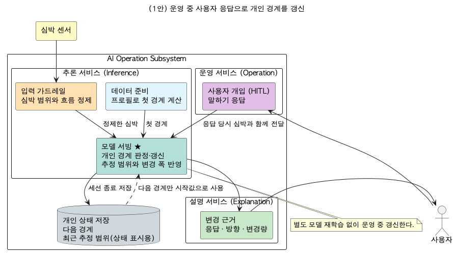
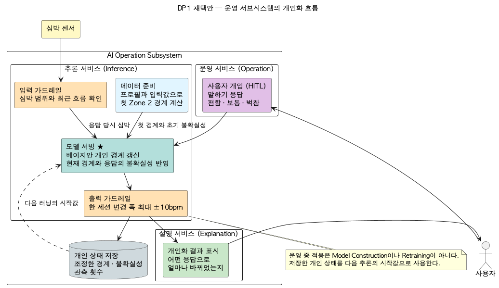
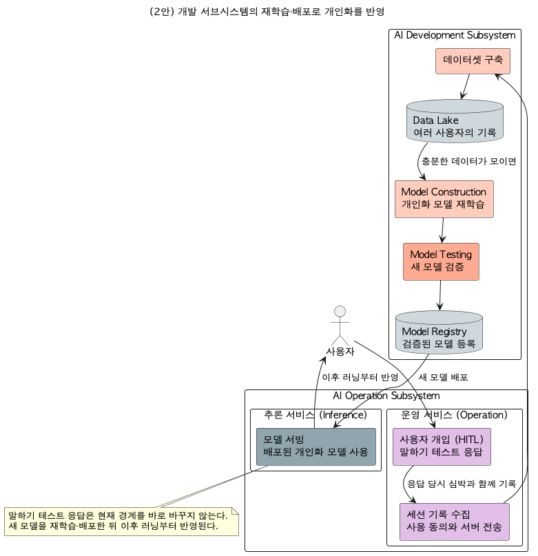

# DP(기능적응성) 설계 보고서 — 개인 Zone 2 경계를 그 사람에게 맞춰가는 아키텍처

> 인증 보고서 "03. 설계 / Architectural Decision"의 DP 파트. 샘플(씬스틸러) DP 슬라이드 형식을 따른다:
> **[설계 문제 정의] → [설계안 결정 표: 구조(다이어그램) / 장점(QA 별점) / 단점(QA 별점) / Trade Off] → [설계 결정 및 근거]**.
> 이 분야를 전혀 모르는 사람도 읽고 이해할 수 있게 쓴다. 이 문서는 **기능적응성 DP 하나에만** 집중한다.
>
> **상태**: v2 (2026-08-03, 리뷰 반영 — 채택안 개별화 도식 + 상세 도식 신설, 표현 교정). 리서치 노트(`dp-03-adaptability-research.md`) 근거.
> DP-01(설명용이성)/DP-02(제어가능성)와 같은 아키텍처의 다른 QA 단면 — 이 DP는 그중 **적응 루프**를 본다.

---

## 0. 읽기 전에 — 30초 배경

- Zone 2 코칭의 기준선인 **개인 Zone 2 경계는 사람마다 다르고, 같은 사람도 체력에 따라 변한다.** 나이로 계산하는 공식은 출발점일 뿐이다 — 같은 나이라도 실제 최대심박은 공식에서 ±10~15bpm 벗어나는 사람이 흔하다(spec-001).
- 그래서 이 앱의 정체성 품질 중 하나가 **기능적응성**이다: 변화를 감지하고, 경계를 그 사람에게 맞춰 옮기고, 안정되게 수렴시키는 능력.
- 어려운 점은 **정답지가 없다는 것**이다. 진짜 경계는 실험실 장비로나 잴 수 있다. 그래서 적응의 근거는 검증할 수 있는 것 — **사용자가 직접 답하는 말하기 테스트**("지금 대화가 편한가요?") — 여야 한다.
- **이 DP = 경계를 개인에게 맞춰가는 적응 루프를 어떤 내부 구조로 만들 것인가** 라는 설계 결정이다. 적응이 어디서(폰 안 vs 서버), 언제(그 자리에서 vs 재학습 주기마다), 무엇을 근거로(사용자 실라벨 vs 수집 데이터 재학습) 일어나는지가 갈린다.

---

## 1. 설계 문제 정의

### 1-1. 배경

**(1) 서비스가 원하는 것**
사용자가 쓸수록 경계가 그 사람에게 맞아가야 한다. 처음에는 나이/안정심박으로 잡은 대략의 출발선에서 시작하지만, 몇 세션 안에 실제 몸에 맞는 자리로 옮겨 가고, 그 뒤에는 흔들리지 않고 안정되어야 한다(감지 → 적응 → 안정).

**(2) 무엇이 어려운가 — 이 문제의 진짜 난도**
- **개인차가 크다**: 나이 공식의 개인 오차가 ±10~15bpm에 이른다(spec-001). 경계가 10bpm 어긋나면 Zone 2 코칭은 다른 운동을 시키는 것과 같다.
- **정답지가 없다**: 진짜 경계를 잴 수 없으니, "적응이 잘 됐는지"를 채점할 외부 기준이 없다. 검증 가능한 근거는 사용자의 실제 답(말하기 테스트)뿐이다.
- **라벨이 드물고 노이즈가 있다**: 말하기 테스트는 세션당 몇 번이고, 주관적 답이라 한 번의 답이 틀릴 수 있다. 적은 라벨로 조금씩, 그러나 폭주 없이 움직여야 한다.
- **온디바이스/비용 0**: 서버 학습 인프라 없이 폰 안에서 적응해야 한다(제약 C01).

**(3) 그래서 생기는 결론**
적응을 "대량 데이터로 미리/주기적으로 학습"에 두면, 개인의 변화가 경계에 반영되기까지 수집→재학습→배포 주기를 기다려야 하고, 재학습의 목적함수를 세울 참값도 없다. 반대로 **적응을 사용자 실라벨 기반의 온라인 갱신으로 폰 안에 두면**, 변화가 그 자리에서 반영되고, 근거가 검증 가능하며, 불확실도와 이동 한도로 폭주를 막을 수 있다.

### 1-2. 문제점 — 적응을 "아무렇게나 만들면 안 되는" 이유

| # | 문제 | 걸리는 제약(spec-001)/품질(spec-002, framework 8대 QA) |
|---|---|---|
| P1 | 나이 공식의 개인 오차가 ±10~15bpm — 고정 경계는 코칭을 틀리게 한다 | **기능적응성**(정체성 QA) — 개인별 수렴 |
| P2 | 몸 상태가 변한다(체력 향상, 컨디션) — 한 번 맞춘 경계도 낡는다 | **기능적응성** — 지속 적응(감지→적응→안정) |
| P3 | 진짜 경계의 참값이 없다 | **C03** — 적응 근거는 검증 가능한 실라벨이어야 |
| P4 | 라벨(말하기 테스트)이 드물고 주관적 | **강건성** — 한 번의 답에 경계가 확 틀어지면 안 됨 |
| P5 | 적응이 왜 그렇게 움직였는지 보여야 한다 | **설명용이성**(DP-01) — 갱신 근거 노출 |
| P6 | 서버 없이 폰 안에서, 비용 0 | **C01, 수행효율성** — 무거운 재학습 불가 |
| P7 | 사용자가 적응을 되돌리거나 제어할 수 있어야 | **제어가능성**(DP-02) — 이동 한도/정정 채널 |

### 1-3. 설계 문제 (한 문장)

> **"개인차가 ±10~15bpm에 이르는 Zone 2 경계를 — 참값 없이, 드물고 주관적인 사용자 라벨만으로, 서버 없이 폰 안에서 — 몇 세션 안에 그 사람에게 수렴시키고 이후 안정되게 유지하는 적응 구조를 무엇으로 할 것인가."**

---

## 2. 두 후보를 공정하게 비교하는 틀

- **바깥 경계(입출력)를 똑같이 고정하고, 안쪽 구조만 다르게 본다.**
  - 입력: 프로필(나이/안정심박), 세션 관측(1Hz 심박/페이스), 말하기 테스트 답.
  - 출력: 개인 Zone 2 경계(하한/상한)와 그 확신 폭 — 판정/코칭이 소비.
- **다이어그램 읽는 법**(두 안 공통 표기법): 각 블록 상단의 «...» = 강의 AI System 아키텍처의 컴포넌트 유형. 색 = 컴포넌트 성격(가드레일=주황, 모델 서빙=파랑(투명)/회색(블랙박스), 운영=보라, 저장=회청, 개발/학습=코랄, 외부=노랑). 실선=데이터 흐름, 점선=제어/적응.
- 품질(QA) 평가는 그림이 아니라 **결정 표의 장점/단점 칸**에서 한다.

---

## 3. (1안) 온라인 베이지안 개인 적응 아키텍처 — 답할 때마다 그 자리에서 조금씩 — ★채택

**한 줄 개념**: 경계를 **평균과 확신 폭(불확실도)을 가진 추정값**으로 들고 다닌다. 처음엔 나이/안정심박으로 대략의 출발선(사전값)을 잡고, 말하기 테스트 답이 들어올 때마다 **베이지안 갱신**으로 그 자리에서 조금씩 옮긴다. 확신이 쌓일수록 조금만 움직이고(자연 수렴), 세션 결과는 저장돼 다음 세션의 출발선이 된다.

> 위 도식은 실제 아키텍처(일반 도식 `arch/diagrams/02b-component-cnc-simple.png`)를 이 DP의 축(기능적응성)이 드러나게 — 베이지안 개인 적응을 중심에 두고 — 개별화한 것이다. 소스 = `images/dp-03-adaptability-adopted-simple.puml`. 상세 컴포넌트 뷰 = `arch/diagrams/02-component-cnc.png`, 컴포넌트 서술 = `arch/component-catalog.md`(A5/E1/F1/D3).

**채택안 상세 설계 — 적응 경로를 하위 모듈(실제 클래스)까지 풀어 그린 도식**:

> 위 추상 도식의 prior/갱신/한도/저장/warm-start 블록을 실제 클래스 단위로 전개한 것. 소스 = `images/dp-03-adaptability-detail.puml`.

**적응 루프가 도는 방식**:

| 단계 | 하는 일 |
|---|---|
| 1. 출발선(콜드스타트) | 나이/안정심박에서 대략의 경계를 계산해 **사전값**으로 삼는다. 문헌 근거가 있는 출발점일 뿐, 확신 폭을 넓게 잡아 "아직 잘 모른다"를 정직하게 표현한다 |
| 2. 감지(라벨) | 달리는 중 말하기 테스트 — "지금 대화가 편한가요?"(편함/보통/벅참). 힘들어지는 문턱의 실제 라벨이다. 보조 신호(심박 드리프트, 기온)는 적응을 부추기는 트리거로만 쓴다 |
| 3. 갱신 | 답이 들어오면 베이지안 공식으로 경계를 옮긴다. **얼마나 옮길지는 두 불확실성(현재 확신 폭 vs 답의 신뢰도)이 공식으로 정한다** — 사람이 정하는 배율 상수가 없다 |
| 4. 안전장치 | 한 세션에 움직일 수 있는 폭에 한도(±10bpm)가 있다. 최대심박은 관측 피크로 위로만, 안정심박은 아래로만 갱신한다 — 엉뚱한 값 하나가 프로필을 망치지 못한다 |
| 5. 안정(세션 간) | 갱신된 경계와 확신 폭이 저장돼 **다음 세션의 출발선**이 된다. 확신이 쌓일수록 한 번의 답에 덜 흔들린다 — 감지→적응→안정이 구조에서 나온다 |

### 3-1. 구조가 문제점(§1-2)을 푸는 방식

| 문제 | 푸는 구조 |
|---|---|
| P1 개인차 | 공식은 출발선일 뿐 — 몇 세션의 실라벨로 그 사람 자리로 이동 |
| P2 몸이 변함 | 적응이 꺼지지 않는다 — 언제든 답이 들어오면 갱신, 확신 폭이 있어 서서히 |
| P3 참값 없음 | 적응 근거가 사용자 실라벨이라 검증 가능 — "그 답에 맞게 움직였나"를 확인할 수 있다 |
| P4 라벨 노이즈 | 확신 폭이 흡수(답 하나의 영향이 제한됨) + 세션당 이동 한도 ±10bpm |
| P5 갱신 근거 노출 | 평균/확신 폭이 그대로 화면에 노출 — "몇 세션에서 몇 번 답해 얼마나 움직였다"(DP-01과 공유) |
| P6 폰/비용 0 | 갱신이 닫힌 공식 몇 줄 — 서버/재학습 인프라 불필요, 계산 비용 사실상 0 |
| P7 사용자 제어 | 라벨 자체가 사용자 입력(개입=적응) + 이동 한도 + 프로필에서 확인/재설정 |

### 3-2. "이게 검증된 접근이냐?" — 근거

- **① 베이지안 온라인 갱신 = 표준 통계 방법**: 사전값을 두고 증거가 들어올 때마다 사후 추정으로 갱신하는 것은 통계학의 표준 절차다(켤레 정규 갱신). "섞는 비율"이 임의 상수가 아니라 두 불확실성에서 공식으로 도출된다 — 이 시스템의 "값은 구조에서 도출" 원칙과 일치한다.
- **② 온라인 적응 vs 주기 재학습**: 변화하는 대상(concept drift)을 다루는 문헌은 온라인/증분 갱신을 표준 대응으로 분류한다. 변화 감지→적응→안정이라는 기능적응성 정의(강의 정본)와 루프 구조가 일치한다.
- **③ 라벨의 검증 가능성**: 말하기 테스트는 운동생리에서 제1환기역치(VT1)의 실용 지표로 검증된 방법이다(Talk Test 문헌). 예측값이 아니라 사용자의 실제 답이라, 참값 없는 조건에서 유일하게 검증 가능한 적응 근거다.
- **④ 사전값의 정직성**: 나이/안정심박 공식은 인구 평균으로 문헌 근거가 있는 출발점이며, 개인 오차(±10~15bpm)가 크다는 것 역시 같은 문헌이 말한다 — 그래서 "출발선 + 개인 적응"의 역할 분담이 성립한다.

**정직한 한계(먼저 인정)**: (1) **모델이 단순하다** — 경계는 소수의 파라미터(평균/확신 폭)라, 복잡한 비선형 개인 패턴(예: 요일/수면과 경계의 상호작용)은 표현하지 못한다. (2) **라벨 품질에 의존한다** — 사용자가 성의 없이 답하면 적응도 그만큼 흐려진다(한도와 확신 폭이 피해를 제한할 뿐). (3) **절대 정확도는 미검증** — 실라벨과의 일치는 확인해도, 실험실 참값과의 일치는 확인할 수 없다(양안 공통, C03).

**장점(QA 별점)**: 기능적응성 ★★★★★ (답한 그 자리에서 갱신, 세션 간 이어짐 — 적응 지연이 분 단위), 수행효율성 ★★★★★ (닫힌 공식 몇 줄 — 서버/네트워크/재학습 비용 0)
**단점(QA 별점)**: 기능정확성 ★★★★ (주관 라벨 노이즈, 절대 정확도 미검증 — 양안 공통), 강건성 ★★★★ (엉뚱한 답의 영향이 남는다 — 한도/확신 폭이 제한하나 0은 아님)

---

## 4. (2안) 오프라인 재학습 개인화 아키텍처 — 모아서 다시 학습해 배포 — 카운터

**한 줄 개념**: 세션 데이터를 서버로 모아 **주기적으로 개인화 모델을 재학습**하고, 새 모델을 배포해 경계를 갱신한다. 배포본 사이에서 경계는 고정이다. 이는 산업계 개인화/추천의 주류 접근(MLOps 재학습 루프)이며, 지어낸 비교 대상이 아니라 **동등하게 진지한 대안**이다 — 사용자가 많고 서버 인프라와 검증 체계가 있는 조건에서는 이쪽이 우선될 수 있다.

> 카운터(2안)는 이 DP 전용 가정 설계다. 상세 컴포넌트 뷰 = `images/dp-03-adaptability-counter-detailed.png`, 컴포넌트 서술 = `dp-03-adaptability-counter-catalog.md`.

**요지**: 많은 사용자의 데이터를 함께 학습하므로(코호트 학습) 비슷한 사람들의 패턴을 빌려올 수 있고, 복잡한 특징(수면/요일/기온의 상호작용)까지 모델이 배울 잠재력이 있다. 대신 개인의 변화가 경계에 반영되는 시점이 **수집→재학습→배포 주기**에 묶이고, 참값이 없어 재학습의 채점 기준을 세우기 어렵다.

**구조가 문제점을 대응하는 방식과 그 비용**:

| 문제 | 2안의 대응 | 남는 비용 |
|---|---|---|
| P1 개인차 | 개인 데이터 + 코호트 데이터로 재학습 | 첫 배포까지는 인구 평균 모델 — 초기 개인화 지연 |
| P2 몸이 변함 | 다음 재학습 주기에 반영 | 변화 감지→반영이 배포 주기(일/주 단위)에 묶임 — 적응 지연 |
| P3 참값 없음 | 라벨 수집 후 학습 데이터로 사용 | 재학습의 목적함수를 세울 참값이 없어, 무엇을 최적화했는지 검증 어려움 |
| P4 라벨 노이즈 | 배치 학습이 평균화 | (이 축은 2안이 유리 — 대량 평균화가 노이즈에 강함) |
| P5 갱신 근거 노출 | 모델 버전/변경 로그 | 경계가 왜 그 값이 됐는지는 재학습 내부에 있어 설명이 어려움 |
| P6 폰/비용 0 | 서버가 계산 | 서버/네트워크/운영 비용 발생 — 제약 C01과 충돌, 세션 데이터 업로드 필요 |
| P7 사용자 제어 | 피드백을 다음 학습에 반영 | 개입→반영 사이에 재학습 주기 — 개입 효과를 그 자리에서 확인 불가 |

**장점(QA 별점)**: 기능정확성 ★★★★ 잠재 (코호트 대량 학습 + 복잡한 특징 반영 — 단 참값 없어 검증 어려움), 강건성 ★★★★ (배치 평균화가 개별 라벨 노이즈에 강함)
**단점(QA 별점)**: 기능적응성 ★★ (적응이 수집→재학습→배포 주기에 묶임), 수행효율성 ★★ (서버/네트워크/재학습 인프라 비용)

---

## 5. 설계안 결정 표 (샘플 슬라이드 형식)

| | **(1안) 온라인 베이지안 개인 적응 ★채택** | (2안) 오프라인 재학습 개인화 |
|---|---|---|
| 적응 방식 | 사용자가 답한 그 자리에서 폰 안 베이지안 갱신 | 데이터를 모아 서버에서 주기 재학습 후 배포 |
| 구조 | §3 다이어그램(일반 아키텍처 참조) | §4 다이어그램 |
| 장점 | 기능적응성 ★★★★★ 수행효율성 ★★★★★ | 기능정확성 ★★★★ 잠재(코호트 학습) 강건성 ★★★★ (배치 평균화) |
| 단점 | 기능정확성 ★★★★ (주관 라벨, 미검증 — 양안 공통) 강건성 ★★★★ (엉뚱한 답의 영향 잔존) | 기능적응성 ★★ (배포 주기에 묶임) 수행효율성 ★★ (서버/재학습 비용) |
| Trade Off | 변화가 분 단위로 반영되고 근거(실라벨)가 검증 가능 확신 폭과 이동 한도로 폭주 방지, 갱신 근거가 화면에 노출 대신 모델이 단순해 복잡한 개인 패턴은 표현 못 함 | 대량/코호트 데이터로 복잡한 패턴까지 배울 잠재력 대신 적응이 배포 주기에 묶이고, 참값 없는 조건에선 그 잠재를 채점할 기준이 없음 서버 인프라/업로드 필요 |

### 5-1. QA 별점 종합 (8대 QA 중 관련 축)

| QA(품질속성) | (1안) 온라인 베이지안 개인 적응 | (2안) 오프라인 재학습 개인화 |
|---|:---:|:---:|
| 기능적응성 (AI 특화, 이 DP의 축) | ★★★★★ | ★★ |
| 수행효율성 | ★★★★★ | ★★ |
| 설명용이성 (AI 특화, DP-01과 정합) | ★★★★★ | ★★ |
| 제어가능성 (AI 특화, DP-02와 정합) | ★★★★★ | ★★★ |
| 강건성 (AI 특화) | ★★★★ | ★★★★ |
| 기능정확성 (AI 특화) | ★★★★ | ★★★★ (잠재, 미검증) |

- **결정축 = 적응 지연(adaptation latency)과 근거의 검증 가능성**: 기능적응성의 정의가 "변화를 감지해 적응하고 안정되는" 능력이므로, 변화→반영의 지연이 분 단위인 1안과 배포 주기 단위인 2안의 차이가 이 축에서 가장 크게 벌어진다. 그리고 참값 없는 조건에서 1안의 근거(실라벨)는 검증 가능하지만 2안의 재학습 목적함수는 채점 기준이 없다.
- **2안 별점(강건성/정확성)이 높은데 종합에서 앞서지 못하는 이유**: 배치 평균화와 코호트 학습은 실질적 강점이다. 다만 그 강점은 "충분한 사용자 수 + 서버 인프라 + 검증 체계"를 전제하는데, 이 시스템에는 셋 다 없다(1인 사용, C01 온디바이스, C03 참값 없음).
- **조건 의존성(공정한 평가)**: 별점은 이 DP의 결정 범위가 해당 QA에 미치는 영향을 이 과제 조건에서 평가한 것이라, 같은 QA 명칭이라도 DP마다 평가 대상 행위가 다르다(예: DP1의 기능적응성=규칙 밖 패턴 학습 능력, DP3의 기능적응성=경계 적응 지연). 이 별점은 *이 시스템의 조건*(단일 사용자/온디바이스/참값 없음/드문 라벨)에 대한 평가다. **조건이 다르면 — 수만 명 사용자, 서버 인프라, 랩 검증 코호트 확보 — 2안이 우선될 수 있다.**

---

## 6. 설계 결정 및 근거

### 6-1. 최종 채택 구조
**(1안) 온라인 베이지안 개인 적응 아키텍처 = 문헌 근거 사전값(콜드스타트) + 말하기 테스트 실라벨 + 베이지안 온라인 갱신(불확실도 동반) + 이동 한도 + 세션 간 이어달리기(저장→다음 출발선)** 를 채택한다. 경계 적응을 서버 재학습에 위임하지 않는다.

### 6-2. 채택 근거 (2안 대비)
- **적응이 그 자리에서 일어난다.** 사용자가 답한 순간 경계가 움직이고, 얼마나 움직였는지 바로 보인다. 2안은 같은 답이 다음 재학습/배포를 기다린다.
- **근거가 검증 가능하다.** 적응의 라벨이 사용자 실제 답이라 "답에 맞게 움직였는가"를 확인할 수 있다. 참값 없는 조건에서 재학습의 목적함수는 이 검증 가능성이 없다.
- **폭주하지 않는 구조다.** 움직이는 폭이 두 불확실성의 공식에서 나오고(임의 배율 없음), 세션당 한도가 있으며, 확신이 쌓일수록 스스로 덜 흔들린다 — 감지→적응→안정이 구조에서 나온다.
- **제약과 맞는다.** 갱신이 닫힌 공식 몇 줄이라 서버 없이 폰 안에서 비용 0으로 돈다(C01). 세션 데이터가 기기를 떠나지 않는다.
- **DP-01/DP-02와 같은 구조에서 나온다.** 적응 상태(평균/확신 폭)가 그대로 노출되어 설명이 되고(DP-01), 이동 한도와 라벨 채널이 통제가 된다(DP-02) — 세 정체성 QA가 한 설계에서 나온다.

### 6-3. 예상 질문
- **"데이터를 모아 학습하면 더 정확해지지 않나?"** — 사용자가 많고 검증 체계가 있으면 그렇다(2안의 실제 강점). 이 조건(1인, 참값 없음)에서는 코호트도 채점 기준도 없어 그 잠재를 확인할 수 없고, 개인의 변화 반영은 오히려 느려진다.
- **"말하기 테스트 답이 틀리면 어떻게 되나?"** — 답 하나의 영향은 확신 폭이 제한하고, 세션당 이동 한도(±10bpm)가 추가로 막는다. 여러 세션에 걸쳐 일관되게 틀리게 답하면 경계도 그쪽으로 가지만, 그 경우에도 화면에 노출된 갱신 이력으로 확인/재설정할 수 있다.
- **"공식(나이 기반)만으로 충분하지 않나?"** — 공식의 개인 오차가 ±10~15bpm에 이른다는 것이 문헌과 정본(spec-001)의 결론이다. 공식은 첫 세션의 출발선으로만 쓰고, 이후는 그 사람의 실제 답이 경계를 결정한다.

### 6-4. 보완 계획
- **수렴 지표**: 시뮬레이션으로 이미 재 두었다 — 기준 사례 수렴 오차 12.9→1.73bpm, 참임계 5종×시드 3종 스윕 전부 1~2세션 안착, 오답 라벨 10% 주입에도 최종 0.09bpm(report-015 QA2). 잔여 = 실주행 데이터로 같은 지표 재측정(spec-012).
- **라벨 품질 보강**: 말하기 테스트 안내 문구/타이밍을 다듬어 성의 있는 답을 받기 쉽게 한다(라벨 노이즈 원천 축소).
- **보조 신호 트리거 확장**: 드리프트/기온 외에 세션 간 추세(서브맥시멀 심박 하락 = 체력 향상 신호)를 적응 트리거로 승격하는 것을 검토한다 — 판단은 여전히 실라벨이 한다.

---

## 부록 A. 근거 문헌
- 베이지안 켤레 갱신(정규-정규) — 표준 통계 교과 절차(Gelman et al., *Bayesian Data Analysis*). 갱신 가중이 두 분산에서 도출(임의 상수 없음).
- Concept drift 대응으로서의 온라인/증분 학습 — Gama et al., *A Survey on Concept Drift Adaptation*, ACM Computing Surveys (2014).
- 말하기 테스트(Talk Test) = 제1환기역치(VT1) 실용 지표 — Persinger et al. (2004), 이후 체계적 리뷰(2022)에서 지지.
- 나이 기반 최대심박 공식의 개인 오차 — Tanaka, Monahan, Seals (2001): 208 − 0.7×나이, 개인 표준편차 ±10bpm 수준.
- 강의 정본 — 기능적응성 = 변화 감지→적응→안정(진화적 적응), `framework/ai-8-qa.md`.
> 리서치 원본/링크 = `dp-03-adaptability-research.md`.

## 부록 B. 용어 한 줄 사전
- **기능적응성(functional adaptability)**: 환경/대상의 변화를 감지하고 스스로 적응해 안정 상태로 수렴하는 능력(강의 8대 QA).
- **사전값(prior)**: 데이터를 보기 전의 첫 짐작. 이 시스템은 나이/안정심박 공식으로 잡고, 확신 폭을 넓게 두어 "아직 모른다"를 표현한다.
- **베이지안 갱신**: 증거가 들어올 때마다 짐작을 고치는 표준 통계 방법. 움직이는 폭이 두 불확실성에서 공식으로 나온다.
- **콜드스타트(cold start)**: 데이터가 없는 첫 사용 상태. 사전값이 이때의 출발선.
- **온라인 학습 vs 배치 재학습**: 표본이 올 때마다 즉시 갱신 vs 모아서 주기적으로 다시 학습.
- **적응 지연(adaptation latency)**: 변화 발생→경계 반영까지의 시간. 이 DP의 결정축.
- **코호트 학습**: 비슷한 사용자들의 데이터를 함께 학습해 개인 추정을 보강하는 방식(2안의 강점).

> 관련 문서: `dp-03-adaptability-research.md`(리서치), `arch/component-catalog.md`(1안=우리 시스템 A5/E1/F1/D3)/`dp-03-adaptability-counter-catalog.md`(2안 카운터), `images/`(1안 개별화 채택안 도식 + 상세 도식, 2안 카운터 도식)/`arch/diagrams/`(일반 아키텍처 도식), `spec/spec-002`(QA2 시나리오/측정), `spec/spec-004`(경계 갱신), `spec/spec-013`(사전값 층위), `spec/spec-016`(말하기 테스트), `arch/adr-004`(온라인 Bayesian), `arch/adr-012`(최대/안정심박 갱신), `arch/adr-025`(AI≠NN), `arch/dp/dp-01-explainability/`/`arch/dp/dp-02-controllability/`(같은 구조의 다른 QA 단면).
