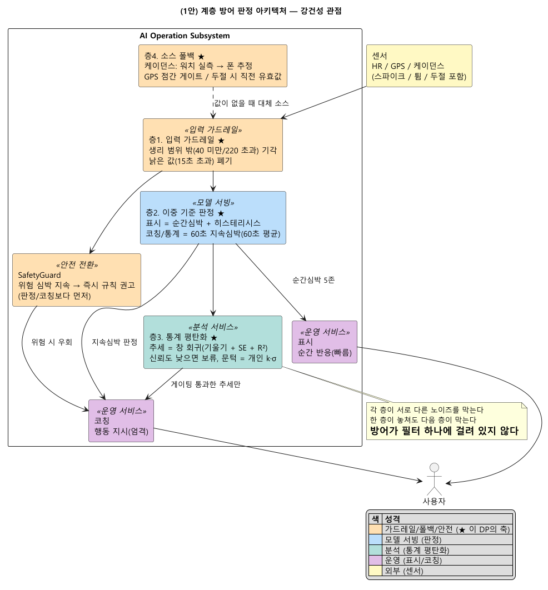
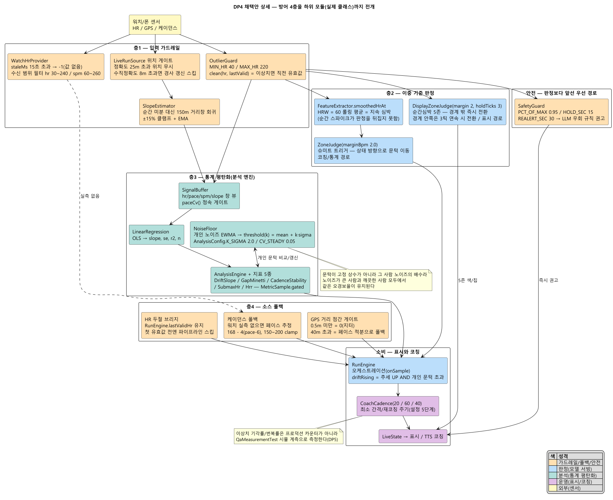
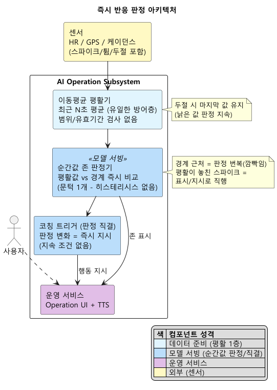

# DP(강건성) 설계 보고서 — 노이즈 섞인 신호에서 판정이 무너지지 않는 아키텍처

> 인증 보고서 "03. 설계 / Architectural Decision"의 DP 파트. 샘플(씬스틸러) DP 슬라이드 형식을 따른다:
> **[설계 문제 정의] → [설계안 결정 표: 구조(다이어그램) / 장점(QA 별점) / 단점(QA 별점) / Trade Off] → [설계 결정 및 근거]**.
> 이 분야를 전혀 모르는 사람도 읽고 이해할 수 있게 쓴다. 이 문서는 **강건성 DP 하나에만** 집중한다.
>
> **상태**: v2 (2026-08-03, 리뷰 반영 — 채택안 개별화 도식 + 상세 도식 신설, 60초 기준의 실제 구현 정정[지속 조건 타이머가 아니라 60초 평균]). 리서치 노트(`dp-04-robustness-research.md`) 근거.
> DP-01/02/03과 같은 아키텍처의 다른 QA 단면 — 이 DP는 그중 **입력에서 판정까지의 방어 구조**를 본다.

---

## 0. 읽기 전에 — 30초 배경

- 이 앱의 입력은 깨끗하지 않다. **손목 광학 심박계는 달리는 중 팔 흔들림으로 값이 튀는 것이 알려진 한계**이고, GPS 고도/페이스도 잡음이 섞이며, 워치-폰 연결이 잠깐 끊기기도 한다.
- 판정 결과는 표시로 끝나지 않고 **"속도를 줄이세요" 같은 행동 지시(코칭)로 이어진다.** 튄 값 하나가 코칭까지 직행하면, 사용자는 노이즈에 맞춰 달리게 된다.
- 경계 근처에서는 더 어렵다 — 심박이 경계를 오르내릴 때마다 판정이 초 단위로 뒤집히면(깜빡임), 화면도 코칭도 신뢰를 잃는다.
- 강건성이라는 품질은 "이상하거나 노이즈 섞인 입력에도 기능이 무너지지 않는 정도"를 말한다(AI 8대 QA).
- **이 DP = 노이즈가 일상인 입력에서 판정과 코칭을 지키는 구조를 무엇으로 할 것인가** 라는 설계 결정이다. 즉시 반응할 것인가, 층을 두고 걸러서 반응할 것인가가 갈린다.

---

## 1. 설계 문제 정의

### 1-1. 배경

**(1) 입력의 현실**
1Hz로 들어오는 심박/페이스/케이던스/고도 중 어느 것도 항상 깨끗하지 않다. 손목 심박은 순간 스파이크(예: 갑자기 220)가 나고, GPS는 고도를 몇 미터씩 튀기며, 신호가 몇 초씩 끊기는 것도 정상 운영 범위다.

**(2) 무엇이 어려운가 — 이 문제의 진짜 난도**
- **오판의 비용이 비대칭이다**: 판정이 조금 늦는 것(반응 지연)보다, 튄 값으로 잘못된 지시를 내보내는 것(오판)이 더 나쁘다 — 코칭은 행동 지시이기 때문이다.
- **깜빡임(flicker)**: 심박이 경계 근처에 있으면 순간값 판정은 초 단위로 뒤집힌다. 화면 표시는 참을 수 있어도, 코칭이 "올려라/내려라"를 번갈아 말하면 신뢰가 무너진다.
- **노이즈 크기가 사람마다 다르다**: 손목 밀착도/피부에 따라 심박 노이즈 폭이 다르다. 고정된 필터 하나로 모두를 맞출 수 없다.
- **참값이 없다**: 어느 판정이 "맞았는지" 채점할 기준이 없으므로, 강건성은 정확도가 아니라 **판정의 일관성(번복 억제, 이상값 차단)**으로 세워야 한다.

**(3) 그래서 생기는 결론**
방어를 필터 하나에 맡기면, 그 필터가 놓친 노이즈가 그대로 지시가 된다. 반대로 **성격이 다른 방어를 층으로 겹치면**(범위 밖 차단 → 지속심박 판정 → 통계 평탄화 → 소스 폴백), 각 층이 서로 다른 노이즈를 막고, 한 층이 놓쳐도 다음 층이 막는다.

### 1-2. 문제점 — 판정을 "순간값에 직결하면 안 되는" 이유

| # | 문제 | 걸리는 제약(spec-001)/품질(spec-002, framework 8대 QA) |
|---|---|---|
| P1 | 손목 심박의 순간 스파이크(생리적으로 불가능한 값) | **강건성** — 이상 입력 차단(입력 가드레일) |
| P2 | 경계 근처 깜빡임 — 판정이 초 단위로 번복 | **강건성** — Flicker Rate 억제(히스테리시스) |
| P3 | 오판이 행동 지시로 직행 — 코칭은 표시보다 비용이 큼 | **제어가능성** — 코칭은 더 엄격한 기준(60초 지속심박) |
| P4 | 노이즈 폭이 사람마다 다름 | **기능적응성** — 개인별 자가 보정(k·σ) |
| P5 | 신호 두절/센서 부재가 정상 운영 범위 | **강건성** — 소스 폴백(기능 유지) |
| P6 | 참값이 없어 "맞았는지" 채점 불가 | **C03** — 강건성 지표는 일관성(번복/기각률)으로 |
| P7 | 방어가 과하면 진짜 변화도 늦게 반영 | **수행효율성** — 방어 비용의 정직한 인정 |

### 1-3. 설계 문제 (한 문장)

> **"스파이크/깜빡임/두절이 일상인 손목 심박과 GPS 신호에서 — 참값 없이, 오판이 행동 지시로 직행하는 조건에서 — 판정의 일관성을 지키면서 진짜 변화는 놓치지 않는 입력-판정 구조를 무엇으로 할 것인가."**

---

## 2. 두 후보를 공정하게 비교하는 틀

- **바깥 경계(입출력)를 똑같이 고정하고, 안쪽 구조만 다르게 본다.**
  - 입력: 1Hz 원시 신호(심박/페이스/케이던스/고도) — 노이즈/두절 포함.
  - 출력: 존 판정(표시), 코칭 트리거(행동 지시), 분석 지표.
- **다이어그램 읽는 법**(두 안 공통 표기법): 각 블록 상단의 «...» = 강의 AI System 아키텍처의 컴포넌트 유형. 색 = 컴포넌트 성격(가드레일=주황, 모델 서빙=파랑, 운영=보라, 저장=회청, 외부=노랑). 실선=데이터 흐름, 점선=제어.
- 품질(QA) 평가는 그림이 아니라 **결정 표의 장점/단점 칸**에서 한다.

---

## 3. (1안) 계층 방어 판정 아키텍처 — 성격이 다른 방어를 겹친다 — ★채택

**한 줄 개념**: 입력에서 판정까지 **네 층의 방어**를 겹친다 — ① 있을 수 없는 값을 문에서 버리고(입력 가드레일), ② 표시와 코칭의 기준을 분리해 코칭은 최근 60초 평균 심박으로 판정하며(이중 기준 + 히스테리시스), ③ 추세는 순간값이 아니라 창 통계로 읽고 신뢰도(불확실도)를 함께 계산하며(통계 평탄화, 개인별 k·σ 자가 보정), ④ 센서가 빠지면 다음 소스로 갈아탄다(소스 폴백). 각 층은 서로 다른 노이즈를 막는다.

> 위 도식은 실제 아키텍처(일반 도식 `arch/diagrams/02b-component-cnc-simple.png`)를 이 DP의 축(강건성)이 드러나게 — 입력에서 판정까지의 방어 4층을 중심에 두고 — 개별화한 것이다. 소스 = `images/dp-04-robustness-adopted-simple.puml`. 상세 컴포넌트 뷰 = `arch/diagrams/02-component-cnc.png`, 컴포넌트 서술 = `arch/component-catalog.md`(A1/A2/A3/A4/A6).

**채택안 상세 설계 — 방어 4층을 하위 모듈(실제 클래스)까지 풀어 그린 도식**:

> 위 추상 도식의 네 층을 실제 클래스 단위로 전개한 것(층1 OutlierGuard/WatchHrProvider/SlopeEstimator, 층2 FeatureExtractor+ZoneJudge/DisplayZoneJudge, 층3 SignalBuffer+LinearRegression+NoiseFloor+AnalysisEngine, 층4 폴백 3종). 소스 = `images/dp-04-robustness-detail.puml`.

**방어 4층** (각 층은 서로 다른 노이즈를 막는다):

| 층 | 장치 | 막는 것 |
|---|---|---|
| 1. 입력 가드레일 | 생리 범위 밖 값(심박 40 미만/220 초과) 기각, 너무 오래된 값(15초 초과) 폐기 | 순간 스파이크, 낡은 값 |
| 2. 이중 기준 판정 | 표시는 순간심박 + 히스테리시스(경계에 들어올 때와 나갈 때 문턱이 다름), **코칭/통계는 60초 지속심박(최근 60초 평균)** — 잠깐 스친 값은 평균을 거의 못 움직인다 | 경계 근처 깜빡임, 순간 이탈의 지시 직행 |
| 3. 통계 평탄화 | 추세(드리프트 등)는 시간 창의 회귀 기울기로 읽고 **신뢰도(기울기의 표준오차/설명력)를 함께 계산** — 신뢰도가 낮으면 판단 보류. 노이즈 문턱은 개인별 관측 노이즈의 배수(k·σ)로 자가 보정 | 잡음을 추세로 오독, 사람마다 다른 노이즈 폭 |
| 4. 소스 폴백 | 케이던스는 워치 실측이 없으면 폰 추정으로, GPS 거리는 점간 게이트(비정상 점프 폐기)로, 신호 두절 시 폴백 값으로 기능 유지 | 센서 부재/두절, GPS 튐 |

### 3-1. 구조가 문제점(§1-2)을 푸는 방식

| 문제 | 푸는 구조 |
|---|---|
| P1 스파이크 | 층1이 문에서 기각 — 뒤 단계는 깨끗한 값만 받는다 |
| P2 깜빡임 | 층2 히스테리시스 — 들어올 때/나갈 때 문턱을 다르게 해 경계 근처 번복 억제 |
| P3 지시 직행 | 층2 이중 기준 — 표시는 순간심박으로 빠르게, 코칭은 60초 평균 심박으로 |
| P4 개인차 | 층3 k·σ — 노이즈 문턱이 그 사람의 관측 노이즈에서 도출(고정 상수 없음) |
| P5 두절/부재 | 층4 폴백 사다리 — 최악의 경우에도 기능이 이어진다 |
| P6 참값 없음 | 강건성 지표를 일관성으로 정의 — 이상치 기각률/판정 번복률을 시뮬 폐루프로 측정 |
| P7 과방어 | 표시 경로는 순간값(빠름) 유지 — 지연은 행동 지시(코칭)에만 지불 |

### 3-2. "이게 검증된 접근이냐?" — 근거

- **① 히스테리시스 = 표준 기법**: 문턱 근처 번복(chattering)을 막는 이중 문턱은 신호처리/제어의 고전 표준(슈미트 트리거)이다. 층2가 이 기법의 직접 적용이다.
- **② 시간 필터와 데드밴드 = 경보 관리 표준**: 산업 경보 관리 표준(ISA-18.2)은 오경보 억제 수단으로 **시간 필터**(지속 시간 조건 on-delay)와 **데드밴드**를 표준으로 제시한다. 이 시스템은 같은 두 수단을 각각 **60초 평균**(시간 필터)과 **히스테리시스**(데드밴드)로 구현했다 — 순간 이탈이 지시가 되지 않게 한다는 목적이 같다. **정확히 하면, 우리 것은 "60초 동안 지속되어야 발동"하는 on-delay 타이머가 아니라 60초 이동평균이다**(`FeatureExtractor.smoothedHrAt`, HRW=60). 타이머는 상태가 유지된 시간을 세고, 평균은 최근 60초의 무게중심을 본다 — 잠깐 스친 값이 판정을 못 바꾼다는 효과는 같지만 수단이 다르므로, 표준을 그대로 적용했다고 말하지 않는다.
- **③ k·σ = 통계적 공정 관리(SPC)의 관리한계**: 이상 여부를 고정 상수가 아니라 관측 산포의 배수로 판정하는 것은 관리도(Shewhart)의 표준 규율이다 — 사람마다 노이즈가 달라도 문턱이 자가 보정된다.
- **④ 신뢰도 동반 추정**: 추세를 기울기 하나로 읽지 않고 표준오차/설명력과 함께 읽어, 신뢰도가 낮으면 판단을 보류한다 — 회귀 추정의 표준 규율이며, "없는 숫자 금지" 원칙(불확실한 값으로 단정하지 않음)과 일치한다.
- **⑤ 손목 광학 심박의 한계는 문헌 합의**: 운동 중 모션 아티팩트는 손목 PPG의 알려진 한계로, 검증 연구들이 일관되게 보고한다 — 방어 계층이 없는 직결 설계가 이 조건에서 위험하다는 전제의 근거다.

**정직한 한계(먼저 인정)**: (1) **코칭 반응이 최대 60초 늦는다** — 60초 평균이 새 상태로 다 채워지기까지 걸리는 시간이고(경계를 넘는 시점은 대략 그 절반), 시간 필터의 직접 비용이다. 이 시스템은 "코칭이 조금 늦는 것"을 "잘못된 지시"보다 낫다고 보고 이 비용을 의도적으로 지불한다(표시는 순간값이라 화면 반응은 빠름). (2) **진짜 급변도 완만하게 반영된다** — 층이 진짜 변화와 노이즈를 완벽히 구별하지는 못한다. 급변 중 위험 신호(고심박 지속)는 별도 안전 규칙이 감시한다. (3) **층이 늘수록 검증 부담이 는다** — 각 층을 독립 모듈로 두고 층별 단위 테스트로 관리한다(테스트가능성과 공유). (4) **최적점은 미검증** — 문턱/창 크기 상수는 문헌 근거 출발점이고, 실주행 데이터로 튜닝할 대상이다.

**장점(QA 별점)**: 강건성 ★★★★★ (층별 방어 — 이상치 차단/번복 억제/두절 유지), 테스트가능성 ★★★★ (층 = 독립 모듈이라 층별 검증 가능, 시뮬로 노이즈 주입 검증)
**단점(QA 별점)**: 수행효율성 ★★★★ (코칭 반응 최대 60초 지연 — 의도된 비용, 계산 부담은 경미), 기능정확성 ★★★★ (과방어 시 진짜 변화도 늦게 반영 — 최적점 미검증, 양안 공통)

---

## 4. (2안) 즉시 반응 판정 아키텍처 — 짧게 다듬고 바로 반응 — 카운터

**한 줄 개념**: 원시 신호를 **짧은 이동평균 한 층**으로 다듬은 뒤, 순간값을 경계와 바로 비교해 판정하고 코칭까지 그대로 잇는다. 구조가 단순하고 반응이 빠르다. 지어낸 비교 대상이 아니라 **동등하게 진지한 대안**이다 — 센서가 깨끗하고(가슴 스트랩 심전도 등) 출력이 표시 위주라면 이쪽이 우선될 수 있다.

> 카운터(2안)는 이 DP 전용 가정 설계다. 상세 컴포넌트 뷰 = `images/dp-04-robustness-counter-detailed.png`, 컴포넌트 서술 = `dp-04-robustness-counter-catalog.md`.

**요지**: 변화가 판정과 코칭에 즉시 반영되고(지연 수 초), 구현/이해/검증이 쉽다. 대신 방어가 평활 하나뿐이라, 평활이 놓친 노이즈는 그대로 판정과 지시가 된다 — 오판 억제를 반응 속도와 맞바꾼 구조다.

**구조가 문제점을 대응하는 방식과 그 비용**:

| 문제 | 2안의 대응 | 남는 비용 |
|---|---|---|
| P1 스파이크 | 이동평균이 희석 | 평균 창이 짧으면 스파이크가 새고, 길면 반응성 상실 — 한 파라미터가 둘을 다 못 잡음 |
| P2 깜빡임 | (대응 없음 — 순간값 비교) | 경계 근처에서 판정이 초 단위 번복 — 표시/코칭 신뢰 저하 |
| P3 지시 직행 | 표시와 코칭이 같은 값 사용 | 튄 값이 행동 지시로 직행할 수 있음 |
| P4 개인차 | 평활 창은 전역 고정 | 노이즈 큰 사용자는 오판 잦고, 깨끗한 사용자는 불필요한 지연 |
| P5 두절/부재 | 마지막 값 유지 | 두절이 길면 낡은 값으로 판정 지속 — 유효성 판단 없음 |
| P6 참값 없음 | (동일 조건) | 번복률이 높아도 "정확하다"고 주장할 기준이 없음 |
| P7 반응성 | 강점 — 수 초 내 반영 | (이 축은 2안이 우위) |

**장점(QA 별점)**: 수행효율성 ★★★★★ (지연 수 초, 계산 최소, 구조 단순), 기능정확성 ★★★ 잠재 (진짜 급변을 놓치지 않음 — 단 노이즈와 급변을 구별 못 함)
**단점(QA 별점)**: 강건성 ★★ (깜빡임/스파이크 통과 — 방어가 평활 하나), 제어가능성 ★★★ (오판이 지시로 직행 — 억제 층 없음)

---

## 5. 설계안 결정 표 (샘플 슬라이드 형식)

| | **(1안) 계층 방어 판정 ★채택** | (2안) 즉시 반응 판정 |
|---|---|---|
| 방어 방식 | 범위 차단 + 이중 기준/히스테리시스 + 통계 평탄화(개인 k·σ) + 소스 폴백 — 4층 | 짧은 이동평균 한 층 후 순간값 직결 |
| 구조 | §3 다이어그램(실제 아키텍처를 강건성 관점으로 개별화 + 상세 전개) | §4 다이어그램 |
| 장점 | 강건성 ★★★★★ 테스트가능성 ★★★★ (층별 독립 검증) | 수행효율성 ★★★★★ (수 초 반응, 단순) 기능정확성 ★★★ 잠재(급변 즉시 반영) |
| 단점 | 수행효율성 ★★★★ (코칭 최대 60초 지연 — 의도된 비용) 기능정확성 ★★★★ (과방어 위험, 최적점 미검증 — 양안 공통) | 강건성 ★★ (깜빡임/스파이크 통과) 제어가능성 ★★★ (오판이 지시로 직행) |
| Trade Off | 오판이 행동 지시가 되는 것을 구조로 막는다 노이즈 문턱이 개인별로 자가 보정된다 대신 코칭 반응이 최대 60초 늦는다(의도적 선택) | 변화가 수 초 안에 반영되고 구조가 단순하다 대신 평활이 놓친 노이즈가 그대로 지시가 된다 경계 근처 번복을 막을 장치가 없다 |

### 5-1. QA 별점 종합 (8대 QA 중 관련 축)

| QA(품질속성) | (1안) 계층 방어 판정 | (2안) 즉시 반응 판정 |
|---|:---:|:---:|
| 강건성 (AI 특화, 이 DP의 축) | ★★★★★ | ★★ |
| 제어가능성 (AI 특화, DP-02와 정합) | ★★★★★ | ★★★ |
| 테스트가능성 (일반) | ★★★★ | ★★★ |
| 기능적응성 (AI 특화 — 개인 k·σ) | ★★★★ | ★★ |
| 수행효율성 (일반) | ★★★★ | ★★★★★ |
| 기능정확성 (AI 특화) | ★★★★ | ★★★ (잠재, 미검증) |

- **결정축 = 오판 비용의 비대칭**: 이 시스템의 출력은 행동 지시라, "조금 늦는 것"과 "틀리게 지시하는 것" 중 후자가 더 비싸다. 1안은 지연을 지불하고 오판을 억제하며, 2안은 그 반대다. 출력이 표시뿐이라면 이 비대칭이 사라져 2안이 유리해진다.
- **1안 수행효율성이 4점인 이유**: 계산 부담은 경미하나(창 통계는 스트리밍 계산), 코칭 반응 지연(최대 60초)이 실재하는 비용이라 만점을 주지 않았다. 이 지연은 결함이 아니라 선택이다 — 표시 경로는 순간값이라 화면은 빠르다.
- **조건 의존성(공정한 평가)**: 별점은 이 DP의 결정 범위가 해당 QA에 미치는 영향을 이 과제 조건에서 평가한 것이라, 같은 QA 명칭이라도 DP마다 평가 대상 행위가 다르다(예: DP1의 기능적응성=규칙 밖 패턴 학습 능력, DP3의 기능적응성=경계 적응 지연). 이 별점은 *이 시스템의 조건*(손목 광학 심박/야외 GPS/출력=행동 지시/참값 없음)에 대한 평가다. **조건이 다르면 — 가슴 스트랩 심전도급 신호, 출력이 기록/표시 위주, 반응 즉시성이 최우선 — 2안이 우선될 수 있다.**

---

## 6. 설계 결정 및 근거

### 6-1. 최종 채택 구조
**(1안) 계층 방어 판정 아키텍처 = 입력 가드레일(범위/유효기간) + 이중 기준 판정(표시=순간심박+히스테리시스 / 코칭·통계=60초 지속심박) + 통계 평탄화(창 회귀 + 신뢰도 + 개인 k·σ) + 소스 폴백 사다리** 를 채택한다. 판정과 코칭을 순간값에 직결하지 않는다.

### 6-2. 채택 근거 (2안 대비)
- **오판 비용이 비대칭이다.** 코칭은 행동 지시라 잘못된 지시가 늦은 지시보다 비싸다. 1안은 이 비대칭에 맞게 표시(빠름)와 코칭(엄격)의 기준을 분리했다. 2안은 두 출력이 같은 값에 매여 있다.
- **한 층으로는 못 막는다.** 스파이크/깜빡임/추세 오독/두절은 성격이 다른 노이즈라 막는 장치도 달라야 한다. 평활 하나는 창 길이 하나로 이 모두와 싸워야 하고, 어느 쪽으로 조정해도 반대쪽이 뚫린다.
- **개인차에 자가 보정된다.** 노이즈 문턱이 고정 상수가 아니라 그 사람 관측 노이즈의 배수(k·σ)라, 노이즈 큰 사용자와 깨끗한 사용자 모두에서 같은 오경보율을 유지한다. 2안의 전역 고정 창은 이것이 안 된다.
- **검증할 수 있는 강건성이다.** 참값 없는 조건에서 강건성을 일관성 지표(이상치 기각률, 판정 번복률)로 정의했고, 층별 독립 모듈이라 시뮬로 노이즈를 주입해 층마다 검증한다(테스트가능성과 공유).
- **표준 기법의 조립이다.** 히스테리시스(슈미트 트리거), 시간 필터(경보 관리 표준의 오경보 억제 수단), k·σ(관리도) — 각 층이 검증된 표준 기법이라, 근거 없는 자체 발명이 없다.

### 6-3. 예상 질문
- **"코칭이 60초 늦으면 이미 늦은 것 아닌가?"** — Zone 2 훈련의 목적은 초 단위 반응이 아니라 강도 유지다. 이 시스템은 "조금 늦은 올바른 지시"가 "빠른 잘못된 지시"보다 낫다고 판단했고, 위험 심박 같은 안전 상황은 별도 규칙이 즉시 감시한다. 표시는 순간값이라 화면 반응은 빠르다.
- **"이동평균 창을 잘 고르면 2안도 충분하지 않나?"** — 창 하나로는 스파이크 억제(긴 창 유리)와 반응성(짧은 창 유리)을 동시에 잡을 수 없고, 경계 근처 번복은 창 길이와 무관하게 남는다(문턱이 하나라서). 번복 억제는 평활의 문제가 아니라 판정 규칙(히스테리시스)과 판정 입력(순간값이냐 60초 평균이냐)을 나누는 문제다.
- **"층이 많으면 어디서 뭐가 버려졌는지 알 수 없지 않나?"** — 각 층의 기각/보류가 기록되고(입력 기각 카운트, 분석 게이팅 사유), 층별 모듈이 분리돼 있어 어느 층이 왜 개입했는지 추적할 수 있다(설명용이성과 공유).

### 6-4. 보완 계획
- **일관성 지표**: 시뮬레이션으로 이미 재 두었다 — 이상치 기각율 100%(오탐 0/500), 번복 억제율 67~75%(시드 5종, 진짜 이동 1틱 — report-015 QA4). 진동 노이즈 크기(정현 2bpm+백색 σ1.5bpm)는 설계 선택(종류 C)이며 실주행 분포로 갱신한다. 잔여 = 실주행 데이터 재측정.
- **상수 필드 튜닝**: 판정 평균 창(60초)/히스테리시스 폭/게이트 문턱은 문헌 근거 출발점(종류 C)이며, 실주행 기각/번복 기록으로 튜닝한다.
- **두절 UX 보강**: 두절이 길어질 때 판정 보류를 사용자에게 알리는 표시(낡은 값으로 조용히 판정하지 않기)를 다듬는다.

---

## 부록 A. 근거 문헌
- 히스테리시스(이중 문턱)로 문턱 근처 번복 억제 — 슈미트 트리거, 신호처리/제어 표준 기법.
- 경보의 시간 필터(on-delay)/데드밴드로 오경보 억제 — ISA-18.2 (Management of Alarm Systems for the Process Industries). 이 시스템의 대응 수단 = 60초 평균(시간 필터) + 히스테리시스(데드밴드) — §3-2 ② 참조.
- 관리한계를 산포의 배수(k·σ)로 — Shewhart 관리도, 통계적 공정 관리(SPC) 표준.
- 회귀 기울기의 표준오차/설명력 동반 보고 — 회귀 분석 표준 규율(추정 불확실도 동반).
- 손목 PPG의 운동 중 모션 아티팩트 — 광학 심박 검증 연구들의 일관된 보고(가슴 스트랩 대비 오차 증가).
- 강의 정본 — 강건성 = 이상/노이즈 입력에서의 기능 유지, `framework/ai-8-qa.md`.
> 리서치 원본/링크 = `dp-04-robustness-research.md`.

## 부록 B. 용어 한 줄 사전
- **강건성(robustness)**: 이상하거나 노이즈 섞인 입력에도 기능이 무너지지 않는 정도(강의 8대 QA).
- **히스테리시스(hysteresis)**: 상태에 들어올 때와 나갈 때 문턱을 다르게 두어, 경계 근처에서 판정이 촐랑거리지 않게 하는 기법.
- **깜빡임(flicker)**: 값이 문턱 근처를 오갈 때 판정이 초 단위로 번복되는 현상. 이 DP의 핵심 억제 대상.
- **지속심박**: 코칭과 통계가 보는 판정 입력 — 최근 60초 심박의 평균. 순간값 대신 이것을 보기 때문에 잠깐 스친 값이 지시를 만들지 못한다(표시는 순간심박을 그대로 쓴다).
- **시간 필터**: 순간 이탈이 경보/지시가 되지 않도록 시간축에서 거르는 장치의 총칭. 표준(ISA-18.2)의 대표 수단은 on-delay 타이머이고, 이 시스템은 60초 평균으로 같은 목적을 달성한다.
- **k·σ(개인 노이즈 배수)**: 문턱을 고정 상수가 아니라 그 사람 관측 노이즈(σ)의 배수로 두는 것 — 사람마다 자가 보정.
- **이동평균(moving average)**: 최근 N개 값의 평균으로 신호를 다듬는 가장 단순한 평활 — 2안의 유일한 방어층.
- **소스 폴백**: 주 센서가 없거나 끊기면 다음 소스(추정값 등)로 갈아타 기능을 유지하는 것.

> 관련 문서: `dp-04-robustness-research.md`(리서치), `arch/component-catalog.md`(1안=우리 시스템 A1/A2/A3/A4/A6)/`dp-04-robustness-counter-catalog.md`(2안 카운터), `images/`(1안 개별화 채택안 도식 + 상세 도식, 2안 카운터 도식)/`arch/diagrams/`(일반 아키텍처 도식), `spec/spec-002`(QA4 시나리오/측정), `spec/spec-003`(입력 가드레일/staleness), `spec/spec-001` FR2(이중 기준 판정), `arch/adr-013`/`arch/adr-023`(히스테리시스), `arch/adr-024`(분석 엔진 노이즈 게이팅/k·σ), `spec/spec-025`(분석 상수 근거), `arch/dp/dp-01-explainability/`~`dp-03-adaptability/`(같은 구조의 다른 QA 단면).
