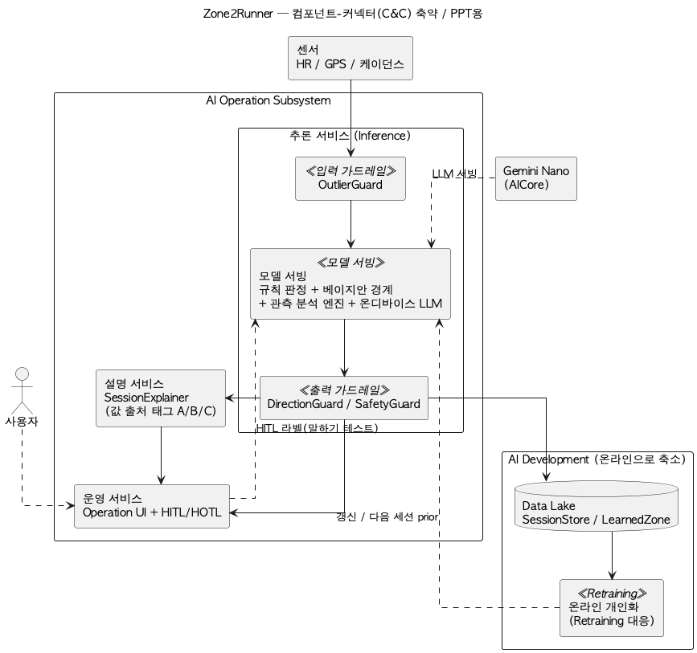
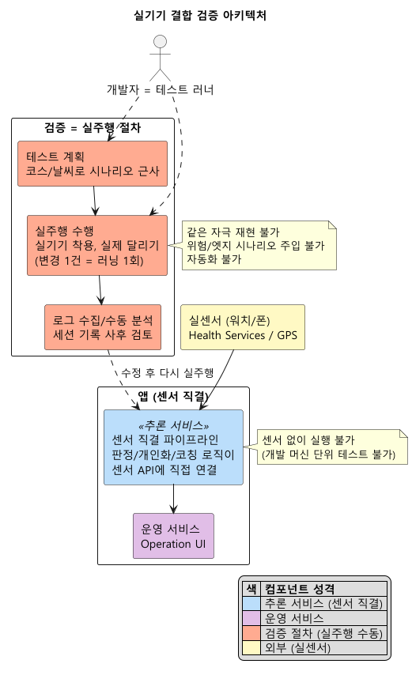

# DP(테스트가능성) 설계 보고서 — 참값 없는 시스템을 반복 검증할 수 있는 아키텍처

> 인증 보고서 "03. 설계 / Architectural Decision"의 DP 파트. 샘플(씬스틸러) DP 슬라이드 형식을 따른다:
> **[설계 문제 정의] → [설계안 결정 표: 구조(다이어그램) / 장점(QA 별점) / 단점(QA 별점) / Trade Off] → [설계 결정 및 근거]**.
> 이 분야를 전혀 모르는 사람도 읽고 이해할 수 있게 쓴다. 이 문서는 **테스트가능성 DP 하나에만** 집중한다.
>
> **상태**: v1 (2026-07-31, 사용자 검토 대기). 리서치 노트(`dp-05-testability-research.md`) 근거.
> DP-01~04와 같은 아키텍처의 다른 QA 단면 — 이 DP는 그중 **검증을 가능하게 만드는 구조**를 본다.

---

## 0. 읽기 전에 — 30초 배경

- 이 시스템은 **검증하기 어려운 조건을 여럿 겹쳐** 갖고 있다: 진짜 Zone 2 경계의 참값이 없고(채점 기준 부재), 입력이 실제 달리기에서만 나오며(같은 러닝을 두 번 뛸 수 없음 — 재현 불가), 워치와 폰 두 기기가 결합돼 있다.
- 그런데 판정/개인화/분석/코칭 로직은 계속 바뀐다. 바뀔 때마다 실제로 뛰어서 확인해야 한다면, 검증은 사실상 불가능해진다.
- 테스트가능성이라는 품질은 "테스트 기준을 세우고, 그 테스트를 실제로 수행하기 쉬운 정도"를 말한다 — 원하는 **자극을 넣을 수 있고**(제어), 결과를 **들여다볼 수 있어야**(관찰) 한다.
- **이 DP = 실제로 뛰지 않고도 전 파이프라인을 반복 검증할 수 있게 만드는 구조를 무엇으로 할 것인가** 라는 설계 결정이다. 입력을 추상화해 갈아끼울 것인가, 실기기 실주행으로 검증할 것인가가 갈린다.

---

## 1. 설계 문제 정의

### 1-1. 배경

**(1) 무엇을 검증해야 하나**
존 판정(경계 비교/히스테리시스), 개인화(말하기 테스트 → 경계 수렴), 관측 분석(드리프트 등 파생지표), 코칭(트리거/가드/폴백) — 입력에서 출력까지 이어지는 전 파이프라인이다.

**(2) 무엇이 어려운가 — 이 문제의 진짜 난도**
- **자극을 재현할 수 없다**: 입력이 실제 달리기에서 나온다. 같은 심박 곡선을 두 번 만들 수 없으니, "고치기 전/후"를 같은 조건에서 비교할 수 없다.
- **엣지 케이스를 만들 수 없다**: 위험 고심박, 센서 두절, 경계 근처 깜빡임 같은 중요한 시나리오는 실주행으로 만들기 어렵거나 위험하다.
- **회귀 검증 비용**: 로직을 바꿀 때마다 실제로 뛰어야 한다면, 변경 하나의 검증 비용이 러닝 한 번이다 — 자동화가 불가능하다.
- **참값 없음의 함정(짜고치기)**: 시뮬로 검증하더라도, 시뮬을 만든 가정으로 시뮬을 채점하면 "정확하다"는 결론이 정의상 나온다. 시뮬의 역할 한계를 정직하게 그어야 한다.

**(3) 그래서 생기는 결론**
검증 가능성은 테스트를 열심히 짜는 문제가 아니라 **구조의 문제**다. 입력 원천을 인터페이스로 추상화해 실센서와 시뮬을 갈아끼울 수 있게 하고, 결정 로직을 기기 의존 없는 순수 모듈로 분리하면 — 재현 가능한 자극 주입(제어)과 자동 검증(관찰)이 가능해진다.

### 1-2. 문제점 — 검증을 "실주행에만 맡기면 안 되는" 이유

| # | 문제 | 걸리는 제약(spec-001)/품질(spec-002, framework 8대 QA) |
|---|---|---|
| P1 | 같은 자극을 두 번 줄 수 없다 — 수정 전/후 비교 불가 | **테스트가능성** — 재현 가능한 자극 주입(제어) |
| P2 | 위험/엣지 시나리오를 실주행으로 못 만든다 | **테스트가능성 + 강건성** — 안전한 시나리오 주입 |
| P3 | 로직 변경마다 실주행 검증은 비용이 감당 불가 | **테스트가능성** — 자동 회귀 검증 |
| P4 | 참값이 없어 "정확하다" 채점 불가 | **C03** — 시뮬 역할을 구조 검증으로 한정(짜고치기 금지) |
| P5 | 개인화 수렴은 여러 세션에 걸친 동작 — 실측에 수 주 소요 | **테스트가능성** — 압축 시간 폐루프 |
| P6 | 워치-폰 결합이라 단독 실행이 어려움 | **테스트가능성** — 기기 의존 분리 |
| P7 | 시뮬 자산(가상 러너 등)도 만들고 유지해야 한다 | **수행효율성** — 검증 인프라 비용의 정직한 인정 |

### 1-3. 설계 문제 (한 문장)

> **"참값이 없고 입력 재현이 불가능한 워치-폰 결합 시스템에서 — 실제로 뛰지 않고도 — 판정/개인화/분석/코칭 전 파이프라인에 재현 가능한 자극을 넣고 결과를 자동 검증할 수 있는 구조를 무엇으로 할 것인가."**

---

## 2. 두 후보를 공정하게 비교하는 틀

- **바깥 경계(입출력)를 똑같이 고정하고, 안쪽 구조만 다르게 본다.**
  - 검증 대상: 판정/개인화/분석/코칭 파이프라인(동일 코드).
  - 검증 산출: 회귀 테스트 결과, 시나리오 재현 결과, 개인화 수렴 곡선.
- **다이어그램 읽는 법**(두 안 공통 표기법): 각 블록 상단의 «...» = 강의 AI System 아키텍처의 컴포넌트 유형. 색 = 컴포넌트 성격(가드레일=주황, 모델 서빙=파랑, 운영=보라, 저장=회청, 개발/검증=코랄, 외부=노랑). 실선=데이터 흐름, 점선=제어.
- 품질(QA) 평가는 그림이 아니라 **결정 표의 장점/단점 칸**에서 한다.

---

## 3. (1안) 소스 추상화 + 폐루프 시뮬 계측 아키텍처 — 입력을 갈아끼워 반복 검증 — ★채택

**한 줄 개념**: 입력 원천을 **인터페이스 하나(RunSource)로 추상화**해, 같은 파이프라인에 실센서/가상 러너/수동 시뮬을 갈아끼운다. **참임계를 아는 가상 러너**가 시나리오(워밍업/오르막/두절/위험 심박)를 재현 가능하게 주입하고, 결정 로직은 기기 의존 없는 순수 모듈이라 개발 머신에서 자동 테스트가 돈다. 단, **시뮬은 구조 검증과 디버깅의 도구이지 정확도의 심판이 아니다** — 이 한계를 설계의 일부로 명시한다.

> 채택안(1안)은 이 시스템의 실제 아키텍처이므로 일반 도식을 참조한다(그림 맨 위 센서 자리에 시뮬 소스가 그대로 끼워진다 — 나머지 경로는 동일). 상세 컴포넌트 뷰 = `arch/diagrams/02-component-cnc.png`, 컴포넌트 서술 = `arch/component-catalog.md`(A1/A9/F2).

**검증 구조 4요소**:

| 요소 | 하는 일 |
|---|---|
| 1. 소스 추상화(RunSource) | 실센서/가상 러너/수동 시뮬이 **같은 인터페이스**로 파이프라인에 꽂힌다 — 뒤의 코드는 입력이 진짜인지 모른다. 검증과 운영이 같은 코드를 지나므로 "테스트용 코드 경로"가 따로 없다 |
| 2. 폐루프 가상 러너 | 참임계를 아는 가상 러너가 심박/페이스를 생성하고 코칭에 반응한다 — 개인화가 그 참임계로 **수렴하는지**를 압축 시간으로 정량 확인(수 주 걸릴 검증을 분 단위로) |
| 3. 순수 로직 분리 | 판정/개인화/분석/가드 로직이 기기(안드로이드) 의존 없는 순수 모듈 — 개발 머신에서 단위 테스트가 돌고(153개, 2026-08-01 기준), 변경마다 자동 회귀 검증 |
| 4. 시뮬 계측 | 시뮬 대시보드에서 시나리오 주입(경사/더위/두절/위험 심박)과 상태 관찰(판정/코칭/가드 동작), LLM 켬/끔 비교 — 자극(제어)과 결과(관찰)를 모두 손에 쥔다 |

### 3-1. 구조가 문제점(§1-2)을 푸는 방식

| 문제 | 푸는 구조 |
|---|---|
| P1 재현 불가 | 가상 러너 시나리오 = 같은 자극을 정확히 다시 재생 — 수정 전/후 비교 가능 |
| P2 엣지 못 만듦 | 위험 심박/두절/깜빡임을 시뮬로 안전하게 주입 — 방어/안전 로직이 실제로 검증됨 |
| P3 회귀 비용 | 순수 모듈 + 자동 테스트 — 변경 하나의 검증 비용이 러닝 한 번이 아니라 수 초 |
| P4 짜고치기 | 시뮬 역할을 명시적으로 한정 — 구조 검증(로직이 설계대로 도는가)과 디버깅만. "실인간 정확도"는 시뮬로 주장하지 않고 실주행 검증으로 남긴다 |
| P5 수렴 검증 | 폐루프 압축 시간 — 참임계를 아는 러너로 수렴 오차/안착 세션 수를 분 단위 측정 |
| P6 기기 결합 | 워치 없이 폰 단독/개발 머신 단독으로 전 파이프라인 실행 |
| P7 시뮬 자산 비용 | 시뮬 소스도 RunSource 구현일 뿐이라 파이프라인과 자동으로 정합 유지(별도 모킹 계층 없음) |

### 3-2. "이게 검증된 접근이냐?" — 근거

- **① 입출력 추상화 = 포트와 어댑터**: 외부 장치를 인터페이스(포트) 뒤로 밀어내고 테스트에서 어댑터를 갈아끼우는 것은 검증 가능한 설계의 표준 패턴(Ports and Adapters/헥사고날)이다. RunSource가 이 패턴의 직접 적용이며, 의존성 역전 원칙(DIP)의 구현이기도 하다.
- **② 테스트 대역 = 표준 관행**: 실물을 대신하는 시뮬레이터/스텁으로 재현 가능한 검증을 만드는 것은 테스트 설계의 고전 표준(Test Double)이다. 가상 러너는 "반응하는 테스트 대역"(폐루프)이라는 점에서 단순 재생보다 강하다 — 코칭이 러너를 바꾸고 러너가 다시 입력을 바꾸는 상호작용까지 검증한다.
- **③ 순수 로직 분리 + 자동화 = 테스트 피라미드**: 빠른 단위 테스트를 두텁게, 느린 실기기 테스트를 얇게 두는 배분은 검증 비용 관리의 표준(테스트 피라미드)이다. 이 시스템은 결정 로직 전부가 피라미드 아래층(수 초)에서 돌고, 실기기는 통합 확인만 맡는다.
- **④ 시뮬레이션 기반 검증 + 한계 인정**: 실환경 시험이 비싸거나 위험한 분야(자율주행 등)에서 시뮬 기반 검증은 표준 관행이며, 동시에 "시뮬과 실제의 간극"을 명시하는 것까지가 관행이다. 이 시스템은 그 간극을 스스로 겪고(초기 예측 설계의 시뮬 성적이 자기 가정 채점이었음을 확인) 시뮬의 역할을 구조 검증/디버거로 한정하는 결정을 내렸다 — 한계 인정이 사후 변명이 아니라 설계 이력에 있다.

**정직한 한계(먼저 인정)**: (1) **시뮬 통과 ≠ 실인간 정확도** — 가상 러너는 우리가 만든 가정으로 움직인다. 시뮬로 확인되는 것은 "로직이 설계대로 동작한다"이지 "실제 사람에게 정확하다"가 아니며, 후자는 실주행 검증(별도 계획)이 필요하다. (2) **시뮬 자산도 유지 대상** — 가상 러너/시나리오도 코드라 만들고 고쳐야 한다(추상화 덕에 비용이 제한될 뿐 0이 아니다). (3) **실환경 특성은 못 잡는다** — 실센서 타이밍/OS 전원 관리/블루투스 특성 같은 결합 문제는 시뮬 밖이라, 실기기 확인이 여전히 필요하다(축소될 뿐 사라지지 않는다).

**장점(QA 별점)**: 테스트가능성 ★★★★★ (재현 자극 주입 + 자동 회귀 + 압축 시간 수렴 검증), 강건성 ★★★★ (위험/엣지 시나리오를 안전하게 주입해 방어 로직을 실제로 검증)
**단점(QA 별점)**: 기능정확성 ★★★★ (시뮬은 실인간 정확도를 말하지 못함 — 실주행 검증 별도 필요, 양안 공통), 수행효율성 ★★★★ (시뮬 자산 구축/유지 비용 — 추상화가 비용을 제한하나 0은 아님)

---

## 4. (2안) 실기기 결합 검증 아키텍처 — 실제 환경에서 실제로 확인 — 카운터

**한 줄 개념**: 추상화 계층 없이 센서를 파이프라인에 직결하고, 검증은 **실기기 실주행 테스트 중심**으로 한다. 간접 계층이 없어 구조가 단순하고, 검증되는 것이 곧 실환경이다. 지어낸 비교 대상이 아니라 **동등하게 진지한 대안**이다 — 실환경 충실도는 시뮬이 결코 완전히 대체할 수 없는 실제 강점이며, 최종 검증은 어느 설계든 실주행이 필요하다.

> 카운터(2안)는 이 DP 전용 가정 설계다. 상세 컴포넌트 뷰 = `images/dp-05-testability-counter-detailed.png`, 컴포넌트 서술 = `dp-05-testability-counter-catalog.md`.

**요지**: 센서 특성/타이밍/OS 제약까지 실제 그대로 검증되고, 시뮬 자산을 만들 필요가 없다. 대신 자극을 재현할 수 없어 수정 전/후 비교가 안 되고, 위험/엣지 시나리오를 만들 수 없으며, 변경마다 검증 비용이 러닝 한 번이라 자동화가 불가능하다.

**구조가 문제점을 대응하는 방식과 그 비용**:

| 문제 | 2안의 대응 | 남는 비용 |
|---|---|---|
| P1 재현 불가 | 여러 번 뛰어 평균으로 판단 | 같은 자극이 아니라 통계 비교 — 미묘한 회귀는 못 잡음 |
| P2 엣지 못 만듦 | 오르막 코스 등 일부는 코스 선택으로 | 위험 심박/두절/깜빡임은 만들기 어렵거나 위험 |
| P3 회귀 비용 | 변경 후 실주행 확인 | 변경 하나 = 러닝 한 번 — 잦은 변경에서 검증 생략 유혹 |
| P4 짜고치기 | 실데이터라 이 함정은 없음 | (이 축은 2안이 유리 — 실환경 자체가 기준) |
| P5 수렴 검증 | 수 주간 실사용 | 개인화 수렴 확인에 달력 시간 수 주 |
| P6 기기 결합 | 결합 그대로 검증 | 워치 없으면 개발/검증 불가, 자동 실행 불가 |
| P7 시뮬 자산 | 만들 필요 없음 | (이 축은 2안이 유리) |

**장점(QA 별점)**: 기능정확성 ★★★★ (실환경 충실도 — 센서/타이밍/OS 특성까지 실제 그대로), 수행효율성 ★★★★ (시뮬 자산 구축/유지 비용 없음, 간접 계층 없음)
**단점(QA 별점)**: 테스트가능성 ★★ (재현/자동화 불가 — 회귀 검증이 사실상 수동), 강건성 ★★ (위험/엣지 시나리오를 검증하지 못한 채 출시 — 방어 로직 미검증)

---

## 5. 설계안 결정 표 (샘플 슬라이드 형식)

| | **(1안) 소스 추상화 + 폐루프 시뮬 계측 ★채택** | (2안) 실기기 결합 검증 |
|---|---|---|
| 검증 방식 | 입력을 인터페이스로 추상화해 시뮬 소스를 갈아끼움 — 재현 자극 + 자동 회귀 + 압축 시간 폐루프 | 센서 직결 + 실기기 실주행 테스트 중심 |
| 구조 | §3 다이어그램(일반 아키텍처 참조) | §4 다이어그램 |
| 장점 | 테스트가능성 ★★★★★ 강건성 ★★★★ (엣지 주입 검증) | 기능정확성 ★★★★ (실환경 충실도) 수행효율성 ★★★★ (시뮬 자산 불필요) |
| 단점 | 기능정확성 ★★★★ (시뮬 ≠ 실인간 정확도 — 실주행 별도, 양안 공통) 수행효율성 ★★★★ (시뮬 자산 유지 비용) | 테스트가능성 ★★ (재현/자동화 불가) 강건성 ★★ (위험/엣지 미검증) |
| Trade Off | 같은 자극을 다시 넣어 비교할 수 있고, 변경 검증이 수 초 위험 시나리오를 안전하게 검증 대신 시뮬의 결론을 "구조 검증"으로 정직하게 한정해야 하고, 실기기 확인이 사라지지 않음 | 검증되는 것이 곧 실환경 — 간극 자체가 없음 대신 변경 하나의 검증 비용이 러닝 한 번 위험/엣지는 검증 못 한 채 남음 |

### 5-1. QA 별점 종합 (8대 QA 중 관련 축 + 일반 QA)

| QA(품질속성) | (1안) 소스 추상화 + 시뮬 계측 | (2안) 실기기 결합 검증 |
|---|:---:|:---:|
| 테스트가능성 (일반, 이 DP의 축) | ★★★★★ | ★★ |
| 강건성 (AI 특화 — 엣지 검증) | ★★★★ | ★★ |
| 기능적응성 (AI 특화 — 수렴 검증 가능) | ★★★★★ | ★★★ |
| 설명용이성 (AI 특화 — 시뮬 계측 관찰) | ★★★★ | ★★★ |
| 수행효율성 (일반) | ★★★★ | ★★★★ |
| 기능정확성 (AI 특화) | ★★★★ | ★★★★ (실환경 충실) |

- **결정축 = 자극의 재현 가능한 주입**: 테스트가능성의 본질은 원하는 자극을 넣고(제어) 결과를 보는(관찰) 능력이다. 1안은 이것을 구조(인터페이스 교체)로 얻고, 2안은 실환경 충실도와 맞바꾼다. 참값 없는 이 시스템에서 검증 가능한 것은 "로직이 설계대로 도는가"이므로, 재현 가능한 주입의 가치가 특히 크다.
- **양안이 배타적이지 않다(중요)**: 1안을 채택해도 실기기 확인은 사라지지 않는다 — 시뮬이 회귀/엣지/수렴을 맡고, 실기기는 결합 확인과 최종 실주행 검증을 맡는 **역할 분담**이다. 2안 단독과의 차이는 "실기기만으로 검증하느냐"다.
- **조건 의존성(공정한 평가)**: 별점은 이 DP의 결정 범위가 해당 QA에 미치는 영향을 이 과제 조건에서 평가한 것이라, 같은 QA 명칭이라도 DP마다 평가 대상 행위가 다르다(예: DP1의 기능적응성=규칙 밖 패턴 학습 능력, DP3의 기능적응성=경계 적응 지연). 이 별점은 *이 시스템의 조건*(1인 개발/참값 없음/잦은 로직 변경/위험 시나리오 포함)에 대한 평가다. **조건이 다르면 — 테스트 러너 풀과 장비를 갖춘 조직, 로직이 안정된 유지보수 단계 — 실주행 중심 검증의 비중이 커질 수 있다.**

---

## 6. 설계 결정 및 근거

### 6-1. 최종 채택 구조
**(1안) 소스 추상화 + 폐루프 시뮬 계측 아키텍처 = RunSource 인터페이스(실센서/가상 러너/수동 시뮬 교체) + 참임계를 아는 폐루프 가상 러너 + 순수 로직 분리(자동 단위 테스트) + 시뮬 대시보드 계측** 을 채택한다. 시뮬의 결론은 구조 검증/디버깅으로 한정하고, 실인간 정확도 주장에 쓰지 않는다.

### 6-2. 채택 근거 (2안 대비)
- **재현이 검증의 전제다.** 수정 전/후를 같은 자극으로 비교할 수 없으면 회귀를 잡을 수 없다. 1안은 시나리오 재생으로 이것을 얻고, 2안은 얻을 방법이 없다.
- **위험한 것일수록 시뮬로 검증해야 한다.** 위험 고심박에서 안전 규칙이 작동하는지를 실주행으로 확인하는 것은 위험하거나 불가능하다. 시뮬 주입은 이 검증을 안전하게 만든다.
- **변경 비용이 러닝 한 번이면 검증은 생략된다.** 로직이 계속 바뀌는 개발 단계에서 자동 회귀(수 초)와 실주행(시간 단위)의 차이는 검증을 하느냐 마느냐의 차이가 된다.
- **수렴은 압축 시간으로만 확인할 수 있다.** 개인화가 참임계로 수렴하는지는 여러 세션에 걸친 동작이라, 실측이면 수 주가 걸린다. 참임계를 아는 가상 러너의 폐루프가 이것을 분 단위로 만든다.
- **짜고치기 함정을 구조로 피한다.** 시뮬의 역할을 "구조 검증/디버거"로 명시해, 시뮬 성적을 정확도 주장에 쓰는 함정(자기 가정 채점)을 설계 차원에서 차단했다. 실주행 검증은 별도 계획으로 정직하게 남긴다.

### 6-3. 예상 질문
- **"시뮬로 통과했다는 게 무슨 의미가 있나? 실제 사람이 아닌데."** — 정확한 지적이고, 그래서 시뮬의 결론을 한정한다. 시뮬이 답하는 것은 "로직이 설계대로 동작하는가"(판정 모순 없음, 가드 작동, 수렴 구조 건전)이지 "실제 사람에게 정확한가"가 아니다. 후자는 실주행 검증으로만 답해지며, 그 계획이 별도로 있다.
- **"추상화 계층은 오버엔지니어링 아닌가?"** — RunSource는 메서드 몇 개의 인터페이스 하나이고, 시뮬 소스들은 그 구현일 뿐이다. 이 한 겹이 사는 것: 자동 회귀 153개, 위험 시나리오 검증, 수 주짜리 수렴 확인의 분 단위 압축. 비용 대비 산 것이 크다.
- **"실기기 테스트를 안 한다는 건가?"** — 아니다. 역할 분담이다 — 시뮬이 회귀/엣지/수렴을 맡아 실기기 확인을 "결합 확인과 최종 실주행 검증"으로 줄인다. 실기기 확인은 축소될 뿐 사라지지 않는다(§정직한 한계).

### 6-4. 보완 계획
- **실주행 검증 실행**: 시뮬이 답하지 못하는 실인간 정확도(경계 수렴의 실제 체감, 상수 튜닝)를 실주행 데이터 수집 계획으로 검증한다 — 시뮬 검증의 다음 단계이지 대체물이 아니다.
- **시나리오 카탈로그 확장**: 가상 러너 시나리오(두절 패턴/GPS 튐 프로파일/경계 근처 진동)를 강건성 DP의 일관성 지표 측정과 연동해 늘린다.
- **시뮬-실측 간극 기록**: 실주행 데이터가 쌓이면 시뮬 가정(심박 반응 모양 등)과 실측의 차이를 기록해, 시뮬의 신뢰 범위를 데이터로 갱신한다.

---

## 부록 A. 근거 문헌
- 테스트가능성 정의 — ISO/IEC 25010 품질 모델: 테스트 기준 확립과 테스트 수행의 용이성(유지보수성 하위 특성). 테스트의 제어(자극 주입)와 관찰(결과 확인) 가능성.
- Ports and Adapters(헥사고날 아키텍처) — Cockburn: 외부 장치를 포트 뒤로 밀어내 테스트에서 어댑터 교체.
- Test Double 분류 — Meszaros, *xUnit Test Patterns*: 실물을 대신하는 대역(스텁/페이크/목)으로 재현 가능한 검증.
- 테스트 피라미드 — Cohn(*Succeeding with Agile*), Fowler 정리: 빠른 단위 테스트를 두텁게, 느린 통합/실기기 테스트를 얇게.
- 시뮬레이션 기반 검증과 sim-to-real 간극 — 자율주행 등 실환경 시험이 비싼 분야의 표준 관행 + 간극 명시 관행.
- 이 저장소의 자체 이력 — 시뮬 성적이 자기 가정 채점이 되는 함정을 직접 확인하고(짜고치기, `ml/EXPERIMENT_LOG.md` §15-3) 시뮬 역할을 한정한 결정(adr-024, spec-002 QA5 "시뮬=구조 검증/디버거").
> 리서치 원본/링크 = `dp-05-testability-research.md`.

## 부록 B. 용어 한 줄 사전
- **테스트가능성(testability)**: 테스트 기준을 세우고 실제로 수행하기 쉬운 정도 — 자극을 넣을 수 있고(제어) 결과를 볼 수 있는(관찰) 구조.
- **포트와 어댑터(Ports and Adapters)**: 외부 장치를 인터페이스(포트) 뒤로 밀어내고, 실물/시뮬(어댑터)을 갈아끼우는 설계 패턴.
- **테스트 대역(test double)**: 검증을 위해 실물을 대신하는 가짜 구현. 가상 러너는 코칭에 반응까지 하는 "폐루프 대역".
- **폐루프(closed loop)**: 출력(코칭)이 입력(러너 행동)에 다시 영향을 주는 상호작용까지 검증하는 구성.
- **회귀 검증(regression test)**: 수정이 기존 동작을 깨지 않았는지 자동으로 재확인하는 테스트.
- **짜고치기(자기 가정 채점)**: 시뮬을 만든 가정으로 시뮬을 채점해 "정확하다"는 결론이 정의상 나오는 함정 — 이 시스템이 직접 겪고 구조로 차단한 것.
- **sim-to-real 간극**: 시뮬과 실환경의 차이. 시뮬 결론의 신뢰 범위를 긋는 기준.

> 관련 문서: `dp-05-testability-research.md`(리서치), `arch/component-catalog.md`(1안=우리 시스템 A1/A9/F2)/`dp-05-testability-counter-catalog.md`(2안 카운터), `arch/diagrams/`(1안 도식)/`images/`(2안 도식), `spec/spec-002`(QA5 시나리오/측정), `spec/spec-003`(RunSource), `spec/spec-019`(가상 러너 검증 도구), `spec/spec-022`(수동 가상 러너), `spec/spec-012`(실주행 검증 계획), `arch/adr-024`(시뮬 역할 한정), `ml/EXPERIMENT_LOG.md` §15-3(짜고치기 확인 이력), `arch/dp/dp-01-explainability/`~`dp-04-robustness/`(같은 구조의 다른 QA 단면).
