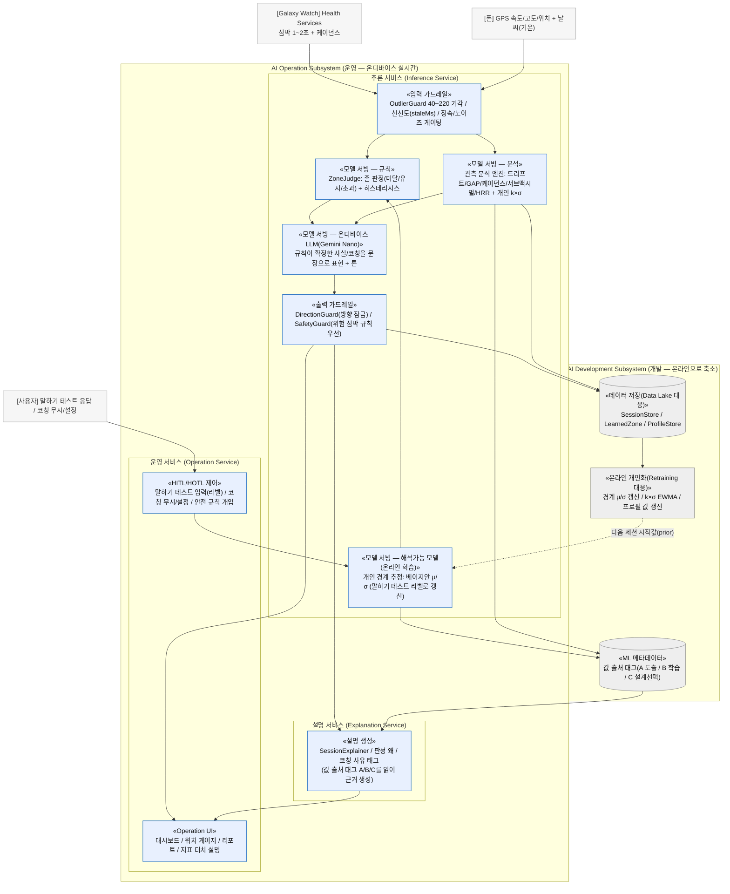

# 시스템 아키텍처 다이어그램 (강의 AI System 표준 형식 매핑)

- **상태**: 검토용 v1 (2026-07-14) — DP 문서/보고서의 기반 도식. 합의 후 살을 붙인다.
- **목적**: 우리 Zone2Runner를 강의 표준 **AI System 아키텍처**(운영 서브시스템 + 개발 서브시스템 + 공유 레지스트리)에 매핑한 **소프트웨어 시스템 도식**. 각 블록은 실제 컴포넌트이며, 블록 상단 «...»는 그 블록이 강의 표준의 어느 컴포넌트인지를 나타낸다(주석 note가 아니라 **컴포넌트 유형 라벨**).

## 읽는 법

- **subgraph = 강의 표준의 서비스/서브시스템** (추론 서비스, 설명 서비스, 운영 서비스, 개발 서브시스템 등).
- **블록 = 실제 컴포넌트.** 블록 첫 줄 `«...»` = 강의 표준 컴포넌트 유형(입력 가드레일 / 모델 서빙 / 출력 가드레일 …), 둘째 줄 = 우리 구현 이름.
- 표준의 어떤 컴포넌트가 우리에게 **비어 있거나 형태가 다른지**도 그대로 드러낸다(예: 오프라인 대량 학습이 없고 온라인 개인화로 대체됨 — 이는 콜드스타트/무데이터/온디바이스 조건에 따른 설계 선택).

## 다이어그램

## 표준 컴포넌트 ↔ 우리 구현 (요약표)

| 강의 표준 컴포넌트 | 우리 컴포넌트 | 비고 |
|---|---|---|
| 입력 가드레일 | OutlierGuard + 신선도/정속 게이팅 | 이상값/노이즈 차단 |
| 모델 서빙(규칙) | ZoneJudge(존 판정 + 히스테리시스) | 결정론 규칙 |
| 모델 서빙(해석가능/온라인 학습) | 개인 경계 베이지안 μ/σ | 말하기 테스트 라벨로 온라인 갱신 |
| 모델 서빙(분석) | 관측 분석 엔진(5지표 + k×σ) | 파생지표 도출 |
| 모델 서빙(LLM) | 온디바이스 Gemini Nano | 사실을 문장으로만(이유 생성 아님) |
| 출력 가드레일 | DirectionGuard / SafetyGuard | 방향 잠금 + 안전 우선 |
| 설명 서비스 | SessionExplainer + 사유 태그 | 값 출처 태그를 읽어 근거 생성 |
| 운영 서비스(UI) | 대시보드/워치/리포트/터치 설명 | 표시 계층 |
| HITL/HOTL 제어 | 말하기 테스트 라벨 / 코칭 설정 / 안전 규칙 | 사람 개입 + 규칙 감독 |
| Data Lake | SessionStore/LearnedZone/ProfileStore | 소형 개인 온디바이스 저장 |
| ML 메타데이터 | 값 출처 태그(A/B/C) | provenance = 전 컴포넌트 규율 |
| Retraining 루프 | 온라인 개인화 갱신 | 오프라인 배치 아님(온라인) |

## 이 시스템 아키텍처의 특징 (정직)

- **개발 서브시스템이 온라인으로 축소**: 표준의 "오프라인 대량 학습 → 레지스트리 배포"가 우리에겐 거의 비어 있고, 학습이 **운영 안에서 온라인 개인화**로 일어난다. 콜드스타트/개인 소량 데이터/온디바이스/참값 없음 조건에 따른 **설계 선택**이다(대량 사전학습이 오히려 검증 불가/과적합 위험).
- **가드레일이 양쪽(입력/출력)에 명시적**: 약한 온디바이스 LLM을 출력 가드레일 + 폴백으로 감싼 것이 제어가능성의 실체.
- **값 출처 태그(ML 메타데이터)가 설명 서비스로 흐른다**: "모든 수치에 출처"(제1원칙)가 아키텍처에서 메타데이터 → 설명 서비스 흐름으로 드러난다.

---

> 관련: `framework/ai-system-and-quality.md §1-3`(표준 아키텍처), `arch/architecture-overview.md`(전체 개요), `arch/adr-025`(AI≠NN).
