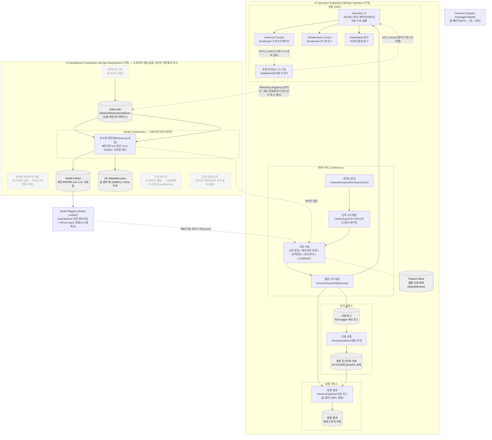

# 시스템 아키텍처 (강의 AI System 표현방식으로 그린 우리 시스템)

- **상태**: 검토용 v1 (2026-07-14)
- **참조**: `framework/lecture-pdfs/0-AI-시스템-개요.pdf` p6 "AI System 아키텍처" 도식의 표현방식을 그대로 따른다 — 좌 **AI Operation Subsystem**(운영/추론/설명/분석 서비스), 우 **AI Development Subsystem**(데이터셋 구축 → Data Lake → Model Construction → 모델 테스팅 → 등록), 하단 **공유 레지스트리**(Model/Container Registry). 실선=데이터 흐름, 점선=제어 트리거(HITL/HOTL/Retraining), 원통=저장소.
- **읽는 법**: 각 상자의 **윗줄 = 강의 표준 컴포넌트명**, 아랫줄 = **우리 구현**. 표준에는 있으나 우리에겐 **없거나 온라인으로 대체된** 컴포넌트는 점선/회색으로 표시해 정직하게 드러낸다.

## 표준 ↔ 우리 (있는 것 / 없는 것)

| 강의 표준 | 우리 | 상태 |
|---|---|---|
| 운영 서비스: Operation UI / Inference Control / Infra Control / Explanation 분석 / 운영조치 | 대시보드/리포트 / RunEngine / RunService / 설명 표시 / SafetyGuard+코칭 | 있음 |
| 추론 서비스: 데이터준비 → 입력가드레일 → 모델서빙 → 출력가드레일 | FeatureExtractor → OutlierGuard → (규칙판정+베이지안+분석+LLM) → DirectionGuard/SafetyGuard | 있음(핵심) |
| Feature Store(추론) | SignalWindow 롤링 버퍼 | 경량 |
| 설명 서비스: 설명 생성 → 설명 결과 | SessionExplainer → 세션 스토리 저장 | 있음 |
| 분석 서비스: 서빙로그 → 지표산출 → 모니터링 지표 | RunLogger → SessionAnalytics → EF/드리프트/추세 | 있음 |
| HITL / HOTL 제어 | 말하기 테스트 라벨 / 코칭 무시/규칙 감독 | 있음 |
| Data Lake | SessionStore/LearnedZone(소형 개인) | 축소 |
| Model Construction(오프라인 학습) | **없음 → 온라인 개인화(베이지안/k×σ)로 대체** | 대체 |
| Model Artifact / ML Metadata | 개인 파라미터 / 값 출처 태그·uFrac 이력 | 있음(소형) |
| 모델 테스팅 | **오프라인 없음 → 시뮬 폐루프(VirtualRunner)로 검증** | 대체 |
| 모델 등록/승격 | **없음(온라인 파라미터)** | 없음 |
| Model Registry / Container Registry | LearnedZone+AICore Nano / APK | 있음 |

## 이 도식이 말하는 우리 아키텍처의 정체성 (정직)

- **Operation 서브시스템이 거의 전부**다. 표준의 Development(오프라인 데이터셋 → 대량 학습 → 테스팅 → 승격 → 배포)가 우리에겐 **비어 있고**, 그 자리를 **운영 안의 온라인 개인화**(베이지안 경계 갱신 + k×σ)가 대신한다. → 콜드스타트/개인 소량 데이터/온디바이스/참값 없음 조건에 따른 **설계 선택**(대량 사전학습은 검증 불가/과적합 위험).
- **입력/출력 가드레일이 추론 경로에 명시적**이고, 약한 온디바이스 LLM(Nano)을 출력 가드레일+폴백으로 감싼 것이 제어가능성의 실체.
- **값 출처 태그(ML Metadata) → 설명 서비스** 흐름이 "모든 수치에 출처"(제1원칙)를 아키텍처로 드러낸다.
- 모델 검증은 오프라인 테스트셋이 아니라 **시뮬 폐루프(VirtualRunner)** 로 한다(참값 없는 조건의 우회).

---

> 관련: `framework/ai-system-and-quality.md §1-3`, `arch/architecture-overview.md`, `arch/system-architecture-diagram.md`(이전 버전), `arch/adr-025`.
