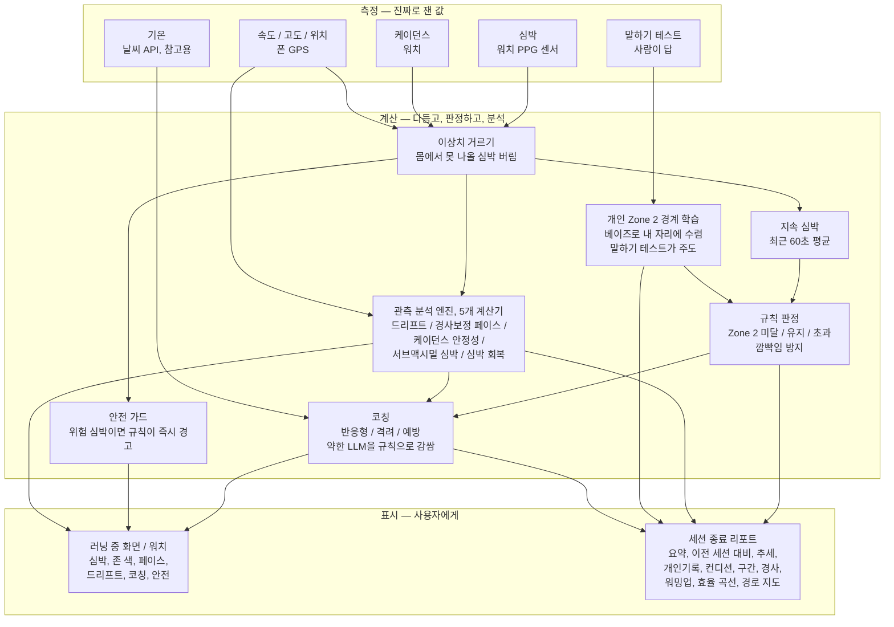

# 00. 이 앱을 한눈에

> 이 앱이 무엇을 하는지, 그리고 측정에서 화면까지 어떤 흐름으로 도는지 3분 안에 잡는 지도.

## 이 앱은 무엇을 하나

**Zone 2 러닝 코치**예요. Zone 2는 "숨차지 않고 오래 달릴 수 있는, 편하게 대화가 되는 강도"를 말해요. 이 구간에서 꾸준히 뛰면 유산소 기초 체력과 지방 연소에 좋습니다.

앱은 세 가지를 해요.
1. 갤럭시 워치와 폰으로 **심박, 속도, 걸음, 경사 같은 걸 잰다(측정)**.
2. 잰 값으로 **지금이 Zone 2인지 판정하고, 여러 각도로 분석한다(계산)**.
3. 달리는 중엔 **실시간 코칭**, 끝나면 **세밀한 리포트**로 **보여준다(표시)**.

## 이 앱의 대원칙 (제일 중요)

> **미래를 점치지(예측하지) 않는다. 없는 숫자를 지어내지 않는다.**
> 실제로 잰 관측과, 그걸로 계산한 근거 있는 숫자만 쓴다.

- "곧 심박이 넘을 거야" 같은 **예측을 안 해요.** 대신 "지금 관측된 게 이렇다"만 말해요.
- "오르막이면 +5bpm" 같은 **아무 근거 없는 고정 숫자를 안 써요.** 판단선도 그 사람 데이터로 스스로 배운 값(k×σ)으로 정해요.
- 확실하지 않으면 억지로 만들지 않고 **비워둬요(값 없음).**

이 원칙 때문에 예전에 있던 "심박 예측 기능"은 통째로 뺐어요. 예측이 맞았는지 채점하려면 "진짜 정답"이 있어야 하는데, 달리는 중엔 그 정답을 알 방법이 없거든요. 채점할 수 없는 기능은 믿을 수 없으니 넣지 않았어요.

## 큰 흐름 (측정 → 계산 → 표시)

> mermaid 그림이라 GitHub에서는 바로 그림으로 보여요. VS Code에서 그림으로 보려면 Markdown Preview Mermaid 확장이 필요해요(없으면 코드로 보임).

## 그림에 나온 말 풀이

낯선 낱말만 짧게 풀어요. 더 자세한 계산은 각 항목이 02~03 문서에 있어요.

- **PPG** — 손목에 빛을 쏘아 핏줄의 부피 변화를 읽어 심박을 재는 광학 센서. 갤럭시 워치가 이 방식이에요.
- **베이즈(Bayesian) 학습** — "지금까지 알던 것"에 "새로 관측한 것"을 믿음의 정도만큼 섞어 조금씩 정답에 다가가는 방법. 관측이 쌓일수록 내 Zone 2 경계가 내 몸에 맞는 자리로 수렴해요. 신경망 같은 무거운 AI가 아니라 간단한 확률 계산이에요. (그 "믿음의 정도"를 우리가 마음대로 정하는지는 바로 아래에서 증명해요.)
- **서브맥시멀 심박(submaximal HR)** — "최대가 아닌, 정해둔 중간 강도(같은 페이스)"에서의 심박. 같은 페이스인데 세션이 갈수록 이 심박이 낮아지면 유산소 체력이 좋아졌다는 신호예요.
- **드리프트(cardiac drift)** — 같은 속도로 계속 달릴 때 시간이 지나며 심박이 슬금슬금 올라가는 현상. 피로 / 더위 / 탈수의 표시예요.
- **경사보정 페이스(GAP)** — 오르막과 내리막을 감안해 "평지였다면 이 페이스"로 환산한 값. 언덕 때문에 느려진 걸 벌주지 않으려는 거예요.
- **케이던스 안정성** — 1분에 발을 딛는 횟수(케이던스)가 얼마나 일정한지. 지치면 리듬이 흔들려서 폼/피로의 단서가 돼요.
- **심박 회복(HRR)** — 힘든 구간을 끝낸 뒤 심박이 얼마나 빨리 떨어지는지. 빨리 내려올수록 회복력이 좋아요.
- **깜빡임 방지(히스테리시스)** — 경계선 위에서 심박이 살짝 떨려도 판정과 색이 매초 뒤집히지 않게 여유를 두는 신호처리 기법.

## 증명 — "섞는 비율"조차 우리가 마음대로 정한 숫자가 아니에요

베이즈에서 "새 관측을 얼마나 섞을지"가 궁금할 수 있어요. 혹시 우리가 "30%씩 섞자"처럼 임의로 정한 걸까요? 아니에요. 만약 그랬다면 그게 바로 이 앱이 금지하는 "근거 없는 고정 숫자(마법 상수)"거든요. 실제 규칙은 이래요.

- **섞는 비율은 우리가 고르는 게 아니라 공식이 계산해요.** 새 관측에 실리는 무게는 `새 관측의 확신 ÷ (기존의 확신 + 새 관측의 확신)`으로 정해져요. 두 확신이 정해지면 비율은 수학이 강제해요 — 돌릴 수 있는 손잡이가 아니에요. (값의 세 종류 중 **A. 도출값**. 코드: 개인화 갱신 공식 `muUpper = (muUpper×p0 + z×p1) / (p0+p1)`)
- **그럼 우리가 정하는 건?** 비율이 아니라 "각 정보가 몇 bpm쯤 불확실한가"뿐이에요. 예를 들어 말하기 테스트에서 "보통(딱 문턱)" 답은 가장 확신 있어 오차를 좁게(6bpm), "아주 편함"은 덜 확신해 넓게(16bpm) 둬요. 이 숫자들은 뜻(bpm 오차)과 순서(6 < 14 < 16)와 문헌 근거가 있는 **C. 설계 선택**이고, 실제 데이터로 다듬을 값이에요 — "그냥 정한 수"가 아니에요.
- **첫 추정의 힘은 저절로 빠져요.** 관측이 쌓일수록 기존의 확신이 커져서, 처음 프로필로 잡은 추정의 몫이 자동으로 작아지고 진짜 관측이 판을 주도해요. "언제 첫 추정을 놓아줄지"조차 우리가 손으로 정하지 않아요.

한마디로, 이 앱에서 **판정에 쓰는 숫자는 (A) 잰 값을 공식으로 계산한 값, (B) 그 사람에게서 배운 값, (C) 뜻과 근거가 있는 설계 선택** 셋 중 하나뿐이에요. 그 밖의 "그냥 정한 수"는 없어요. 이게 이 앱의 대원칙이에요.

> **헷갈리기 쉬운 한 가지.** 화면의 **큰 심박 숫자와 색**은 "지금 이 순간" 값이에요. 반면 **Zone 2 판정과 코칭**은 흔들림을 없앤 "최근 60초 평균"을 써요. 그래서 큰 숫자는 초록인데 판정은 살짝 다를 수 있는데, 고장이 아니라 일부러 그렇게 나눈 거예요 (순간값은 즉각 반응, 판정값은 안정 우선).

## 세 기둥 요약

| 기둥 | 무엇 | 예 | 자세히 |
|------|------|-----|--------|
| **측정** | 진짜로 잰 관측값 | 심박, 속도, 케이던스, 경사, 기온, 말하기 테스트 | [01](01-무엇을-측정하나.md) |
| **계산 (기본)** | 잰 값을 다듬고 판정 | 지속 심박, Zone 2 경계, 존 판정, 안전 감지 | [02](02-무엇을-계산하나-기본.md) |
| **계산 (분석)** | 다각도 파생 지표 | 드리프트, 효율(EF), 경사보정 페이스, 회복, 세션 간 추세 | [03](03-무엇을-계산하나-분석엔진.md) |
| **표시 (실시간)** | 달리는 중 화면 | 심박, 존 색, 코칭 문구, 안전 경고, 워치 게이지 | [04](04-무엇을-보여주나-러닝중.md) |
| **표시 (리포트)** | 끝난 뒤 리포트 | 요약, 비교, 추세, 개인기록, 구간 분석, 지도 | [05](05-무엇을-보여주나-리포트.md) |

## 알아두면 좋은 한 가지 — 값의 세 종류

이 앱의 모든 숫자는 아래 셋 중 하나예요(근거 없는 네 번째는 금지).

- **A. 도출값** — 잰 신호에서 그때그때 계산한 값 (예: 드리프트 기울기, 효율)
- **B. 학습값** — 그 사람에게서 스스로 배워 수렴한 값 (예: 평소 드리프트 선, 오르막 초과 경향)
- **C. 설계 선택** — 문헌 근거가 있는 출발 상수 (예: 60초 창, Minetti 다항식)

각 문서의 항목 끝에 이 종류가 표시돼 있어요.

---

**다음**: 어디부터 읽을지는 [README](README.md)를 보세요. 순서대로 읽으려면 [01. 무엇을 측정하나](01-무엇을-측정하나.md)부터.
