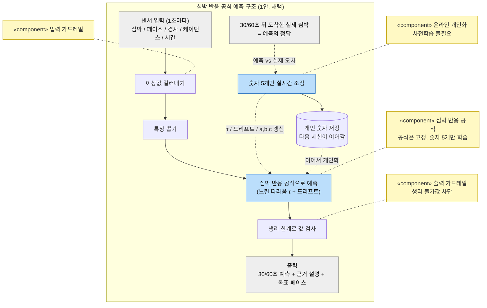
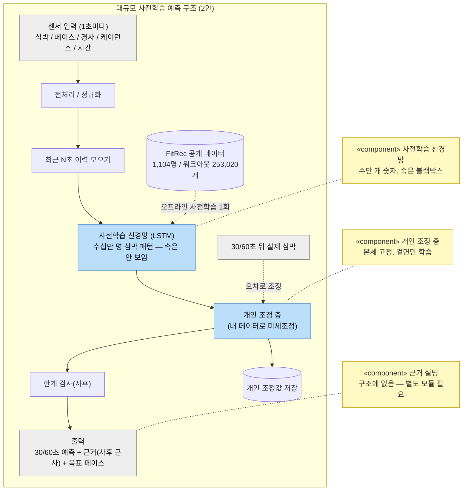

# report-006 DP1 설계 보고서 — 가까운 미래 심박 예측 아키텍처

> 인증 보고서 "03. 설계 / Architectural Decision"의 DP1 파트. 샘플(씬스틸러) DP 슬라이드 형식을 따른다:
> **[설계 문제 정의] → [설계안 결정 표: 구조(다이어그램) / 장점(QA 별점) / 단점(QA 별점) / Trade Off] → [설계 결정 및 근거]**.
> 이 분야를 전혀 모르는 사람도 읽고 이해할 수 있게 쓴다. 이 문서는 **DP1 하나에만** 집중한다.
>
> **상태: v3 (2026-07-09) — 사용자 피드백 + 공식 검증 리서치 반영.** 말투를 쉽게 고치고, "우리 공식이 검증된 것이냐"는
> 핵심 질문에 문헌 근거로 답했다.

---

## 0. 읽기 전에 — 30초 배경

- **Zone 2 러닝** = "편하게 오래 달릴 수 있는 낮은 강도"의 유산소 운동. 이 강도를 지키는지는 **심박수**로 판단한다.
- **핵심 문제**: 심박은 강도를 곧바로 못 따라온다. 페이스를 올려도 심박은 **20~40초쯤 늦게** 서서히 오른다.
- 그래서 **"지금 심박"만 보고 코칭하면 늘 한발 늦는다.** 이미 강도를 넘긴 뒤에야 "초과!"라고 말하게 된다.
- 제때 코칭하려면 **"이 페이스로 계속 가면 30~60초 뒤 심박이 어디까지 갈지"를 미리 계산**해야 한다.
- **DP1 = 그 "미래 심박 계산"을 어떤 구조로 만들 것인가** 라는 설계 결정이다.

---

## 1. DP1. 설계 문제 정의

### 1-1. 배경

**(1) 서비스가 원하는 것**
Zone2Runner의 핵심은 "러닝 내내 Zone 2를 지키게 하는 실시간 코칭"이다(spec-001 FR3). 코칭이 좋은지는 결국
**존에 머문 시간**으로 드러난다. 이미 벗어난 뒤 알려주는 코칭은 그 시간을 늘리지 못한다.

**(2) 몸이 방해하는 것 — 이 문제의 진짜 어려움**
- **늦게 따라옴**: 심박은 강도 변화를 20~40초 늦게 따라온다. 오르막에 들어선 순간 몸은 이미 힘든데 심박은 아직 조용하다.
- **드리프트**: 같은 페이스여도 시간이 지나면(더위/탈수) 심박이 서서히 오른다. "지금 심박"이 "지금 강도"를 대표하지 못하는 두 번째 이유.
- **사람마다 다름**: 얼마나 늦게 따라오는지, 얼마나 드리프트하는지는 사람마다 다르고, 같은 사람도 그날 컨디션마다 다르다.

**(3) 그래서 생기는 결론**
심박이 **늦게 오는 신호**라서, "지금 심박 → 판정 → 코칭"식으로 반응만 하면 **항상 늦는다.** 게다가 사용자가 코칭을 듣고
페이스를 바꿔도, 그 효과가 심박에 나타나기까지 또 20~40초가 걸린다 — **지연이 두 번 겹친다.** 이걸 없애는 유일한 길은
"이 페이스로 계속 가면 30~60초 뒤 심박이 어디로 가나"를 미리 아는 것, 즉 **예측**이다.

### 1-2. 문제점 — 예측을 "아무렇게나 만들면 안 되는" 이유

| # | 문제 | 걸리는 제약(spec-001) / 품질(spec-002) |
|---|---|---|
| P1 | 늦게 오고 드리프트하는 심박을 30~60초 앞서 맞혀야 한다 | 문제의 본질(배경 2) |
| P2 | 사람마다 달라서 "평균 러너" 모델은 그 사람에게 틀린다 — 그런데 개인 데이터는 세션 수십 개뿐 | **C02** 우리 데이터 부족 |
| P3 | 예측이 맞는지 잴 "정답 기준"이 없다 — 시뮬로 학습하면 "시뮬 흉내"라는 순환에 빠진다(판정 모델에서 실제로 겪은 결함, adr-013) | **C03** 참값 없음, **C04** 평가=시뮬 |
| P4 | 심박은 사용자 눈에 보이는 숫자다 — 예측이 어긋나면 바로 들통난다. "왜 그렇게 봤나"를 못 보여주면 신뢰가 무너진다 | **QA1 설명용이성** |
| P5 | 매초, 폰 혼자, 비용 0으로 돌아야 한다 | **C01** 온디바이스/비용0, **QA6 수행효율성** |
| P6 | 말도 안 되는 예측(순간 250bpm 등)이 코칭을 오염시키면 안 된다 | **QA4 제어가능성**, QA3 강건성 |

### 1-3. 설계 문제 (한 문장)

> **"늦게 오고 드리프트하고 사람마다 다른 심박을, 대량 데이터도 정답 기준도 없이, 폰 혼자 매초, 사용자에게 설명 가능하게
> 30~60초 앞서 맞히는 내부 구조를 무엇으로 할 것인가."**

---

## 2. 두 후보를 공정하게 비교하는 틀

- **바깥 경계(입출력)를 똑같이 고정하고, 안쪽 구조만 다르게 본다.**
  - 입력: 1초마다 들어오는 값(심박 / 페이스 / 경사 / 케이던스 / 경과시간)
  - 출력: ① 30~60초 뒤 예측 심박, ② 그 예측의 근거 설명, ③ Zone 2 목표 페이스
- 다이어그램은 이름 붙은 상자 + 화살표로 깔끔하게. `«component»`는 그 상자가 어떤 부품인지 붙인 **주석**이다.
- 품질(QA) 평가는 그림이 아니라 **결정 표의 장점/단점 칸**에서 한다(대비가 극명한 2개씩).

---

## 3. (1안) 심박 반응 공식으로 예측 — ★채택 (구현됨: `HrOdeModel`, adr-020)

**한 줄 개념**: 심박이 움직이는 법칙을 **간단한 공식**으로 적어두고, 그 공식의 **개인 숫자 5개**만 뛰면서 실시간으로 그 사람에게 맞춰간다.
사전학습도, 속이 안 보이는 신경망도 쓰지 않는다.

### 3-1. 우리가 쓰는 공식 (쉽게)

심박을 세 가지로 본다.

1. **정착 심박** — "이 페이스로 계속 가면 심박이 결국 어디에 자리잡나". 빠를수록/오르막일수록 높다.
   → `정착 심박 = a + b×속도 + c×경사` (이걸 "수요맵"이라 부른다: 이 강도가 요구하는 심박)
2. **느린 따라옴** — 지금 심박은 그 정착점을 향해 **서서히** 다가간다. 처음엔 빨리, 가까워질수록 천천히
   (뜨거운 물에 담근 찬 컵이 물 온도로 서서히 가는 것과 같다). 이 "굼뜬 정도"를 숫자 하나 **τ(타우)**로 요약한다.
3. **드리프트** — 오래 뛰면 같은 페이스에도 심박이 분당 조금씩 더 오른다.

이 셋을 합쳐 "30~60초 뒤 심박"을 계산한다. (정확한 식은 부록에.)

**개인 숫자 5개** = 이 사람 데이터로 실시간 맞추는 값들:
- **τ**(반응이 얼마나 굼뜬가, 초),
- **드리프트**(오래 뛰면 분당 몇 bpm 더 오르나),
- **a, b, c**(정착 심박 공식의 바닥값 / 속도 영향 / 경사 영향).

이 5개 말고는 아무것도 학습하지 않는다. 그래서 데이터가 조금만 있어도 맞춰진다.

**시작값과 한계(clamp)**: 5개는 **문헌 기반 출발값**(예: τ≈30초, 드리프트=0에서 시작)에서 시작해 개인화된다. 그리고 값이
튀지 않게 **생리적으로 가능한 범위 안**으로만 움직이게 막아둔다 — 정착 심박은 "안정심박 살짝 위 ~ 최대심박 살짝 위",
τ는 12~80초, 드리프트는 분당 한계 안. 말이 안 되는 예측(순간 250bpm 등)은 여기서 원천 차단된다(P6).

**기온은?** 지금 공식에는 **기온이 직접 들어가지 않는다.** 더위 효과(같은 페이스에도 심박↑)는 **드리프트 항**과 **a/b/c의
실시간 재적합**이 흡수한다. 정직한 한계다: 더운 날 초반에는 재적합 전까지 조금 낮게 예측할 수 있다. 기온을 별도 입력으로
넣는 건 검증된 개선 경로다(Apple 모델이 실제로 그렇게 한다 — §3-3).



**비유**: 내비가 "10분"이라는데 당신은 늘 8분에 도착하면, 내비가 그 버릇을 배워 다음부터 "8분"으로 고쳐준다.
여기서 공식 = 심박 반응 법칙, 배우는 것 = 그 사람의 반응 속도/드리프트 같은 **숫자 몇 개**뿐이다.

**정답을 아무도 지어내지 않는다(그림의 점선)**: 예측의 정답 라벨을 사람도 시뮬레이터도 만들지 않는다 — 30~60초 뒤에
**같은 센서로 도착하는 실제 심박이 그대로 정답**이다. 판정 모델에서 겪은 "시뮬이 시뮬을 흉내내는 순환"(P3)이 여기선
구조적으로 생길 수 없다.

### 3-2. 구조가 문제점(§1-2)을 푸는 방식

| 문제 | 푸는 구조 |
|---|---|
| P1 늦게 옴 + 드리프트 | 공식이 "느린 따라옴(τ)"과 "드리프트"를 **항으로 직접** 갖는다 — 문제의 생리를 공식에 그대로 씀 |
| P2 사람마다 다름 vs 데이터 부족 | 배우는 게 심박 함수 전체가 아니라 **숫자 5개** → 세션 몇 개로도 맞춰짐, 사전학습 불필요 |
| P3 정답 없음/순환 | 학습 정답 = **30~60초 뒤 실제 심박** — 시뮬이 지어낸 값이 아니라 순환 없음 |
| P4 설명(신뢰) | 예측이 "정착점으로 가는 몫 + 드리프트 몫"의 합이라 **분해해서 보여주기가 공짜로 나온다**(분해 합 = 예측) |
| P5 폰 혼자 매초 | 곱셈/덧셈 몇 줄 + 지수함수 한 번 |
| P6 말도 안 되는 값 | 출력 가드레일(생리 한계로 잘라내기) |

### 3-3. "이 공식이 검증된 거냐?" — 근거 (핵심 질문)

솔직하게: **"하나의 공인된 공식"이라고 주장하지 않는다.** 대신 **검증된 것 세 겹**으로 이뤄져 있다.

- **① 구조가 이미 논문으로 검증됨.** "수요를 향해 느리게 따라오는(1차 지연) + 드리프트" 구조는 우리가 지어낸 게 아니라
  이미 출판된 심박 모델의 구조다. 특히 **Apple이 Nature 계열(npj Digital Medicine) 2023**에 **거의 똑같은 구조**
  (강도가 정하는 목표를 향한 지연 + 시간에 따른 피로/드리프트 + 날씨 + 개인화)를 발표했다(Nazaret 외, 워크아웃 27만 개).
  차이는 그들은 목표 심박 함수를 신경망으로, 우리는 **선형으로 단순화**한 것뿐이다.
- **② 부품 하나하나가 교과서.** 저강도에서 심박이 강도에 거의 **선형**(Åstrand-Ryhming 1954, Conconi 1982),
  운동 시작 시 심박이 **지수적으로 따라옴**(Poole & Jones 2012), **카디악 드리프트**(Coyle 2001),
  경사에 따른 러닝 비용이 완만한 경사에선 **거의 선형**(Minetti 2002, ACSM식), %HRR≈%VO2R(Swain 1997).
- **③ 특정 조합(선형/숫자 5개)은 우리의 공학적 근사.** 위 검증된 구조를, 우리 상황(폰/데이터 부족)에 맞게 **선형으로
  단순화하고 5개 숫자로 개인화**한 건 우리 설계 선택이다. "생리 법칙"이 아니라 "검증된 구조의 정직한 단순화"다.

**★ 왜 단순화가 정당한가 — Zone 2이기 때문이다.** 위 선형 근사들은 **운동 역치 아래(=바로 Zone 2 구간)에서 특히 잘
맞는다.** 심박-강도 선형은 역치 위에서 곡선이 되고, 단일 지수 반응도 역치 위에서 깨지는데(느린 성분 등장), 우리는 그
아래만 다룬다. 즉 "선형이라 부실하다"는 흔한 공격이, 우리가 **좁은 저강도 대역만** 다루기에 **오히려 설계로 정당화된다.**

**정직한 최대 약점(먼저 인정).** 진짜 심박 반응은 단일 지수보다 복잡하고(초반 빠른 국면 + 뒤 느린 국면), τ도 문헌상
20~60초로 넓다. 그리고 **기온을 직접 안 쓴다.** 우리 방어는 두 가지다 — (1) Zone 2 대역이라 근사가 가장 잘 듣고,
(2) τ/드리프트/a/b/c를 **그 사람 데이터로 실시간 맞춰서** 사람 간 차이를 데이터가 흡수한다. 남는 빈틈(기온)은 향후 입력으로
추가할 검증된 경로다.

> **선 긋기(정직)**: Apple 모델은 대규모 데이터로 미리 학습한 뒤 개인을 맞추는 방식이고, 우리는 **사전학습 없이 폰에서
> 실시간으로 맞추는** 방식이다. 즉 **구조는 논문으로 검증됐지만, 우리의 실시간 적합 방식 자체는 우리 기여**다 — Apple이
> 우리 학습법까지 검증해준 건 아니라고 명확히 둔다.

**장점(QA 별점)**: 설명용이성 ★★★★★ (예측을 "따라옴 몇 bpm + 드리프트 몇 bpm"으로 분해), 강건성 ★★★★★ (생리 한계로 이상값 원천 차단)
**단점(QA 별점)**: 기능적응성 ★★★★ (적응은 강하나 공식이 못 담는 비선형은 못 배움 — 상한), 테스트가능성 ★★★★ (절대 정확도는 정답 기준이 없어 시뮬 검증에 의존 — C03, 양안 공통)

> **검토했지만 안 넣은 것 — gray-box 잔차 신경망**: 이 공식 위에 아주 작은 신경망을 얹어 공식이 놓친 나머지 오차만
> (생리 한계 안에서) 보정하는 방법도 설계/프로토타입했다(시뮬 홀드아웃 +10%). 하지만 그 신경망은 실데이터 없이 시뮬로만
> 학습할 수 있어 실사용 이득이 불확실했고, 굳이 필수도 아니라(숫자 5개 온라인 학습이 이미 진짜 학습이다) 넣지 않았다.
> 실주행 데이터가 쌓이면 다시 검토한다(설계 기록 = report-005).

---

## 4. (2안) 대규모 데이터로 통째로 학습 — 카운터 아키텍처

**한 줄 개념**: 공식 없이, **수십만 명의 실측 데이터가 심박의 움직임을 통째로 배우게** 한다. 공개 데이터로 "사람 심박은
대체로 이렇다"를 미리 학습한 신경망(시계열용 LSTM)을 폰에 싣고, 개인화는 그 위에 얇은 층만 살짝 조정한다.
빅테크 웨어러블이 실제로 쓰는 정공법 계열이다.

**허수아비가 아니다(정직)**: 이건 지어낸 비교 대상이 아니라 **우리가 실제로 검토했던 길**이다(자체 신경망 도입 검토,
2026-07-06). 학습 데이터도 실존한다 — **FitRec**(Endomondo 사용자 1,104명의 워크아웃 253,020개, 심박/속도/GPS 포함,
Ni 외, WWW 2019, UCSD 공개).



**비유**: 수십만 명 러닝 기록을 미리 외운 모델을 폰에 싣고, 내 기록으로 겉면만 살짝 덧칠하는 방식. 많이 본 만큼 다양한
패턴을 알지만, **왜 그렇게 예측했는지는 모델 자신도 말 못 한다**(수만 개 숫자의 합이라 사람이 못 읽는다).

**구조가 문제점을 대응하는 방식과 그 비용**:

| 문제 | 2안의 대응 | 남는 비용 |
|---|---|---|
| P1 늦게 옴 + 드리프트 | 데이터에 그 패턴이 있으니 은근히 학습 | 공식이 아니라 "왜"는 답 못 함 |
| P2 사람마다 다름 | 개인 조정 층 미세조정 | 적은 개인 데이터로 신경망 조정 — 과적합 위험, 얼마나 빨리 맞춰질지 불확실 |
| P3 정답/순환 | 실시간 정답은 1안과 같음(실제 도착) | **사전학습 품질이 남의 데이터에 종속** — FitRec 정확도가 우리 사용자 보장이 아님(C02/C03) |
| P4 설명 | 별도 사후 근사 모듈 부착 | 근사일 뿐, "분해 합 = 예측" 같은 보장 없음 — 설명이 구조 밖 |
| P5 폰 혼자 매초 | 작은 LSTM이면 예측 자체는 가벼움 | 학습 파이프라인/모델 변환/버전 관리 공정이 더 붙음 |
| P6 말도 안 되는 값 | 사후 잘라내기 부착 | 속이 생리를 모름 — 처음 보는 입력에서 이상 출력 가능성은 남음 |
| **P-추가** | **FitRec은 일반 워크아웃(자전거/걷기 등 혼재)이지 Zone 2 러닝 전용이 아니다** | **우리 목표 대역(저강도 러닝)과 데이터 분포가 어긋남 — 정확도 잠재력이 우리 문제에 그대로 오지 않음** |

**장점(QA 별점)**: 기능적응성 ★★★★ 잠재(실제 ★★★ — 과적합 위험, §5-1), 수행효율성 ★★★★ (작은 예측은 온디바이스 가능)
**단점(QA 별점)**: 설명용이성 ★★ (속이 안 보임 — 설명은 별도 근사), 강건성 ★★★ (생리를 몰라 사후 잘라내기로만 방어)

---

## 5. 설계안 결정 표 (샘플 슬라이드 형식)

| | **(1안) 심박 반응 공식 예측 ★채택** | (2안) 대규모 사전학습 예측 |
|---|---|---|
| 구조 | §3 다이어그램 | §4 다이어그램 |
| 장점 | 설명용이성 ★★★★★<br/>강건성 ★★★★★ | 기능적응성 ★★★★ 잠재(실제 ★★★, §5-1)<br/>수행효율성 ★★★★ |
| 단점 | 기능적응성 ★★★★ (적응은 강하나 공식 밖 비선형은 못 배움 — 상한)<br/>테스트가능성 ★★★★ (절대 정확도는 정답 기준이 없어 시뮬 검증 의존 — C03, 양안 공통) | 설명용이성 ★★<br/>강건성 ★★★ |
| Trade Off | 공식이 먼저 정답의 뼈대를 정하고, 학습은 그 안에서만 조정(무결성)<br/>사전학습 불필요 — 첫 세션부터 동작, 뛸수록 개인화<br/>설명이 사후 근사가 아니라 구조에서 바로 나옴 | 공식이 못 담는 비선형까지 데이터가 배울 잠재력<br/>남의 대규모 지식으로 초반 콜드스타트 완화<br/>단 정확도의 뿌리가 남의 데이터 품질에 종속되고, 설명/안전은 별도 모듈로 보강 필요 |

### 5-1. QA 별점 종합 (6대 QA 전체 — 부록)

| QA(품질속성) | (1안) 공식 + 온라인 개인화 | (2안) 사전학습 LSTM + 조정층 |
|---|:---:|:---:|
| QA1 설명용이성 | ★★★★★ | ★★ |
| QA2 기능적응성 | ★★★★ | ★★★ |
| QA3 강건성 | ★★★★★ | ★★★ |
| QA4 제어가능성 | ★★★★ | ★★★ |
| QA5 테스트가능성 | ★★★★ | ★★ |
| QA6 수행효율성 | ★★★★★ | ★★★★ |

- 2안 QA2가 "잠재력은 높은데 별점은 ★★★"인 이유: 잠재력은 이론이고, **적은 개인 데이터로 신경망을 미세조정하는 실제 적응**은
  과적합 위험과 "얼마나 빨리 맞춰질지 모른다"는 불확실성을 안는다. 1안의 적응(숫자 5개 추정)은 폭은 좁지만 **맞춰지는 게 검증돼 있다**(τ 30→약20, 시뮬).
- 2안 QA5가 ★★인 이유: 사전학습 품질이 남의 데이터에 달려 있어(우리가 다시 만들 수도 통제할 수도 없다), 개인 단위 절대 정확도는
  어차피 정답 기준이 없어(C03) 검증 불가 — "정확 잠재력"이라는 2안의 유일한 우위가 **우리 조건에선 확인할 수 없는 약속**이 된다.

---

## 6. DP1. 설계 결정 및 근거

### 6-1. 최종 채택 구조
**(1안) 심박 반응 공식 + 개인 숫자 5개 온라인 조정 구조**를 채택한다. (자체 학습 신경망은 쓰지 않는다.)
(처음엔 속 안 보이는 신경망을 시도했지만, 시뮬 데이터로 학습하면 "우리가 이미 쓴 공식을 흉내내는 순환"임을 확인하고
폐기 → 재설계. gray-box 잔차 신경망 확장도 검토/프로토타입했으나 데이터 여건상 미배포. adr-020, report-005.)

### 6-2. 채택 근거 (2안 대비)
- **설명용이성(QA1) 결정적 우위**: 예측을 "따라옴 몇 bpm + 드리프트 몇 bpm"으로 쪼개 화면에 보여줄 수 있다. 2안은 이 화면
  자체가 불가능하고(사후 근사뿐), 심박처럼 **눈에 보이는 숫자**에서 설명 불가는 신뢰 붕괴로 직결된다(P4).
- **강건성(QA3)**: 생리 한계가 구조 안에 있어 말도 안 되는 예측을 원천 차단(P6). 2안은 속이 생리를 모르는 채 사후에 잘라내는 방식이다.
- **데이터 현실(P2/C02) 부합**: 2안의 유일한 우위는 "충분한 우리-대역 데이터가 있을 때의 정확 잠재력"인데, **그 전제가 우리
  조건에서 성립하지 않는다**(C02 — 공개 데이터는 평균이고 Zone 2 러닝 전용도 아님, C03 — 잠재력을 확인할 정답 기준도 없음).
  1안은 뼈대가 공식이라 대규모 데이터가 필요 없고, 첫 세션부터 실시간으로 맞춰간다.
- **검증된 구조 위에 있음**: 1안의 구조는 우리가 지어낸 게 아니라 이미 논문으로 검증된 형태다(Apple/Nature 2023, §3-3).
  그 구조를 Zone 2 대역에 맞게 정직하게 단순화한 것 — 우리 대역이 선형 근사를 가장 잘 정당화한다.
- **수행효율성(QA6)**: 식 몇 줄 → 온디바이스 실시간(P5). 학습 파이프라인/모델 변환/버전 관리 공정도 불필요.
- **무결성 원칙 정합(QA4)**: 공식이 먼저 정답의 뼈대를 정하고, 학습(숫자 5개 조정)은 그 안에서만 움직인다(프로젝트 관통 원칙).

### 6-3. 예상 질문 — "FitRec 같은 공개 데이터가 있는데 왜 그걸로 학습 안 했나?"

못 한 게 아니라 **검토 후 안 가기로 결정**했다(검토 기록: 2026-07-06).

1. **평균은 우리 병목이 아니다**: FitRec으로 배운 모델이 주는 건 "평균 사용자"의 심박이다. 우리 병목은 개인차(P2)라 그 위에
   개인화가 어차피 필요한데, 공식 뼈대 + 숫자 5개 조정만으로 이미 목표를 이뤘다(시뮬 60초 오차 약 2.4bpm — 시뮬 기준
   알고리즘 수렴 지표이지 실인간 정확도 아님). 사전학습으로 얻는 건 개인화 되기 전 첫 몇 분뿐인데, 그 초반은 문헌 출발값이 이미 감당한다.
2. **검증의 정직함**: FitRec 정확도는 그 데이터 사용자에 대한 것이지 우리 사용자 보장이 아니다(C02/C03). 정직하게 잴 수 있는 건
   "우리 사용자의 실시간 예측 오차"뿐인데, 1안은 그 지표를 직접 줄인다.
3. **데이터가 우리 대역이 아님**: FitRec은 기기(손목/가슴 혼재)/종목/인구가 섞인 일반 워크아웃이고 **Zone 2 러닝 전용이 아니다** —
   우리 목표 분포와 어긋난다. 소량데이터 ML 심층연구(2026-07-06)에서도 외부 데이터 의존 전이학습을 비권장으로 분류했다.
4. **1인 1개월 일정**: 25만 워크아웃 정제/학습/온디바이스 변환/검증은 큰 공정이다 — 개인화 결정(adr-004)에서 "오프라인 대규모
   학습 + 개인화"를 일정 리스크로 접은 것과 같은 논리.

이 길을 실제로 저울질했기에, 2안은 허수아비가 아니라 **진짜 대안**이다.

### 6-4. 보완 계획
- **기온 입력 추가 검토**: 지금은 드리프트가 흡수하는 기온을, Apple 모델처럼 별도 입력으로 넣을지 실주행 데이터로 검토.
- **gray-box 잔차 신경망 재검토**: 실주행 로그가 쌓이면, 공식이 못 담는 비선형을 작은 신경망으로 보완하는 방안을 실데이터로 재평가(지금은 시뮬 학습이라 보류).
- **개인화 수렴 실측**: τ/드리프트가 실사용자에게서 어떻게 맞춰지는지 필드 검증.

---

## 부록 A. 정확한 식 (관심 있는 독자용)

값은 전부 %HRR(여유심박 대비 비율). "현재 페이스 유지" 조건에서:

```
정착 심박(hSS) = 지금 심박 + τ × (지금 심박의 초당 변화)     ← 지금 오르는 기울기로 정착점을 역산
h초 뒤 심박   = hSS + (지금 심박 − hSS) × e^(−h/τ) + 드리프트 × (h/60)
목표 페이스   = "정착 심박 = a + b×속도 + c×경사" 를 Zone 2 중심으로 거꾸로 풀어 속도를 구함
```

- 학습: τ/드리프트/a/b/c를 실제 도착 심박과의 오차로 조금씩(LMS) 조정. "페이스 유지된 표본"만 사용(페이스가 바뀌면 조건이 달라진 것).
- 한계(clamp): 정착 심박 0.20~1.15, τ 12~80초, 드리프트 분당 한계, a/b/c 각각 생리 범위. → 말이 안 되는 값 차단.

## 부록 B. 근거 문헌
- **Nazaret 외 (2023), npj Digital Medicine 6:207** — 운동 심박을 "지연+드리프트+날씨+개인화" ODE로. 우리 구조의 출판된 검증(Apple).
- Åstrand-Ryhming (1954) / Conconi 외 (1982) — 저강도에서 심박이 강도에 선형(역치 위에서 곡선).
- Poole & Jones (2012), Compr Physiol — 저강도(moderate) 심박이 지수적으로 따라옴(단일 지수가 특히 유효한 구간).
- Coyle & González-Alonso (2001) / Montain & Coyle (1992) — 카디악 드리프트(더위/탈수로 심박 상승).
- Minetti 외 (2002) — 경사에 따른 러닝 비용(완만한 경사에선 거의 선형). Swain & Leutholtz (1997) — %HRR≈%VO2R.

## 부록 C. 용어 한 줄 사전
- **심박 반응 공식**: 심박이 "정착점을 향해 서서히 오르고, 오래 뛰면 조금 더 오른다"는 법칙을 적은 간단한 식. (수학적으로는 ODE=상미분방정식이지만 겁먹을 것 없다.)
- **τ(타우)**: "얼마나 굼뜨게 따라오나"를 초 하나로 요약한 값. τ초에 남은 거리의 약 63%를 좁힌다.
- **수요맵(a/b/c)**: "이 속도/경사면 심박이 얼마나 필요한가"의 간단한 지도(정착 심박 = a + b×속도 + c×경사). 거꾸로 풀면 "Zone 2가 되려면 얼마로 뛰어야 하나"가 나온다.
- **드리프트**: 오래 뛰면 같은 페이스에도 심박이 서서히 오르는 현상.
- **가상 러너 시뮬레이션**: 정답을 아는 가상 사람과 앱을 서로 반응시키며 돌려서, 앱이 제대로 배우는지 자동으로 채점하는 검증(참값 없는 문제를 우회). 실인간 정확도가 아니라 소프트웨어/알고리즘 검증임.
- **가드레일**: 입력/출력을 안전 범위로 막는 장치. 생리적으로 말 안 되는 값 방지.
- **QA(품질속성)**: 잘 만들었는지 보는 기준. 6대 QA = 설명용이성/기능적응성/강건성/제어가능성(AI 4) + 테스트가능성/수행효율성(일반 2), spec-002.

> 관련 문서: `arch/adr-020`(공식 결정), `report-005`(gray-box/PINN 학습 노트), `report-007`(QA 척추), `spec/spec-002`(QA 정의).
