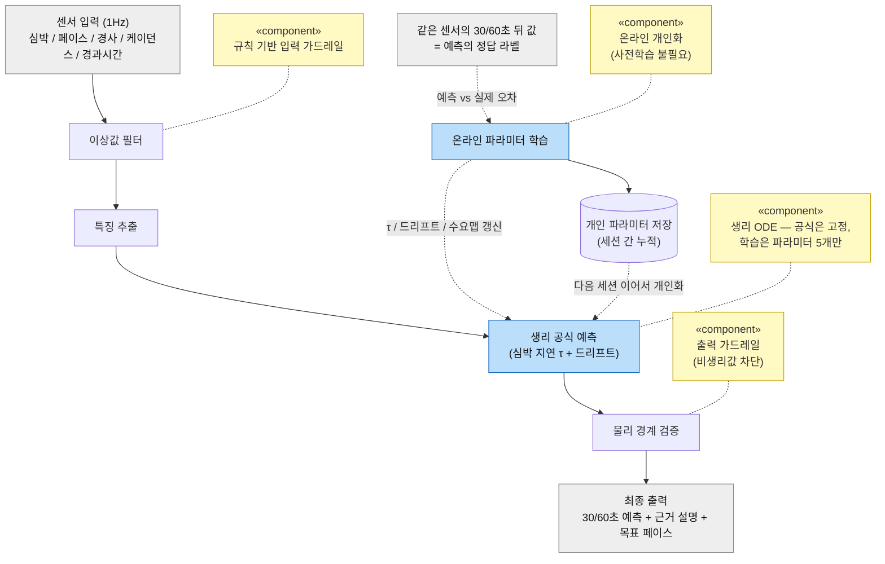
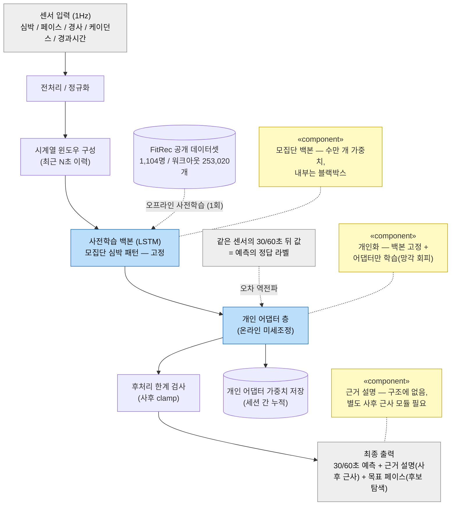

# report-006 DP1 설계 보고서 — 가까운 미래 심박 예측 아키텍처

> 인증 보고서 "03. 설계 / Architectural Decision"의 DP1 파트. 샘플(씬스틸러) DP 슬라이드 형식을 따른다:
> **[설계 문제 정의] → [설계안 결정 표: 구조(다이어그램) / 장점(QA 별점) / 단점(QA 별점) / Trade Off] → [설계 결정 및 근거]**.
> 이 분야 지식이 전혀 없는 사람도 읽고 이해할 수 있도록 쓴다. 이 문서는 **DP1 하나에만** 집중한다.
>
> **상태: v2 초안 완성 (2026-07-08) — 사용자 검토 대기.** §1 문제 정의(3겹 배경 + P1~P6) / §2 표현 규칙 /
> §3 (1안 채택, mermaid) / §4 (2안 카운터, mermaid) / §5 결정 표 + 별점 종합 / §6 결정 근거 + 예상 질문 Q&A.
> 보고서(PPT) 최종본에서는 이 중 취사선택한다.

---

## 0. 읽기 전에 — 30초 배경 (도메인 지식 0 전제)

- **Zone 2 러닝** = "편하게 오래 달릴 수 있는 낮은 강도"의 유산소 운동. 이 강도를 유지하는지는 **심박수(분당 심장 박동)** 로 판단한다.
- **문제의 핵심**: 심박은 운동 강도를 **곧바로 따라오지 않는다.** 페이스를 올려도 심박은 **20~40초쯤 늦게** 서서히 오른다.
- 그래서 **"지금 심박"만 보고 코칭하면 항상 늦는다.** 이미 강도를 넘긴 뒤에야 "초과!"라고 말하게 된다.
- 제때 코칭하려면 **"이 페이스를 유지하면 곧(30/60초 뒤) 심박이 어디까지 갈지"를 미리 예측**해야 한다.
- **DP1 = 그 "미래 심박 예측"을 어떤 구조(아키텍처)로 만들 것인가** 라는 설계 결정이다.

---

## 1. DP1. 설계 문제 정의

### 1-1. 배경 — 세 겹의 논증

**(1) 서비스가 요구하는 것**
Zone2Runner의 핵심 가치는 "러닝 내내 Zone 2를 유지하게 하는 실시간 코칭"이다(spec-001 FR3 심박 예측/선제 코칭).
코칭의 품질은 결국 **존 체류 시간**으로 나타난다 — 벗어난 뒤 혼내는 코칭은 체류 시간을 늘리지 못한다.

**(2) 생리학이 방해하는 것 — 이 문제의 본질**
- **지연(on-kinetics)**: 심박은 강도 변화를 20~40초 늦게 따라온다. 오르막에 들어선 순간 힘은 이미 넘쳤는데 심박은 아직 조용하다.
- **드리프트(cardiac drift)**: 같은 페이스여도 시간이 지나면(더위/탈수) 심박이 서서히 오른다. "지금 값"이 "지금 강도"를 대표하지 않는 두 번째 이유.
- **개인차**: 지연 속도(τ)와 드리프트 크기는 사람마다 다르고, 같은 사람도 그날 컨디션에 따라 다르다.

**(3) 구조적 귀결**
심박은 **지연 신호**이므로, "현재 심박 → 판정 → 코칭"의 반응형 제어는 **구조적으로 항상 늦는다.**
사용자가 코칭을 듣고 페이스를 바꿔도 그 효과가 심박에 나타나기까지 또 20~40초가 걸린다 — **지연이 왕복으로 두 번 쌓인다.**
이 지각을 없애는 유일한 방법은 "이 페이스를 유지하면 30/60초 뒤 심박이 어디로 가는가"를 미리 아는 것, 즉 **예측**이다.

### 1-2. 문제점 — 예측을 "그냥 만들면 안 되는" 이유 (제약/QA 충돌 지점)

| # | 문제 | 충돌하는 제약(spec-001) / QA(spec-002) |
|---|---|---|
| P1 | 지연+드리프트를 가진 신호를 30/60초 앞서 맞혀야 한다 | 문제의 본질(배경 2) |
| P2 | 개인차가 커서 "평균 러너" 모델은 그 사람에게 틀린다 — 그런데 개인당 데이터는 세션 수십 개뿐 | **C02** 대량 사전학습 데이터 없음 |
| P3 | 예측 정답을 잴 참값 기반이 없다 — 시뮬로 학습하면 "시뮬 흉내"라는 순환에 빠진다(판정 MLP에서 실제로 겪은 결함, adr-013) | **C03** 참값 없음, **C04** 평가=시뮬, QA5 |
| P4 | 심박은 사용자 눈에 보이는 숫자다 — 예측이 어긋나는 순간 바로 들통난다. "왜 그렇게 예측했나"를 보여주지 못하면 신뢰가 무너진다 | **QA1 설명용이성** |
| P5 | 매초, 폰 단독, 비용 0으로 돌아야 한다 | **C01** 온디바이스/비용0, **QA6 수행효율성** |
| P6 | 비생리적 예측(순간 250bpm 등)이 코칭 방향을 오염시키면 안 된다 | **QA4 제어가능성**, QA3 강건성 |

### 1-3. 설계 문제 (한 문장)

> **"지연/드리프트/개인차를 가진 심박을, 대량 데이터도 참값도 없이, 폰 단독으로 매초, 사용자에게 설명 가능한 형태로 30/60초 앞서 예측하는 내부 구조를 무엇으로 할 것인가."**

---

## 2. 아키텍처 표현 규칙 (두 후보 공통 — 공정 비교의 틀)

- **입출력 계약 고정**: 두 후보 모두 같은 외부 경계를 갖는다. 내부 구조만 다르다.
  - 입력: 1Hz 샘플(심박 / 페이스 / 경사 / 케이던스 / 경과시간)
  - 출력: ① 30/60초 뒤 예측 심박, ② 예측의 근거 설명, ③ Zone 2 목표 페이스
- **다이어그램은 깨끗하게**: 이름 붙은 컴포넌트 박스 + 화살표 + `«component»` 주석 노트(6~9박스). QA 태그는 그림에 넣지 않는다.
- **QA 평가는 표의 장점/단점 행에서**: 장점 = 대비가 극명한 QA 2개(★4~5), 단점 = 상대적으로 약한 QA 2개(★3 수준). 6개 전부 나열하지 않는다.
- **채택안은 굵은 테두리(1안 위치)로 강조**, Trade Off 행에 그 구조의 본질 3문장.
- 강의 AI System 아키텍처 대응: 실선 경로 = **추론 서비스**, 점선 학습 경로 = **재훈련 루프**(우리는 온디바이스 온라인 학습이라는 극한형), 저장 원통 = **모델 레지스트리**(개인 파라미터), 설명 출력 = **설명 서비스**.

---

## 3. (1안) 생리 모델 예측 구조 — ★채택 (구현됨: `HrOdeModel`, adr-020)

**한 줄 개념**: 심박이 움직이는 법칙을 **생리 공식(ODE)** 으로 두고, 공식의 **개인 파라미터 5개**(반응 속도 τ, 드리프트, 수요맵 a/b/c)만 뛰면서 **실시간으로 그 사람에 맞춰간다.** 사전학습도, 자체 학습 신경망도 없다.

**쉬운 설명**: 내비가 "10분"이라는데 당신은 늘 8분에 도착하면, 내비가 그 패턴을 배워 다음부터 "8분"으로 고쳐준다.
여기서 공식 = 생리 ODE, 배우는 것 = 그 사람의 반응 속도/드리프트 같은 **숫자 몇 개**. 공식이 뼈대라 예측을
"추세 몇 bpm + 드리프트 몇 bpm"으로 쪼개 보여줄 수 있고, 학습은 폰에서 뛰는 동안 바로 일어난다.

**라벨의 정직성(그림의 점선 루프)**: 정답 라벨을 사람도 시뮬레이터도 만들지 않는다 — 30/60초 뒤에 **같은 센서로
도착하는 실측값이 그대로 정답**이다(자기지도). 판정 MLP에서 겪은 "시뮬 라벨 순환"(P3)이 구조적으로 불가능한 이유.

> **수요맵 공식의 근거와 한계(정직 고지)**: `정상상태 심박 = a + b·속도 + c·경사`는 그 자체로 "공인된 표준 공식"이
> 아니라 **표준 지식의 국소 선형 근사**다. 근거: (1) 최대하 운동에서 정상상태 심박이 운동 강도에 거의 선형으로
> 비례하는 것은 운동생리학 교과서 수준의 사실(최대하 심박-강도 선형성 — Åstrand 계열 추정법의 전제),
> (2) 달리기 대사 비용의 표준식(ACSM 대사 방정식)도 속도에 선형이며 경사 항을 가짐, (3) 경사에 따른 러닝 에너지
> 비용은 넓은 범위에선 곡선이지만(Minetti 2002) 우리가 다루는 완만한 범위(±10% 클램프)에선 선형 근사가 유효.
> 한계: ACSM식의 속도x경사 상호작용 항을 생략했고, 급한 내리막의 비대칭 비용은 못 담는다 — 대신 Zone 2라는
> **좁은 운용 대역** 안에서만 쓰고, a/b/c를 **개인 실주행으로 온라인 적합**하므로 국소 곡률은 파라미터가 흡수한다.

**구조 요소가 문제점(§1-2)을 해결하는 방식**:

| 문제 | 해결하는 구조 요소 |
|---|---|
| P1 지연+드리프트 예측 | 생리 공식이 지연(τ)과 드리프트를 **명시적 항**으로 가짐 — 문제의 생리학을 공식으로 직접 씀 |
| P2 개인차 vs 데이터 부족 | 학습 대상이 심박 함수 전체가 아니라 **숫자 5개** → 세션 몇 개로도 수렴, 사전학습 불필요 |
| P3 참값 부재/순환 | 학습 라벨 = **실제 미래 심박**(30/60초 뒤 도착하는 실측) — 시뮬 라벨이 아니므로 순환 없음 |
| P4 설명(신뢰) | 예측이 물리 두 항의 합이라 **분해 표시가 구조에서 공짜로 나옴**(분해 합 = 예측, 불변식 테스트) |
| P5 온디바이스 매초 | 지수함수 한 번 포함 식 몇 줄 |
| P6 비생리값 차단 | 출력 가드레일(물리 경계 clamp) + 정상상태 역추정 자체의 경계 |

**장점(QA 별점)**: 설명용이성 ★★★★★ (예측 = 추세+드리프트 물리 분해), 강건성 ★★★★★ (물리 경계로 비생리값 원천 차단)
**단점(QA 별점)**: 기능적응성 ★★★★ (적응은 강하나 공식 표현력 밖 비선형은 못 배움 — 상한), 테스트가능성 ★★★★ (절대 정확도 검증은 참값 부재로 폐루프 시뮬 의존 — C03, 양안 공통 한계)

> **검토했으나 미배포 — gray-box 잔차 신경망(선택적 확장)**: 1안 위에 아주 작은 신경망이 ODE의 잔차(나머지 오차)만
> 물리 경계 안에서 보정하는 gray-box 구조도 설계/프로토타입했다(시뮬 홀드아웃 +10%). 그러나 사전학습을 실데이터 없이
> 시뮬로만 할 수 있어 실사용 이득이 불확실했고, 자체 학습 신경망이 필수도 아니라(온라인 파라미터 개인화가 이미 ML)
> 배포하지 않았다. 실주행 필드 데이터가 쌓이면 재학습해 재평가한다(설계 기록 = report-005).

---

## 4. (2안) 사전학습 시계열 회귀 구조 — 카운터 아키텍처

**한 줄 개념**: 물리 공식 없이, **대규모 실측 데이터가 심박의 움직임을 통째로 배우게** 한다. 공개 데이터셋으로
모집단 심박 패턴을 사전학습한 시계열 신경망(LSTM 계열)을 백본으로 싣고, 개인화는 백본을 고정한 채 위에 얹은
작은 어댑터 층만 온라인 미세조정한다. 업계(빅테크 웨어러블)가 실제로 쓰는 정공법 계열이다.

**허수아비가 아닌 이유(정직 고지)**: 이 경로는 지어낸 비교 대상이 아니라 **본 프로젝트가 실제로 검토했던 경로**다
(자체 NN 도입 검토 시 후보 데이터셋으로 조사, HANDOFF 2026-07-06 세션 B). 사전학습 데이터도 실존한다:
**FitRec** — Endomondo 앱 사용자 1,104명의 워크아웃 253,020개(심박/속도/GPS 시계열 포함, Ni, Muhlstein,
McAuley, WWW 2019, UCSD 공개 배포).

**쉬운 설명**: 수십만 명의 러닝 기록을 미리 보고 "사람 심박은 대체로 이렇게 움직인다"를 통째로 외운 모델을 폰에
싣고, 내 기록으로 겉면만 살짝 덧칠(어댑터 미세조정)하는 방식. 많이 본 만큼 다양한 패턴을 알지만, **왜 그렇게
예측했는지는 모델 자신도 말할 수 없다**(수만 개 가중치의 합산이라 사람이 읽을 수 없음).

**구조 요소가 문제점(§1-2)을 대응하는 방식과 그 비용**:

| 문제 | 2안의 대응 | 남는 비용 |
|---|---|---|
| P1 지연+드리프트 | 데이터에 지연/드리프트 패턴이 들어 있으므로 암묵적으로 학습 | 공식이 아니라서 "왜"는 답 못 함 |
| P2 개인차 | 어댑터 미세조정 | 소량 개인 데이터로 NN 미세조정 — 과적합/망각 위험, 수렴 속도 불확실 |
| P3 참값/순환 | 온라인 라벨은 1안과 동일(실측 도착) | **사전학습 품질은 외부 데이터에 종속** — FitRec 홀드아웃 정확도가 우리 사용자 보장이 아님(C02/C03) |
| P4 설명 | 별도 사후 근사(주의 시각화 등) 모듈을 부착 | 근사일 뿐 "분해 합 = 예측" 같은 불변식이 없음 — 설명이 구조 밖 |
| P5 온디바이스 | 소형 LSTM이면 순전파 가벼움 | 학습 파이프라인/모델 변환/버전 관리 공정 추가 |
| P6 비생리값 | 사후 clamp 부착 | 내부가 물리를 모름 — 분포 밖 입력에서 이상 출력 가능성 자체는 남음 |

**장점(QA 별점)**: 기능적응성 ★★★★ 잠재(실제 ★★★ — 과적합/망각 위험, §5-1), 수행효율성 ★★★★ (소형 순전파는 온디바이스 가능)
**단점(QA 별점)**: 설명용이성 ★★ (내부 불투명 — 설명은 별도 사후 근사), 강건성 ★★★ (물리 무지 — 사후 clamp로만 방어)

---

## 5. 설계안 결정 표 (샘플 슬라이드 형식)

| | **(1안) 생리 모델 예측 구조 ★채택** | (2안) 사전학습 시계열 회귀 구조 |
|---|---|---|
| 구조 | §3 다이어그램 | §4 다이어그램 |
| 장점 | 설명용이성 ★★★★★ 강건성 ★★★★★ | 기능적응성 ★★★★ 잠재(실제 ★★★, §5-1) 수행효율성 ★★★★ |
| 단점 | 기능적응성 ★★★★ (적응은 강하나 공식 표현력 밖 비선형은 못 배움 — 상한) 테스트가능성 ★★★★ (절대 정확도 검증은 참값 부재로 폐루프 시뮬 의존 — C03, 양안 공통 한계) | 설명용이성 ★★ 강건성 ★★★ |
| Trade Off | 물리가 사실을 확정하고 학습은 그 경계 안에서만(무결성) 사전학습 불필요 — 첫 세션부터 동작, 뛸수록 개인화 설명이 사후 근사가 아니라 구조에서 나옴 | 공식이 못 담는 비선형까지 데이터가 배울 잠재력 모집단 사전지식으로 콜드스타트 완화 단 정확도의 근거가 외부 데이터 품질에 종속되고, 설명/안전은 별도 모듈로 보강 필요 |

### 5-1. QA 별점 종합 (6대 QA 전체 — 부록)

| QA(품질속성) | (1안) 생리 ODE + 온라인 개인화 | (2안) 사전학습 LSTM + 어댑터 |
|---|:---:|:---:|
| QA1 설명용이성 | ★★★★★ | ★★ |
| QA2 기능적응성 | ★★★★ | ★★★ |
| QA3 강건성 | ★★★★★ | ★★★ |
| QA4 제어가능성 | ★★★★ | ★★★ |
| QA5 테스트가능성 | ★★★★ | ★★ |
| QA6 수행효율성 | ★★★★★ | ★★★★ |

- 2안 QA2가 "잠재 상한은 높은데 별점은 ★★★"인 이유: 상한은 이론이고, **소량 개인 데이터로 NN을 미세조정하는 실제 적응**은 과적합/파국적 망각 위험과 수렴 불확실성을 안는다. 1안의 적응(파라미터 5개 추정)은 폭은 좁지만 **수렴이 검증돼 있다**(τ 30→약20, 폐루프).
- 2안 QA5가 ★★인 이유: 사전학습 품질이 외부 데이터에 종속되고(우리가 재현/통제 불가), 개인 단위 절대 정확도는 어차피 참값이 없어(C03) 검증 불가 — "정확 잠재력"이라는 2안의 유일한 우위 축이 **우리 제약에서는 확인할 수 없는 약속**이 된다.

---

## 6. DP1. 설계 결정 및 근거

### 6-1. 최종 채택 구조
**(1안) 생리 ODE + 온라인 파라미터 개인화 구조**를 채택한다. (자체 학습 신경망은 쓰지 않는다.)
(초기엔 블랙박스 신경망을 시도했으나, 시뮬 데이터로 학습하면 "우리가 이미 쓴 공식을 흉내내는 순환"임을 확인하고 폐기 → 재설계. gray-box 잔차 NN 확장도 검토/프로토타입했으나 데이터 여건상 미배포. adr-020, report-005.)

### 6-2. 채택 근거 (QA 기준 — 2안 대비)
- **설명용이성(QA1) 결정적 우위**: 예측을 "추세 몇 bpm + 드리프트 몇 bpm"으로 분해해 화면에 표시할 수 있다. 2안은 이 화면 자체가 불가능하고(사후 근사뿐), 심박처럼 **사용자 눈에 보이는 숫자**에서 설명 불가는 신뢰 붕괴로 직결된다(P4).
- **강건성(QA3)**: 물리 경계가 구조 안에 있어 비생리적 예측을 원천 차단(P6). 2안은 물리를 모르는 내부에 사후 clamp를 덧대는 방식 — 방어가 구조 밖이다.
- **데이터 현실(P2/C02) 부합**: 2안의 유일한 우위 축은 "충분한 우리-도메인 데이터가 있을 때의 정확 잠재력"인데, **그 전제가 우리 제약에서 성립하지 않는다**(C02 — 공개 데이터는 모집단 평균, C03 — 잠재력을 확인할 참값도 없음). 1안은 뼈대가 물리라 대규모 데이터가 필요 없고, 개인화는 사전학습 없이 첫 세션부터 실시간으로 맞춰간다.
- **수행효율성(QA6)**: 식 몇 줄 → 온디바이스 실시간(P5). 학습 파이프라인/모델 변환/버전 관리 공정도 불필요.
- **테스트가능성(QA5)**: 폐루프 시뮬에서 개인 파라미터가 참값으로 수렴(τ 30→약20)하는 것을 정량 확인, 라벨 순환 결함 없음. 2안은 사전학습 품질이 외부 데이터에 종속돼 우리가 재현/통제할 수 없다.
- **무결성 원칙 정합(QA4)**: 물리/규칙이 사실을 확정하고 학습 요소(온라인 파라미터 추정)는 그 경계 안에서만 움직인다(프로젝트 관통 원칙).

### 6-3. 예상 질문 — "FitRec 같은 공개 데이터가 있는데 왜 그걸로 학습하지 않았나?"

못 한 것이 아니라 **검토 후 가지 않기로 결정**한 것이다(검토 기록: 자체 NN 도입 검토, 2026-07-06).

1. **모집단 평균은 우리 병목이 아니다**: FitRec으로 학습한 백본이 주는 것은 "평균 Endomondo 사용자"의 심박 함수다. 우리 문제의 병목은 개인차(P2)라 그 위에 온라인 개인화 층이 어차피 필요한데, 생리 공식 뼈대 + 온라인 파라미터 추정만으로 이미 목표를 달성했다(폐루프 60초 RMSE 약 2.4bpm — 시뮬 기준 알고리즘 수렴 지표이지 실인간 정확도 아님). 백본 교체로 얻는 것은 개인화 수렴 전 첫 몇 분뿐이고, 그 콜드스타트는 모집단 prior(문헌값 τ 등)가 이미 감당한다.
2. **검증의 정직성**: FitRec 홀드아웃 정확도는 Endomondo 사용자에 대한 것이지 우리 사용자 보장이 아니다(C02/C03). 정직하게 잴 수 있는 유일한 지표는 "우리 사용자의 온라인 예측 오차"인데, 1안은 그 지표를 직접 최적화한다.
3. **도메인 갭**: 이기종 기기(손목 광학/가슴 스트랩 혼재)/종목/인구가 섞인 스크랩 데이터 — 소량데이터 ML 심층연구(2026-07-06)에서도 외부 데이터 의존 전이학습 경로를 비권장으로 분류했다.
4. **1인 1개월 일정**: 25만 워크아웃 정제/학습/온디바이스 변환/검증은 큰 공정 — 개인화 결정(adr-004)에서 "오프라인 모집단 ML + 개인화"를 일정 리스크로 기각한 것과 같은 논리.

이 경로를 실제로 검토했기 때문에, 본 문서의 2안은 허수아비가 아니라 **실행 가능성을 저울질했던 진짜 대안**이다.

### 6-4. 보완 계획
- **gray-box 잔차 NN 재검토**: 실주행 필드 로그가 쌓이면, 공식이 못 담는 비선형을 잔차 신경망으로 보완하는 방안을 실데이터로 재학습해 재평가(현재는 시뮬 학습이라 보류).
- **표현력 한계 모니터**: 순수 ODE가 특정 상황(더위+오르막 복합 등)에서 계통 오차를 보이면 로그로 포착 → 잔차 도입 여부 판단.
- **개인화 수렴 실측**: 온라인 파라미터(τ/드리프트)가 실사용자에서 어떻게 수렴하는지 필드 검증.

---

## 부록. 용어 한 줄 사전 (도메인 지식 0 독자용)

- **심박 예측**: "이 페이스를 유지하면 30/60초 뒤 심박이 몇일지" 미리 계산하는 것.
- **ODE(상미분방정식)**: 겁먹을 것 없이 "변화 규칙을 적은 식". 여기선 "심박이 목표를 향해 서서히 오르는 법칙".
- **on-kinetics / 드리프트**: 심박이 강도를 20~40초 늦게 따라오는 성질 / 오래 뛰면 같은 페이스에도 심박이 서서히 오르는 현상.
- **τ(타우, 시상수)**: "목표를 향해 지수적으로 접근하는" 시스템의 굼뜸을 초 하나로 요약한 표준 기호. τ초에 남은 거리의 약 63%, 3τ초에 약 95%를 좁힌다. 여기선 "이 사람 심박의 반응 속도" — 개인 파라미터 1번.
- **수요맵(a/b/c)**: "이 속도/경사로 달리면 심박이 얼마나 필요한가"의 간단한 지도: 정상상태 심박 = a(바닥) + b×속도 + c×경사. 거꾸로 풀면 "Zone 2가 되려면 얼마로 뛰어야 하나"(목표 페이스 역질의)가 나온다.
- **잔차**: 공식이 맞히고 남은 나머지 오차. "항상 +2도 빗나가는 버릇" 같은 것.
- **신경망(MLP/LSTM)**: 입력 숫자를 여러 층에 곱하고 더해 결과를 내는 학습 모델. 속이 불투명(블랙박스). LSTM은 시계열(순서 있는 데이터)용.
- **gray-box / PINN**: 물리 공식(뼈대) + 작은 신경망(잔차 보정)을 합친 구조. 적은 데이터에 강하고 설명 가능.
- **clamp**: 출력을 안전 범위로 "잘라내기". 생리적으로 말 안 되는 값 방지.
- **QA(품질속성)**: 시스템이 잘 만들어졌는지 보는 기준. 이 프로젝트의 6대 QA = 설명용이성/기능적응성/강건성/제어가능성(AI 4) + 테스트가능성/수행효율성(일반 2), spec-002.

> 관련 문서: `arch/adr-020`(생리 ODE 결정), `report-005`(gray-box/PINN 학습 노트), `report-007`(QA 선정 척추), `WHITEPAPER 5-1`(상세), `spec/spec-002`(QA 정의).
