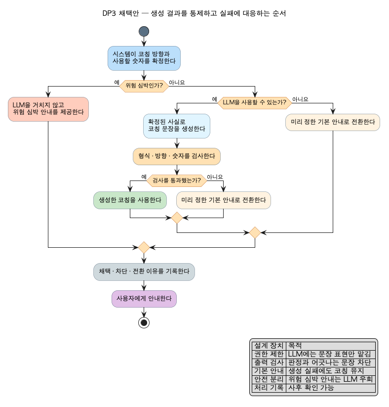

# Report-009: DP2 (제어가능성) — 인증 보고서 "03. 설계 / Architectural Decision" 원고

- **날짜**: 2026-08-03 (v3 — 리뷰 반영: 개별화 채택안+상세 도식, 표현 교정)
- **용도**: 인증 보고서 PPT 원고. 인증과제 샘플(씬스틸러) DP 형식 3장 + Appendix 1장.
- **작성 원칙**: 전문가가 아니어도 읽히는 쉬운 한국어. 압축 표기와 영문 용어 없이 설명하는 문장으로. 영문 용어는 Appendix 용어표에만.
- **정본**: `arch/dp/dp-02-controllability/dp-02-controllability-decision.md` — 이 문서는 그 표현물.

---

## 슬라이드 1 — DP2. 설계 문제 정의

### 1. 배경

- 이 앱은 코칭 문장을 만들 때 폰 안에서 도는 작은 LLM을 쓴다. 서버 없이 도는 작은 모델이라 능력에 한계가 있다.
- LLM은 자연스러운 문장을 만들지만 출력이 항상 같은 형식으로 나오지는 않는다. 이 앱에서는 판정의 권한을 규칙에 두고, LLM은 이미 정해진 판단을 자연스럽게 표현하는 역할로 제한한다.
- 그런데 코칭은 달리는 중에 실시간 음성으로 나간다. 사람이 문장 하나하나를 검사해 줄 수 없다. **통제는 사람 손이 아니라 자동으로 작동하는 구조여야 한다.** 그 구조를 고르는 것이 이 설계 결정이다.

### 2. 문제점

- **프롬프트만으로 출력 형식과 사용 가능한 숫자를 항상 고정하기는 어렵다.** 규칙이 판단과 사실을 먼저 확정하고, 생성된 문장이 그 범위 안에 있는지 검사해야 한다. 기준을 벗어나거나 LLM을 사용할 수 없을 때는 기본 문구로 전환한다.
- **LLM이 없는 상황도 있다.** 지원하지 않는 기종이 있고, 첫 모델 다운로드가 끝나기 전이거나 응답이 늦거나 실패할 수도 있다. 어느 경우든 코칭은 끊기면 안 된다.
- **긴급 상황에 대비할 수 있어야 한다.** 위험할 정도로 심박이 높을 때의 권고는 늦거나 틀리면 안 되므로 LLM에 맡길 수 없다.
- **통제가 작동했는지 나중에 확인할 수 있어야 한다.** 어떤 문장을 왜 기각했는지 기록으로 남고, 사용자도 말하기 테스트로 판정 기준을 정정하고 설정에서 코칭 빈도와 말투를 바꿀 수 있어야 한다.

---

## 슬라이드 2 — DP2. 설계안 결정

| | **(1안) 규칙 확정 + LLM 표현 한정 아키텍처** (채택) | **(2안) LLM 판단 위임 아키텍처** |
|---|---|---|
| **한 줄 소개** | 무엇을 권할지는 규칙이 정하고, LLM은 문장을 만드는 일만 맡는 구조 | 관측 상황을 통째로 주고 LLM이 코칭 내용까지 직접 판단해 만드는 구조 |
| **구조** | (그림: `arch/dp/dp-02-controllability/images/dp-02-controllability-adopted-simple.png` — 제어가능성 관점 개별화본) 규칙이 방향과 사실 숫자를 확정하면 LLM은 그 재료로 문장만 만든다. 나온 문장은 형식, 방향, 숫자 세 가지 검사를 거치고, 걸리거나 LLM이 실패하면 "속도 줄이기" 같은 짧은 문구로 바꿔 내보낸다. 위험 심박 권고는 LLM을 거치지 않고, 모든 호출의 경로와 기각 사유가 기록된다 | (그림: `arch/dp/dp-02-controllability/images/dp-02-controllability-counter-simple.png`) 심박, 페이스 같은 상황을 프롬프트로 주면 LLM이 무엇을 권할지까지 스스로 판단해 문장을 만든다. 통제는 프롬프트에 규정을 써 두고 출력에 금칙어, 수치 범위 필터를 거는 방식이다. LLM 활용 서비스의 주류 접근이다 |
| **장점** | 제어가능성 ★★★★★ (기각·기본 문구·LLM 우회가 구조에 있음) 강건성 ★★★★★ (LLM을 사용할 수 없어도 코칭이 이어짐) | 기능적응성 ★★★★ (규칙 밖 상황에도 문맥 코칭을 만들 잠재력) 설명용이성 ★★★ (풍부한 표현은 가능하지만 판단 근거와의 연결은 별도 확인) |
| **단점** | 기능적응성 ★★★ (새 상황은 규칙을 추가해야 함) 테스트가능성 ★★★★★ (검사와 기본 문구 전환을 반복 확인 가능) | 제어가능성 ★★ (개입 수단이 프롬프트 수정에 한정) 강건성 ★★ (LLM 실패 시 판단을 대신할 경로가 없음) |
| **Trade Off** | 어긋난 문장은 걸러지고 실패해도 코칭이 이어진다. 대신 코칭 내용의 자유도에 상한이 있다 | 문맥이 풍부한 코칭이 나올 수 있다. 대신 통제가 "LLM이 규정을 따라 준다"는 기대에 의존하고, 실패하면 갈아탈 판단 주체가 없다 |

---

## 슬라이드 3 — DP2. 설계결정 및 근거

### 1. 최종 채택 구조

**후보 1: 규칙 확정 + LLM 표현 한정 아키텍처 채택**

### 2. 채택 근거

- **문제가 생기면 손쓸 수단이 구조 안에 있다.** 어긋난 문장은 기각되고(교정), LLM이 없으면 짧은 문구로 대신하고(보완), 위험 심박이면 LLM을 거치지 않는다(안전전환). 셋 다 사람 손 없이 자동으로 작동한다. 2안에서 손쓸 수단은 프롬프트 수정뿐이고 그 효과는 보장되지 않는다.
- **약한 모델이라는 전제와 맞는다.** 1안은 LLM이 규정을 안 지켜도 통제가 성립한다 — 출력을 규칙이 다시 검사하고, 걸리면 바꿔 내보낸다. 2안은 "지켜 준다"는 기대 자체가 통제의 근거다.
- **실패해도 코칭이 이어진다.** LLM이 없거나 실패했을 때 1안의 최악은 "짧은 문구 코칭"이고, 2안의 최악은 "코칭 중단"이다.
- **통제 작동을 데이터로 확인한다.** 어떤 문장이 왜 기각됐고 언제 폴백했는지가 세션마다 기록되어 리포트에서 확인할 수 있다.
- **DP1과 같은 구조에서 나온다.** 판단을 규칙에 두었기 때문에 설명이 실제 판단과 일치하고(DP1), 나온 문장을 검사할 정답도 시스템 안에 생긴다(DP2). 하나의 구조 선택이 두 품질을 함께 만든다.

### 3. 보완 계획

- **단기**: 방향위반 기각율 등 측정 항목은 시뮬레이션과 단위 테스트로 이미 재 두었다(검증 파트 QA3 수록 — 기각율 100%). 남은 것은 실주행에서 기각률과 폴백 사유 분포를 모아 검사 기준을 조정하는 일이다.
- **장기**: 기각 기록에서 자주 걸리는 표현 유형을 분석해 프롬프트를 교정하고(기각 자체를 줄이는 통제), 방향 검사의 알려진 비대칭(유지 의도는 금지어 목록 검사만이라 미등재 어휘는 통과 가능)을 판정 연동 검사로 보완한다.

---

## Appendix 슬라이드 — DP2 상세 설계 내역

**이 설계 결정이 다루는 품질 문제**

- 작은 LLM은 프롬프트를 가끔 어긴다 → 제어가능성
- 실시간이라 출력마다 사람이 검수할 수 없다 → 제어가능성
- 미지원 기종, 다운로드 전, 지연, 오류로 LLM이 없을 수 있다 → 강건성
- 위험 심박 권고는 지연과 오작동을 허용할 수 없다 → 제어가능성(안전전환)
- 통제가 작동했는지 사후 확인이 필요하다 → 제어가능성(감사)
- 사용자도 개입할 수 있어야 한다 → 제어가능성(교정, 보완)
- 통제가 과하면 표현이 굳는다 → 기능적응성

**채택안 상세 설계 — 통제 경로를 하위 모듈(실제 클래스)까지 전개**

**채택안의 통제 장치 5층** (각 층은 독립 작동 — 한 층이 뚫려도 다음 층이 막는다)

| 층 | 하는 일 | 제어 유형 |
|---|---|---|
| 1. 격리 | 판단은 규칙, LLM은 문장만 — 맡기는 권한 자체를 좁힌다 | 예방 |
| 2. 출력 검사 | 형식(길이), 방향(판정과 모순이면 기각), 숫자(관측에 없는 숫자면 기각) | 교정 |
| 3. 폴백 | 걸리거나 실패하면 "속도 줄이기" 같은 짧은 문구로 바꿔 내보낸다 | 안전전환 |
| 4. 안전 분리 | 위험 심박 권고는 LLM을 거치지 않는다 | 안전전환 |
| 5. 사람 개입 + 기록 | 말하기 테스트로 판정 기준 정정, 설정 토글, 모든 호출 경로와 기각 사유를 세션에 기록 | 교정, 보완, 감사 |

**QA 별점 종합**

| 품질 속성 | (1안) 규칙 확정 + LLM 표현 한정 | (2안) LLM 판단 위임 |
|---|:---:|:---:|
| 제어가능성 | ★★★★★ | ★★ |
| 강건성 | ★★★★★ | ★★ |
| 설명용이성 | ★★★★★ | ★★ |
| 테스트가능성 | ★★★★★ | ★★★ |

**평가의 조건**: 별점은 이 DP의 결정 범위가 해당 QA에 미치는 영향을 이 과제 조건에서 평가한 것이라, 같은 QA 명칭이라도 DP마다 평가 대상 행위가 다르다(예: DP1의 기능적응성=규칙 밖 패턴 학습 능력, DP3의 기능적응성=경계 적응 지연). 이 별점은 작은 온디바이스 모델, 실시간 음성, LLM이 없을 수 있음(미지원 기종/다운로드 전), 안전 권고 포함이라는 이 과제 조건에서의 평가다. 조건이 다르면(충분히 강한 모델, 서버 실행, 출력별 사람 검수 가능) 2안이 우선될 수 있다.

**용어 대조(심사용)**: 개입 가능성 = intervenability(ISO/IEC 25059 제어가능성의 핵심) / 맡기는 일 자체를 좁히는 통제 = architectural containment(구조적 격리) / 실패 시 무손상 전환 = fail-safe fallback / 사람 개입 = HITL(루프 안 교정), HOTL(루프 위 감독) / 사후 확인 = audit(감사)

**근거 문헌**: ISO/IEC 25059(제어가능성 정의) / LLM 가드레일 계층 방어 서베이(구조적 격리가 가장 강한 층) / LLM 단독 판단 회피 권고 / 생성 결과 검사와 실패 경로 분리를 다룬 가드레일 연구

상세 = `arch/dp/dp-02-controllability/` (decision / research / counter-catalog)
